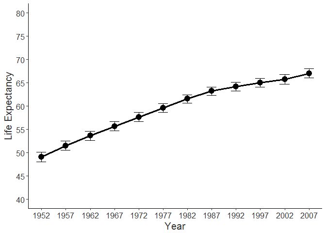
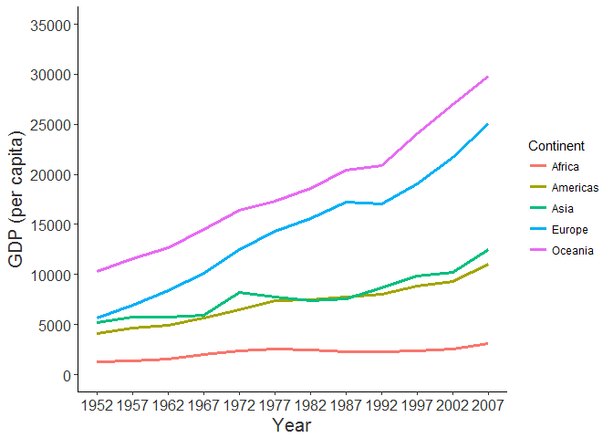

Homework 1: Gapminder
================

  In this assignment I will look at the [**gapminder**](https://cran.r-project.org/web/packages/gapminder/index.html) data set, let us begin by seeing what variables are available,

    ## [1] "country"   "continent" "year"      "lifeExp"   "pop"       "gdpPercap"

and their respective formats.

    ## Classes 'tbl_df', 'tbl' and 'data.frame':    1704 obs. of  6 variables:
    ##  $ country  : Factor w/ 142 levels "Afghanistan",..: 1 1 1 1 1 1 1 1 1 1 ...
    ##  $ continent: Factor w/ 5 levels "Africa","Americas",..: 3 3 3 3 3 3 3 3 3 3 ...
    ##  $ year     : int  1952 1957 1962 1967 1972 1977 1982 1987 1992 1997 ...
    ##  $ lifeExp  : num  28.8 30.3 32 34 36.1 ...
    ##  $ pop      : int  8425333 9240934 10267083 11537966 13079460 14880372 12881816 13867957 16317921 22227415 ...
    ##  $ gdpPercap: num  779 821 853 836 740 ...

Let us now have a small look at the actual data itself,

    ## # A tibble: 6 x 6
    ##       country continent  year lifeExp      pop gdpPercap
    ##        <fctr>    <fctr> <int>   <dbl>    <int>     <dbl>
    ## 1 Afghanistan      Asia  1952  28.801  8425333  779.4453
    ## 2 Afghanistan      Asia  1957  30.332  9240934  820.8530
    ## 3 Afghanistan      Asia  1962  31.997 10267083  853.1007
    ## 4 Afghanistan      Asia  1967  34.020 11537966  836.1971
    ## 5 Afghanistan      Asia  1972  36.088 13079460  739.9811
    ## 6 Afghanistan      Asia  1977  38.438 14880372  786.1134

and a few descriptive statistics.

    ##         country        continent        year         lifeExp     
    ##  Afghanistan:  12   Africa  :624   Min.   :1952   Min.   :23.60  
    ##  Albania    :  12   Americas:300   1st Qu.:1966   1st Qu.:48.20  
    ##  Algeria    :  12   Asia    :396   Median :1980   Median :60.71  
    ##  Angola     :  12   Europe  :360   Mean   :1980   Mean   :59.47  
    ##  Argentina  :  12   Oceania : 24   3rd Qu.:1993   3rd Qu.:70.85  
    ##  Australia  :  12                  Max.   :2007   Max.   :82.60  
    ##  (Other)    :1632                                                
    ##       pop              gdpPercap       
    ##  Min.   :6.001e+04   Min.   :   241.2  
    ##  1st Qu.:2.794e+06   1st Qu.:  1202.1  
    ##  Median :7.024e+06   Median :  3531.8  
    ##  Mean   :2.960e+07   Mean   :  7215.3  
    ##  3rd Qu.:1.959e+07   3rd Qu.:  9325.5  
    ##  Max.   :1.319e+09   Max.   :113523.1  
    ## 

On seeing what the data set contains we can now ask specific questions. For instance, has *life expectancy* changed from the early *1950s to 2007*.

<h3>
Life Expectancy Over Decades
</h3>

Looking at this scatter plot a rough trend does seem evident. Let us try and better visually summarize this by creating a figure where mean life expectancy is plotted for each year.

 

<b><i>note.</b></i> Error bars represent +/- 1 one standard error of the mean.

As we can see life expectancy has increased each year, resulting in gain of roughly 15 years since study onset. A more nuanced distinction however may be made by considering the growth rates of different *continents*.

 

<h3>
Life Expectancy Across Continents
</h3>

 <b><i>note.</b></i> Error bars represent +/- 1 one standard error of the mean.  

Visually a trend seems apparent. Continents like Asia and America had larger increases in life expectancy than did Europe and Oceania. Interestingly Asia and America both also had a lower life expectancy at study start. Perhaps then, continents that started with a lower life expectancy had an opportunity for greater gains over the years. A ranking of average life expectancy increase is provided in the table below.

 

<table style="width:96%;">
<colgroup>
<col width="6%" />
<col width="29%" />
<col width="30%" />
<col width="23%" />
<col width="5%" />
</colgroup>
<thead>
<tr class="header">
<th><strong>Continent</strong></th>
<th><strong>Mean Life Expectacy in 1952</strong></th>
<th><strong>Mean Life Expectancy in 2007 </strong></th>
<th><strong>Life Expectancy Increase</strong></th>
<th><strong>Relative ranking</strong></th>
</tr>
</thead>
<tbody>
<tr class="odd">
<td>Africa</td>
<td>39.14</td>
<td>54.81</td>
<td>15.67</td>
<td>3</td>
</tr>
<tr class="even">
<td>Americas</td>
<td>53.28</td>
<td>73.81</td>
<td>20.53</td>
<td>2</td>
</tr>
<tr class="odd">
<td>Asia</td>
<td>46.31</td>
<td>70.73</td>
<td>24.42</td>
<td>1</td>
</tr>
<tr class="even">
<td>Europe</td>
<td>64.41</td>
<td>77.65</td>
<td>13.24</td>
<td>4</td>
</tr>
<tr class="odd">
<td>Oceania</td>
<td>69.26</td>
<td>80.72</td>
<td>11.46</td>
<td>5</td>
</tr>
</tbody>
</table>

Overall it would seem that continents with lower life expectancy saw greater gains over the years than continents with already high life expectancy. Somewhat puzzling however is that Africa although having the lowest life expectancy only showed an intermediate increase. Why might this be? One notable difference is that unlike the other continents Africa did not have nearly as pronounced an increase in *gross domestic product (GDP)* over the years.

 

<h3>
GDP Across Continents
</h3>

 <b><i>note.</b></i> Error bars were not included to avoid an overly cluttered figure.

Whether Africa did not see as steady an increase in life expectancy is attributable to a halted GDP would seem tenable.

According to more recent 2016 statistics provided by the [**International Monetary Fund**](http://www.imf.org/external/datamapper/NGDPD@WEO/OEMDC/ADVEC/WEOWORLD/AFQ) Africa currently has a similar GDP as in the 2007 measurement. One might expect and hypothesize that as GDP has not greatly changed since the 2007 measurement, perhaps neither has life expectancy.
