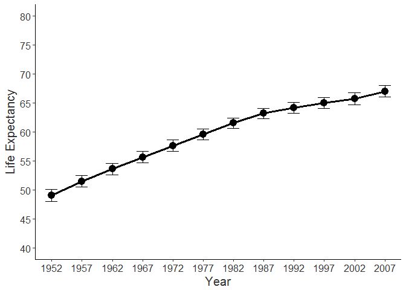
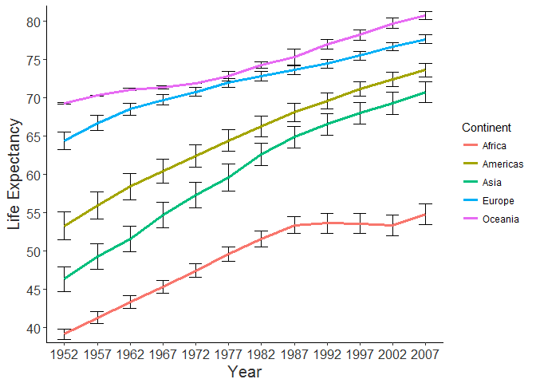

Homework 1: Life Expectacy
================

This repository was created by Pavel Kozik to complete the first [**STATS 545**](https://www.rstudio.com/wp-content/uploads/2015/02/rmarkdown-cheatsheet.pdf) homework assignment.

I am a third year PhD student in cognitive psychology. During my free time I enjoy reading, and am currently reading the [**metamorphosis**](https://www.goodreads.com/book/show/485894.The_Metamorphosis) by Franz Kafka.

I also enjoy climbing, running and rainy weather.

In this assignment I will look at the [**gapminder**](https://cran.r-project.org/web/packages/gapminder/index.html) data set in which *life expectancy* was measured from the early *1950s to 2007*.

<h3>
Life Expectacy Over Decades
</h3>

                               ***note***. Error bars represent +/- 1 one standard error of the mean. 

   

As we can see life expectancy has increased by roughly 15 years since study onset.

 

A more nuanced distinction however may be made by considering the growth rates of different *continents*.

 

<h3>
Life Expectacy Across Continents
</h3>

                               ***note***. Error bars represent +/- 1 one standard error of the mean. 

were not included to avoid an overly cluttered figure.

   

Visually a trend seems apparent. Continents like Asia and America had a larger increase in life expectancy than did Europe and Oceania. Thus while life expectacy has increased the most noticable difference seems to be in continents that started with a lower life expectancy.

 

<table style="width:96%;">
<colgroup>
<col width="6%" />
<col width="29%" />
<col width="30%" />
<col width="23%" />
<col width="5%" />
</colgroup>
<thead>
<tr class="header">
<th><strong>Continent</strong></th>
<th><strong>Mean Life Expectacy in 1952</strong></th>
<th><strong>Mean Life Expectancy in 2007 </strong></th>
<th><strong>Life Expectancy Increase</strong></th>
<th><strong>Relative ranking</strong></th>
</tr>
</thead>
<tbody>
<tr class="odd">
<td>Africa</td>
<td>39.14</td>
<td>54.81</td>
<td>15.67</td>
<td>3</td>
</tr>
<tr class="even">
<td>Americas</td>
<td>53.28</td>
<td>73.81</td>
<td>20.53</td>
<td>2</td>
</tr>
<tr class="odd">
<td>Asia</td>
<td>46.31</td>
<td>70.73</td>
<td>24.42</td>
<td>1</td>
</tr>
<tr class="even">
<td>Europe</td>
<td>64.41</td>
<td>77.65</td>
<td>13.24</td>
<td>4</td>
</tr>
<tr class="odd">
<td>Oceania</td>
<td>69.26</td>
<td>80.72</td>
<td>11.46</td>
<td>5</td>
</tr>
</tbody>
</table>

   

Somewhat puzzling to this interpretation however is that Africa although having the lowest life expectancy only showed intermediate increase. One notable difference is that unlike the other continents, Africa did not have nearly as pronounced an increase in *gross domestic product (GDP)* over the years.

 

<h3>
GDP Across Continents
</h3>

                               Error bars were not included to avoid an overly cluttered figure. 

   

Whether this halted progression may in part be influencing life expectancy rate in Africa would seem a tenable notion.

 

According to more recent 2016 statisics provided by the [**International Monetary Fund**](http://www.imf.org/external/datamapper/NGDPD@WEO/OEMDC/ADVEC/WEOWORLD/AFQ) Africa currently has a GDP of 2.18, a value comparable to the above figure. Whether or not Africa has in turn had an increase in life expectancy would be worth considering.
