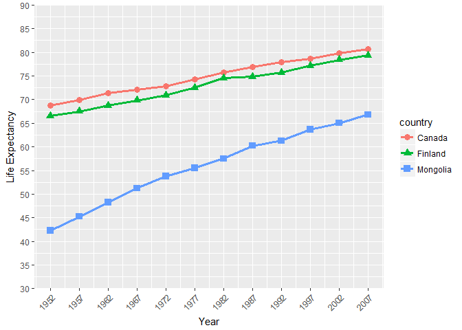

Homework Two
================

#### Begin by loading the relevant libraries

``` r
library(gapminder)
library(tidyverse)
```

#### Smell Test Questions

*1. Is it a data.frame, a matrix, a vector, a list?*

``` r
typeof(gapminder)
```

    ## [1] "list"

The gapminder dataframe is a list.

*2. What's its class?*

``` r
class(gapminder)
```

    ## [1] "tbl_df"     "tbl"        "data.frame"

A data frame (and more specifically a tibble data frame).

*3. How many variables/columns?*

``` r
ncol(gapminder)
```

    ## [1] 6

There are are 6 variables/columns

*4. How many rows/observations?*

``` r
nrow(gapminder)
```

    ## [1] 1704

There are 1704 rows/observations

*5. Can you get these facts about “extent” or “size” in more than one way? Can you imagine different functions being useful in different contexts?*

One simple way to quickly measure the number of rows and columns an object has, is through the *dim* function.

``` r
dim(gapminder)
```

    ## [1] 1704    6

This output tells us the number of rows (1704) by columns (6). This is useful if we need both pieces of information concurrently or want to easily create a new object to store this information.

Another simple method is to use *str* function.

``` r
str(gapminder)
```

    ## Classes 'tbl_df', 'tbl' and 'data.frame':    1704 obs. of  6 variables:
    ##  $ country  : Factor w/ 142 levels "Afghanistan",..: 1 1 1 1 1 1 1 1 1 1 ...
    ##  $ continent: Factor w/ 5 levels "Africa","Americas",..: 3 3 3 3 3 3 3 3 3 3 ...
    ##  $ year     : int  1952 1957 1962 1967 1972 1977 1982 1987 1992 1997 ...
    ##  $ lifeExp  : num  28.8 30.3 32 34 36.1 ...
    ##  $ pop      : int  8425333 9240934 10267083 11537966 13079460 14880372 12881816 13867957 16317921 22227415 ...
    ##  $ gdpPercap: num  779 821 853 836 740 ...

The output here tells us a great deal about the data frame, but if we tool to the top right of the output, it reads *1704 obs. of 6 variables*. This lets us have another quick way of verifying our dimensions.

A slightly different question, what if one is interested in knowing the number of observations for a specific variable? Here the *n\_distinct* function is helpful. For instance, what if we wanted to know the number of observatins for the ***pop*** variable?

``` r
n_distinct(gapminder$pop)
```

    ## [1] 1704

Lastly, if one is working with a small dataframe, the *names* function can be useful. We can quickly see how many variables there are, and their titles.

``` r
names(gapminder)
```

    ## [1] "country"   "continent" "year"      "lifeExp"   "pop"       "gdpPercap"

*6. What data type is each variable?*

To answer this question we can use the *str* function.

``` r
str(gapminder)
```

    ## Classes 'tbl_df', 'tbl' and 'data.frame':    1704 obs. of  6 variables:
    ##  $ country  : Factor w/ 142 levels "Afghanistan",..: 1 1 1 1 1 1 1 1 1 1 ...
    ##  $ continent: Factor w/ 5 levels "Africa","Americas",..: 3 3 3 3 3 3 3 3 3 3 ...
    ##  $ year     : int  1952 1957 1962 1967 1972 1977 1982 1987 1992 1997 ...
    ##  $ lifeExp  : num  28.8 30.3 32 34 36.1 ...
    ##  $ pop      : int  8425333 9240934 10267083 11537966 13079460 14880372 12881816 13867957 16317921 22227415 ...
    ##  $ gdpPercap: num  779 821 853 836 740 ...

##### Doing so, we can quickly find that:

-   country: A factor (with 142 levels)
-   continent: A factor (with 5 levels)
-   year: An integar
-   lifeExp: A numeric
-   pop: An integar
-   gdpPercap: A number

Alternatively, if one is only interested in a specific variable, they can make their output a little more precise and less cluttered by using the class function.

``` r
class(gapminder$country)
```

    ## [1] "factor"

#### Exploring Data Variables

*1. Pick at least one categorical variable and at least one quantitative variable to explore.*

We will pick ***continent*** as our categorical variable, and for our quantitative variables ***lifeExp*** and ***population***.

For the purpose of our own investigation we will focus on the most recent statistics avaliable in the gapminder data set, that is, data collected in 2007.

We can create a data subset containing only 2007 statistics by using the *filter* function. One other potentially useful function here is the *max* function, in case you forgot what the most recent year of data collection was we can substitute in this function.

``` r
gapminder2007 <- gapminder %>%
          filter(year == max(gapminder$year))
```

*2. What are possible values (or range, whichever is appropriate) of each variable?*

Let's consider our qualtiative variable first. Using the *str* function we previously found that ***continent*** is a factor with five levels.

``` r
str(gapminder2007$continent)
```

    ##  Factor w/ 5 levels "Africa","Americas",..: 3 4 1 1 2 5 4 3 3 4 ...

What are these five levels? To identify them we can use the *levels* function.

``` r
levels(gapminder2007$continent)
```

    ## [1] "Africa"   "Americas" "Asia"     "Europe"   "Oceania"

By doing so, we find that ***continent*** is composed of *Africa*, *Americas*, *Asia*, *Europe* and *Oceania*.

Next Lets look at our quantiative variables ***lifeExp*** and ***pop***. We can start by asking what was the mean life expectancy in 2007 for each continent. To answer this we can *pipe* the data and use *group\_by* function.

Let's focus on life expectancy first and calculate what the mean expectancy is for each continent. We can do this through the *piping*, *group\_by* and *summarize* functions.

``` r
gapminder2007 %>%
    group_by(continent) %>% 
    summarize(meanLife=mean(lifeExp))
```

    ## # A tibble: 5 x 2
    ##   continent meanLife
    ##      <fctr>    <dbl>
    ## 1    Africa 54.80604
    ## 2  Americas 73.60812
    ## 3      Asia 70.72848
    ## 4    Europe 77.64860
    ## 5   Oceania 80.71950

We find that Oceania has the highest life expectancy at 81 years and Africa has the lowest with 55 years. The other continents fall within this range, although interestingly none of them have a life expectancy within the 60s. Let us *ggplot2* to try and visually capture this dispersion.

``` r
library(ggplot2)
fig1 <- ggplot(gapminder2007, aes(x = continent, y = lifeExp))
fig1 + stat_summary(fun.y = mean, geom = "bar", width = .5) +
  xlab("Continent") +
  ylab("Life Expectancy") +
  coord_cartesian(ylim = c(0, 90)) +
  scale_y_continuous( expand= c(0,0), breaks=seq(0,90,10))
```


Next we can do a similar analysis by asking what the mean population is for each continent. We will be a bit more nuanced and sophisticated this time by organizing our output in ascending mean population size. To do this we will adopt the *arrange* function.

``` r
gapminder2007 %>%
    group_by(continent) %>% 
    summarize(meanPop=mean(pop)) %>%
    arrange((meanPop))
```

    ## # A tibble: 5 x 2
    ##   continent   meanPop
    ##      <fctr>     <dbl>
    ## 1   Oceania  12274974
    ## 2    Africa  17875763
    ## 3    Europe  19536618
    ## 4  Americas  35954847
    ## 5      Asia 115513752

Asia very clearly is the most populated continent. The mean population of Asia is over 50,000,000 more than the next most populated continent America. The least populated continent is Oceania.

Let us create a figure to visually depict how mean population varies across different continent to better grasp this magnitude difference. Like our output above we can have population size appear in ascending order by using the *reorder* function.

``` r
options(scipen=10000)
fig2 <- ggplot(gapminder2007, aes(x = reorder(continent, pop), y = pop))
fig2 + stat_summary(fun.y = mean, geom = "bar", width = .5) +
  xlab("Continent") +
  ylab("Population") +
  coord_cartesian(ylim = c(0, 120000000)) +
  scale_y_continuous( expand= c(0,0), breaks=seq(0,120000000,10000000))
```


Seeing such a stark difference inspires one to dig deeper. In what country resides the majority of the Asia population? To find this we may *filter* by continent and then narrow our interest using the *select* function. Then we *arrange* the data in descending order of population size. Because we are only interested in the most populated cities we will limit our output to the top 3 countries through the *head* function.

``` r
gapminder2007 %>% 
  filter(continent == "Asia") %>% 
  select(country, pop) %>%
  arrange(desc(pop)) %>%
  head(3)
```

    ## # A tibble: 3 x 2
    ##     country        pop
    ##      <fctr>      <int>
    ## 1     China 1318683096
    ## 2     India 1110396331
    ## 3 Indonesia  223547000

In 2007 the most populated countries in Asia were China, India and Indonesia. Just how much more populated were these countries? A figure here can help put this into perspective. To differentiate this figure from previous ones we will use a scatter plot. We can do this with the the *geom\_point* function.

``` r
gapminder2007 %>% 
  filter(continent == "Asia") %>% 
  ggplot(aes(x=reorder(country, pop), y=pop)) + 
         geom_point(colour = "blue", size = 2) +
          xlab("Continent") +
          ylab("Population") +
          theme(axis.text.x=element_text(angle=45,hjust=1)) + 
          coord_cartesian(ylim = c(0,1500000000)) +
          scale_y_continuous( expand= c(0,0), breaks=seq(0,1500000000,150000000))
```


Seeing the figure very cleary shows that China and India are massively more populated than any other country in Asia.

gapminder2007 %&gt;% filter(continent == "") %&gt;% ggplot(aes(x=reorder(country, pop), y=pop)) + geom\_point(colour = "blue", size = 2) + xlab("Continent") + ylab("Population") + theme(axis.text.x=element\_text(angle=45,hjust=1)) + coord\_cartesian(ylim = c(0,1500000000)) + scale\_y\_continuous( expand= c(0,0), breaks=seq(0,1500000000,150000000))

Having completed the previous analyses I now wish to conduct one of more personal interest. How has the life expectancy of Russia compared to Canada fared during the duration of the gapminder study? A visual inspection of the dataframe revealed the prescence of Canada, however Russia did not seem evident in the list of avaliable countries.

To more thoroughly test for the prescence or abscence of russia we will assign a value of *TRUE* to any country titled "Russia" and then using the *any* function will discern whether at least one value is true.

``` r
Is_Russia_Here <- gapminder$country == "Russia"
any(Is_Russia_Here)
```

    ## [1] FALSE

Russia, at least spelt as "Russia" is not in the current data set. Instead then we will look for different but at least neighboring countries in Finland and Mongolia. Let us check if either can be found in the data set.

``` r
Is_Finland_Here <- gapminder$country == "Finland"
any(Is_Finland_Here)
```

    ## [1] TRUE

``` r
Is_Mongolia_Here <- gapminder$country == "Mongolia"
any(Is_Mongolia_Here)
```

    ## [1] TRUE

Both Finland and Mongolia can be found. With that let us begin a comparison of life expectancy in Finland and Mongolia compared with that of Canada through the use *ggplot2*. With the *aes* function we will experiment with shape and color. Using the *cord\_cartesian* and *scale\_y\_continuous* functions we will specify what year we want the axis to begin on, end on, and in what increment. This will help align years directly directly with data points.

``` r
gapminder %>% 
  filter(country == "Canada" | country == "Finland" | country == "Mongolia") %>%
         ggplot(aes(x=year, y=lifeExp, shape = country, color = country)) +
         stat_summary(fun.y = mean, geom = "line", size = 1.25) +
         geom_point(size = 3) +
          xlab("Year") +
          ylab("Life Expectancy") +
          coord_cartesian(ylim = c(30,90), xlim = c(1952,2007)) +
          scale_y_continuous( expand= c(0,0), breaks=seq(30,90,5)) + 
          scale_x_continuous(breaks=seq(1952,2007,5)) +
         theme(axis.text.x=element_text(angle=45,hjust=1)) 
```



By creating this figure we can in turn very clearly see that Mongolia has a starkedly lower life expectany than either Canada or Finland, and that while all countries have been increasing over the years, Mongolia remains conisderably behind. Canada and Finland alternatively seem highly comparable with Canada being slightly ahead.

#### But I want to do more!

*Evaluate this code and describe the result. Presumably the analyst’s intent was to get the data for Rwanda and Afghanistan. Did they succeed? Why or why not? If not, what is the correct way to do this?*

``` r
Researcher_Sub_Set <- filter(gapminder, country == c("Rwanda", "Afghanistan"))
Researcher_Sub_Set
```

    ## # A tibble: 12 x 6
    ##        country continent  year lifeExp      pop gdpPercap
    ##         <fctr>    <fctr> <int>   <dbl>    <int>     <dbl>
    ##  1 Afghanistan      Asia  1957  30.332  9240934  820.8530
    ##  2 Afghanistan      Asia  1967  34.020 11537966  836.1971
    ##  3 Afghanistan      Asia  1977  38.438 14880372  786.1134
    ##  4 Afghanistan      Asia  1987  40.822 13867957  852.3959
    ##  5 Afghanistan      Asia  1997  41.763 22227415  635.3414
    ##  6 Afghanistan      Asia  2007  43.828 31889923  974.5803
    ##  7      Rwanda    Africa  1952  40.000  2534927  493.3239
    ##  8      Rwanda    Africa  1962  43.000  3051242  597.4731
    ##  9      Rwanda    Africa  1972  44.600  3992121  590.5807
    ## 10      Rwanda    Africa  1982  46.218  5507565  881.5706
    ## 11      Rwanda    Africa  1992  23.599  7290203  737.0686
    ## 12      Rwanda    Africa  2002  43.413  7852401  785.6538

This code only partially collected the data the researcher was after. One hint of this can be found by looking at the years of data collection for each country. The gapminder dataset consists of data collected every five years, starting in 1952 and ending in 2007. However, looking at the code output where is Afghanistan for the year 1952? Or Rwanda for the year 1957?

A pattern quickly becomes evident, data is being delivered in increments of decades for each country. That is, we have Afghanistan data for 1957, 1967, 1977, 1987, 1997 and 2007. For Rwanda we have data from 1952, 1962, 1972, 1982, 1992, and 2002.

It would seem as though we are only collecting data from Afghanistan or Rwanda for a given year, instead we want data from Afghanistan and Rwanda for every year.

*Extra: One other way of quickly verifying something has gone wrong is to consider that because each country was samplied 12 times, we should have a total of 24 observations (12 for Rwanda and 12 for Afghanistan). However when we use the dim function, instead of obtaining 24 rows, we instead get only 12.*

``` r
dim(Researcher_Sub_Set)
```

    ## [1] 12  6

How can we correct for this mistake? Consider the following code.

``` r
Corrected_Sub_Set <- filter(gapminder, country == "Rwanda" | country == "Afghanistan")
Corrected_Sub_Set
```

    ## # A tibble: 24 x 6
    ##        country continent  year lifeExp      pop gdpPercap
    ##         <fctr>    <fctr> <int>   <dbl>    <int>     <dbl>
    ##  1 Afghanistan      Asia  1952  28.801  8425333  779.4453
    ##  2 Afghanistan      Asia  1957  30.332  9240934  820.8530
    ##  3 Afghanistan      Asia  1962  31.997 10267083  853.1007
    ##  4 Afghanistan      Asia  1967  34.020 11537966  836.1971
    ##  5 Afghanistan      Asia  1972  36.088 13079460  739.9811
    ##  6 Afghanistan      Asia  1977  38.438 14880372  786.1134
    ##  7 Afghanistan      Asia  1982  39.854 12881816  978.0114
    ##  8 Afghanistan      Asia  1987  40.822 13867957  852.3959
    ##  9 Afghanistan      Asia  1992  41.674 16317921  649.3414
    ## 10 Afghanistan      Asia  1997  41.763 22227415  635.3414
    ## # ... with 14 more rows

By specifying that we want data from Rwanda **and** Afghanistan we now have the full set. However this output is a bit messy, lets try and make it a bit more visually appealing by using the function knitr::kable()

``` r
knitr::kable(Corrected_Sub_Set)
```

| country     | continent |  year|  lifeExp|       pop|  gdpPercap|
|:------------|:----------|-----:|--------:|---------:|----------:|
| Afghanistan | Asia      |  1952|   28.801|   8425333|   779.4453|
| Afghanistan | Asia      |  1957|   30.332|   9240934|   820.8530|
| Afghanistan | Asia      |  1962|   31.997|  10267083|   853.1007|
| Afghanistan | Asia      |  1967|   34.020|  11537966|   836.1971|
| Afghanistan | Asia      |  1972|   36.088|  13079460|   739.9811|
| Afghanistan | Asia      |  1977|   38.438|  14880372|   786.1134|
| Afghanistan | Asia      |  1982|   39.854|  12881816|   978.0114|
| Afghanistan | Asia      |  1987|   40.822|  13867957|   852.3959|
| Afghanistan | Asia      |  1992|   41.674|  16317921|   649.3414|
| Afghanistan | Asia      |  1997|   41.763|  22227415|   635.3414|
| Afghanistan | Asia      |  2002|   42.129|  25268405|   726.7341|
| Afghanistan | Asia      |  2007|   43.828|  31889923|   974.5803|
| Rwanda      | Africa    |  1952|   40.000|   2534927|   493.3239|
| Rwanda      | Africa    |  1957|   41.500|   2822082|   540.2894|
| Rwanda      | Africa    |  1962|   43.000|   3051242|   597.4731|
| Rwanda      | Africa    |  1967|   44.100|   3451079|   510.9637|
| Rwanda      | Africa    |  1972|   44.600|   3992121|   590.5807|
| Rwanda      | Africa    |  1977|   45.000|   4657072|   670.0806|
| Rwanda      | Africa    |  1982|   46.218|   5507565|   881.5706|
| Rwanda      | Africa    |  1987|   44.020|   6349365|   847.9912|
| Rwanda      | Africa    |  1992|   23.599|   7290203|   737.0686|
| Rwanda      | Africa    |  1997|   36.087|   7212583|   589.9445|
| Rwanda      | Africa    |  2002|   43.413|   7852401|   785.6538|
| Rwanda      | Africa    |  2007|   46.242|   8860588|   863.0885|
