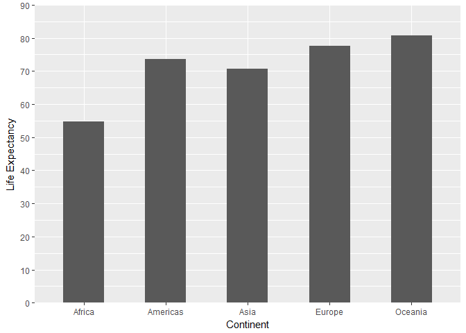
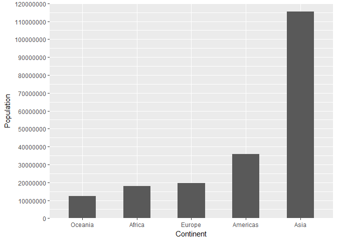
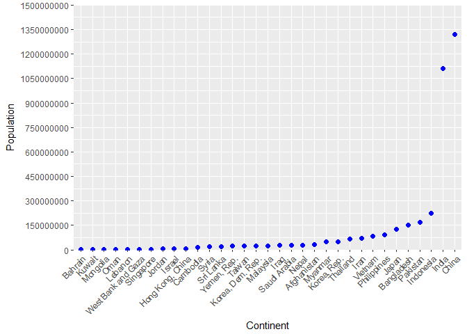
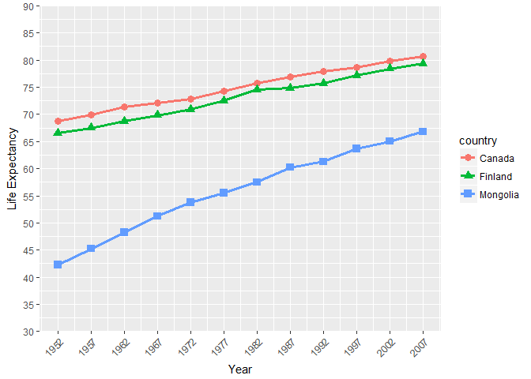

Homework Two
================

#### Begin by loading the relevant libraries

``` r
library(gapminder)
library(tidyverse)
```

#### Smell Test Questions

*1. Is it a data.frame, a matrix, a vector, a list?*

``` r
typeof(gapminder)
```

    ## [1] "list"

A list..

*2. What's its class?*

``` r
class(gapminder)
```

    ## [1] "tbl_df"     "tbl"        "data.frame"

A data frame (and more specifically a tibble data frame).

*3. How many variables/columns?*

``` r
ncol(gapminder)
```

    ## [1] 6

There are are 6 variables/columns

*4. How many rows/observations?*

``` r
nrow(gapminder)
```

    ## [1] 1704

There are 1704 rows/observations

*5. Can you get these facts about “extent” or “size” in more than one way? Can you imagine different functions being useful in different contexts?*

One simple way to quickly measure the number of rows and columns an object has is through the *dim* function.

``` r
dim(gapminder)
```

    ## [1] 1704    6

This output tells us the number of rows (1704) by columns (6) and is is useful if we need both pieces of information concurrently.

Another simple alternative is to use the *str* function.

``` r
str(gapminder)
```

    ## Classes 'tbl_df', 'tbl' and 'data.frame':    1704 obs. of  6 variables:
    ##  $ country  : Factor w/ 142 levels "Afghanistan",..: 1 1 1 1 1 1 1 1 1 1 ...
    ##  $ continent: Factor w/ 5 levels "Africa","Americas",..: 3 3 3 3 3 3 3 3 3 3 ...
    ##  $ year     : int  1952 1957 1962 1967 1972 1977 1982 1987 1992 1997 ...
    ##  $ lifeExp  : num  28.8 30.3 32 34 36.1 ...
    ##  $ pop      : int  8425333 9240934 10267083 11537966 13079460 14880372 12881816 13867957 16317921 22227415 ...
    ##  $ gdpPercap: num  779 821 853 836 740 ...

The output here tells us a great deal about the data frame, but if we look to the top right it reads *1704 obs. of 6 variables*.

A slightly different approach is identifying the number of unique observations for a specific variable of interest. This can be done through the *n\_distinct* function.

``` r
n_distinct(gapminder$pop)
```

    ## [1] 1704

*6. What data type is each variable?*

To answer this question we can use the *str* function.

``` r
str(gapminder)
```

    ## Classes 'tbl_df', 'tbl' and 'data.frame':    1704 obs. of  6 variables:
    ##  $ country  : Factor w/ 142 levels "Afghanistan",..: 1 1 1 1 1 1 1 1 1 1 ...
    ##  $ continent: Factor w/ 5 levels "Africa","Americas",..: 3 3 3 3 3 3 3 3 3 3 ...
    ##  $ year     : int  1952 1957 1962 1967 1972 1977 1982 1987 1992 1997 ...
    ##  $ lifeExp  : num  28.8 30.3 32 34 36.1 ...
    ##  $ pop      : int  8425333 9240934 10267083 11537966 13079460 14880372 12881816 13867957 16317921 22227415 ...
    ##  $ gdpPercap: num  779 821 853 836 740 ...

##### Doing so find:

-   country: Factor (with 142 levels)
-   continent: Factor (with 5 levels)
-   year: Integer
-   lifeExp: Numeric
-   pop: Integer
-   gdpPercap: Numeric

Alternatively if one is only interested in a specific variable the output can be made a little more precise and less cluttered by using the class function.

``` r
class(gapminder$gdpPercap)
```

    ## [1] "numeric"

#### Exploring Data Variables

*1. Pick at least one categorical variable and at least one quantitative variable to explore.*

We will pick ***continent*** as our categorical variable and for our quantitative variables ***lifeExp*** and ***population***.

For the purpose of our own investigation we will focus on the most recent statistics available in the gapminder data set, that is, data collected in 2007.

We can in turn simplify the data set to contain only 2007 statistics by using the *filter* function. One small note, if you forgot what the most recent year of data collection was, the *max* function is handy here.

``` r
gapminder2007 <- gapminder %>%
          filter(year == max(gapminder$year))
```

*2. What are possible values (or range, whichever is appropriate) of each variable?*

Let's consider our qualitative variable first. Using the *str* function we previously found that ***continent*** is a factor with five levels.

``` r
str(gapminder2007$continent)
```

    ##  Factor w/ 5 levels "Africa","Americas",..: 3 4 1 1 2 5 4 3 3 4 ...

What are these five levels? To identify them we can use the *levels* function.

``` r
levels(gapminder2007$continent)
```

    ## [1] "Africa"   "Americas" "Asia"     "Europe"   "Oceania"

By doing so, we find that ***continent*** is composed of *Africa*, *Americas*, *Asia*, *Europe* and *Oceania*.

Next Lets look at our quantitative variables ***lifeExp*** and ***pop***. Let's focus on life expectancy first and calculate what the mean expectancy is for each continent. We can do this through the *piping*, *group\_by* and *summarize* functions.

``` r
gapminder2007 %>%
    group_by(continent) %>% 
    summarize(meanLife=mean(lifeExp))
```

    ## # A tibble: 5 x 2
    ##   continent meanLife
    ##      <fctr>    <dbl>
    ## 1    Africa 54.80604
    ## 2  Americas 73.60812
    ## 3      Asia 70.72848
    ## 4    Europe 77.64860
    ## 5   Oceania 80.71950

We find that Oceania has the highest life expectancy at 81 years and Africa has the lowest with 55 years. The other continents fall within this range, although interestingly none of them have a life expectancy within the 60s. Through *ggplot2* we can and visually capture this dispersion.

``` r
library(ggplot2)
fig1 <- ggplot(gapminder2007, aes(x = continent, y = lifeExp))
fig1 + stat_summary(fun.y = mean, geom = "bar", width = .5) + #allows us to take the mean population value and represent it with a bar, width controls bar size
  xlab("Continent") + #renames our X axis
  ylab("Life Expectancy") + #renames our y axis
  coord_cartesian(ylim = c(0, 90)) + #speficies our range of values
  scale_y_continuous( expand= c(0,0), breaks=seq(0,90,10)) #allows us to control y axis increments
```



Before moving on let's ask what across continents seems to the the most frequent life expectancy. This can be accomplished through the *hist* function.

``` r
hist(gapminder2007$lifeExp)
```


70 and above seem to be the most frequently reported life expediencies. Likely many of the values below this associate with countries in Africa given its lower mean life expectancy found earlier.

Next we can consider our other quantitative variable ***population***. We will be a bit more nuanced this time by organizing our output in ascending mean population size. To do this we will adopt the *arrange* function.

``` r
gapminder2007 %>%
    group_by(continent) %>% 
    summarize(meanPop=mean(pop)) %>%
    arrange((meanPop))
```

    ## # A tibble: 5 x 2
    ##   continent   meanPop
    ##      <fctr>     <dbl>
    ## 1   Oceania  12274974
    ## 2    Africa  17875763
    ## 3    Europe  19536618
    ## 4  Americas  35954847
    ## 5      Asia 115513752

Asia very clearly is the most populated continent. The mean population of Asia is over 50,000,000 more than the next most populated continent America. The least populated continent is Oceania.

Let us create a figure to visually depict this magnitude of difference between Asia and other continents. Like our output above we can have population size appear in ascending order by using the *reorder* function.

``` r
options(scipen=10000) #This lets use exact values for our y-axis (as opposed to scientific notation)
fig2 <- ggplot(gapminder2007, aes(x = reorder(continent, pop), y = pop)) #x = variable of interest sorted by another varible
fig2 + stat_summary(fun.y = mean, geom = "bar", width = .5) +
  xlab("Continent") +
  ylab("Population") +
  coord_cartesian(ylim = c(0, 120000000)) +
  scale_y_continuous( expand= c(0,0), breaks=seq(0,120000000,10000000))
```



Seeing such a stark difference inspires one to dig deeper. In what country resides the majority of the Asia? To find this we may *filter* to only include Asia, and then select from this different countries and their populations with the *select* function. Lastly to find the most populated country we can *arrange* the data in descending order of population size. Because we are only interested in the most populated cities we will limit our output to the top 3 countries through the *head* function.

``` r
gapminder2007 %>% 
  filter(continent == "Asia") %>% 
  select(country, pop) %>%
  arrange(desc(pop)) %>% #by default arrange uses ascending order unless specified
  head(3)
```

    ## # A tibble: 3 x 2
    ##     country        pop
    ##      <fctr>      <int>
    ## 1     China 1318683096
    ## 2     India 1110396331
    ## 3 Indonesia  223547000

In 2007 the most populated countries in Asia were China, India and Indonesia. Just how much more populated were these countries? A figure here can help put this into perspective. To differentiate this figure from previous ones looking at continents we will use a scatter plot. We can do this with the the *geom\_point* function.

``` r
gapminder2007 %>% 
  filter(continent == "Asia") %>% 
  ggplot(aes(x=reorder(country, pop), y=pop)) + 
         geom_point(colour = "blue", size = 2) + #we can control the size and color of our data points
          xlab("Continent") +
          ylab("Country") +
          theme(axis.text.x=element_text(angle=45,hjust=1)) + #this lets us tilt and move our y axis labels, otherwise they overlap and clutter
          coord_cartesian(ylim = c(0,1500000000)) +
          scale_y_continuous( expand= c(0,0), breaks=seq(0,1500000000,150000000))
```



Seeing the figure very clearly shows that China and India are massively more populated than any other country in Asia. Indonesia on the other hand while being the third most populated, seems more comparable to other countries than either China or India.

Before advancing on I now wish to conduct an analysis of more personal interest. How has the life expectancy of Russia and Canada differed through the years? Because we are now going to look at numerous study years we will use the original gapminder (and not gapminder2007) data set.

First, let us ensure that both countries are recorded within the data set. We can test for this using the *unique* function.

``` r
unique(gapminder$country)
```

    ##   [1] Afghanistan              Albania                 
    ##   [3] Algeria                  Angola                  
    ##   [5] Argentina                Australia               
    ##   [7] Austria                  Bahrain                 
    ##   [9] Bangladesh               Belgium                 
    ##  [11] Benin                    Bolivia                 
    ##  [13] Bosnia and Herzegovina   Botswana                
    ##  [15] Brazil                   Bulgaria                
    ##  [17] Burkina Faso             Burundi                 
    ##  [19] Cambodia                 Cameroon                
    ##  [21] Canada                   Central African Republic
    ##  [23] Chad                     Chile                   
    ##  [25] China                    Colombia                
    ##  [27] Comoros                  Congo, Dem. Rep.        
    ##  [29] Congo, Rep.              Costa Rica              
    ##  [31] Cote d'Ivoire            Croatia                 
    ##  [33] Cuba                     Czech Republic          
    ##  [35] Denmark                  Djibouti                
    ##  [37] Dominican Republic       Ecuador                 
    ##  [39] Egypt                    El Salvador             
    ##  [41] Equatorial Guinea        Eritrea                 
    ##  [43] Ethiopia                 Finland                 
    ##  [45] France                   Gabon                   
    ##  [47] Gambia                   Germany                 
    ##  [49] Ghana                    Greece                  
    ##  [51] Guatemala                Guinea                  
    ##  [53] Guinea-Bissau            Haiti                   
    ##  [55] Honduras                 Hong Kong, China        
    ##  [57] Hungary                  Iceland                 
    ##  [59] India                    Indonesia               
    ##  [61] Iran                     Iraq                    
    ##  [63] Ireland                  Israel                  
    ##  [65] Italy                    Jamaica                 
    ##  [67] Japan                    Jordan                  
    ##  [69] Kenya                    Korea, Dem. Rep.        
    ##  [71] Korea, Rep.              Kuwait                  
    ##  [73] Lebanon                  Lesotho                 
    ##  [75] Liberia                  Libya                   
    ##  [77] Madagascar               Malawi                  
    ##  [79] Malaysia                 Mali                    
    ##  [81] Mauritania               Mauritius               
    ##  [83] Mexico                   Mongolia                
    ##  [85] Montenegro               Morocco                 
    ##  [87] Mozambique               Myanmar                 
    ##  [89] Namibia                  Nepal                   
    ##  [91] Netherlands              New Zealand             
    ##  [93] Nicaragua                Niger                   
    ##  [95] Nigeria                  Norway                  
    ##  [97] Oman                     Pakistan                
    ##  [99] Panama                   Paraguay                
    ## [101] Peru                     Philippines             
    ## [103] Poland                   Portugal                
    ## [105] Puerto Rico              Reunion                 
    ## [107] Romania                  Rwanda                  
    ## [109] Sao Tome and Principe    Saudi Arabia            
    ## [111] Senegal                  Serbia                  
    ## [113] Sierra Leone             Singapore               
    ## [115] Slovak Republic          Slovenia                
    ## [117] Somalia                  South Africa            
    ## [119] Spain                    Sri Lanka               
    ## [121] Sudan                    Swaziland               
    ## [123] Sweden                   Switzerland             
    ## [125] Syria                    Taiwan                  
    ## [127] Tanzania                 Thailand                
    ## [129] Togo                     Trinidad and Tobago     
    ## [131] Tunisia                  Turkey                  
    ## [133] Uganda                   United Kingdom          
    ## [135] United States            Uruguay                 
    ## [137] Venezuela                Vietnam                 
    ## [139] West Bank and Gaza       Yemen, Rep.             
    ## [141] Zambia                   Zimbabwe                
    ## 142 Levels: Afghanistan Albania Algeria Angola Argentina ... Zimbabwe

While Canada is quickly spotted, Russia seems absent. Perhaps though, we simply missed seeing it. We can more thoroughly determine whether Russia is in the data set by assigning a value of *TRUE* to any country titled "Russia". We can then use the *any* function will discern whether at least one value is true.

``` r
Is_Russia_Here <- gapminder$country == "Russia"
any(Is_Russia_Here)
```

    ## [1] FALSE

Russia, at least spelt as "Russia" is not in the current data set. Instead, let us consider a few different but at least neighboring countries in Finland and Mongolia. Let us check if either can be found in the data set.

``` r
Is_Finland_Here <- gapminder$country == "Finland"
any(Is_Finland_Here)
```

    ## [1] TRUE

``` r
Is_Mongolia_Here <- gapminder$country == "Mongolia" 
any(Is_Mongolia_Here)
```

    ## [1] TRUE

Both Finland and Mongolia are recorded and with that let us compare their life expectancy to Canada. This time we will explore shape and color within the *aes* function. Using the *cord\_cartesian* and *scale\_y\_continuous* functions we will also specify what years we want the y axis to begin and end.

``` r
gapminder %>% 
  filter(country == "Canada" | country == "Finland" | country == "Mongolia") %>%
         ggplot(aes(x=year, y=lifeExp, shape = country, color = country)) + #Here we change shape and color
         stat_summary(fun.y = mean, geom = "line", size = 1.25) +
         geom_point(size = 3) +
          xlab("Year") +
          ylab("Life Expectancy") +
          coord_cartesian(ylim = c(30,90), xlim = c(1952,2007)) + #Study start and end time
          scale_y_continuous( expand= c(0,0), breaks=seq(30,90,5)) + 
          scale_x_continuous(breaks=seq(1952,2007,5)) + #Increments of 5 years
         theme(axis.text.x=element_text(angle=45,hjust=1)) 
```



Viewing this figure reveals that while all countries have shown life expectancy increases over time, Mongolia overall has a starkly lower life expectancy than either Canada or Finland. Canada and Finland alternatively seem highly comparable, with Canada pushing slightly ahead.

#### But I want to do more!

*Evaluate this code and describe the result. Presumably the analyst’s intent was to get the data for Rwanda and Afghanistan. Did they succeed? Why or why not? If not, what is the correct way to do this?*

``` r
filter(gapminder, country == c("Rwanda", "Afghanistan"))
```

    ## # A tibble: 12 x 6
    ##        country continent  year lifeExp      pop gdpPercap
    ##         <fctr>    <fctr> <int>   <dbl>    <int>     <dbl>
    ##  1 Afghanistan      Asia  1957  30.332  9240934  820.8530
    ##  2 Afghanistan      Asia  1967  34.020 11537966  836.1971
    ##  3 Afghanistan      Asia  1977  38.438 14880372  786.1134
    ##  4 Afghanistan      Asia  1987  40.822 13867957  852.3959
    ##  5 Afghanistan      Asia  1997  41.763 22227415  635.3414
    ##  6 Afghanistan      Asia  2007  43.828 31889923  974.5803
    ##  7      Rwanda    Africa  1952  40.000  2534927  493.3239
    ##  8      Rwanda    Africa  1962  43.000  3051242  597.4731
    ##  9      Rwanda    Africa  1972  44.600  3992121  590.5807
    ## 10      Rwanda    Africa  1982  46.218  5507565  881.5706
    ## 11      Rwanda    Africa  1992  23.599  7290203  737.0686
    ## 12      Rwanda    Africa  2002  43.413  7852401  785.6538

This code only partially collected the data the researcher was after. One hint of this can be found by looking at the years of data collection for each country. The gapminder data set consists of data collected every five years, starting in 1952 and ending in 2007. However, looking at output where is Afghanistan for the year 1952? Or Rwanda for the year 1957?

A pattern quickly becomes evident, data is being delivered in increments of decades for each country. That is, we have Afghanistan data for 1957, 1967, 1977, 1987, 1997 and 2007. For Rwanda we have data from 1952, 1962, 1972, 1982, 1992, and 2002.

*Extra: One other way of double-checking is to consider that because each country was samplied 12 times, we should have a total of 24 observations (12 for Rwanda and 12 for Afghanistan). However when we use the dim function, instead of obtaining 24 rows, we instead have only 12.*

``` r
filter(gapminder, country == c("Rwanda", "Afghanistan")) %>%
dim()
```

    ## [1] 12  6

How can we correct for this mistake? Lets try re-running this code using the *|* operator which specifies that either *a* or *b* is true.

``` r
RA <-filter(gapminder, country == "Rwanda" | country == "Afghanistan") 
dim(RA)
```

    ## [1] 24  6

``` r
RA
```

    ## # A tibble: 24 x 6
    ##        country continent  year lifeExp      pop gdpPercap
    ##         <fctr>    <fctr> <int>   <dbl>    <int>     <dbl>
    ##  1 Afghanistan      Asia  1952  28.801  8425333  779.4453
    ##  2 Afghanistan      Asia  1957  30.332  9240934  820.8530
    ##  3 Afghanistan      Asia  1962  31.997 10267083  853.1007
    ##  4 Afghanistan      Asia  1967  34.020 11537966  836.1971
    ##  5 Afghanistan      Asia  1972  36.088 13079460  739.9811
    ##  6 Afghanistan      Asia  1977  38.438 14880372  786.1134
    ##  7 Afghanistan      Asia  1982  39.854 12881816  978.0114
    ##  8 Afghanistan      Asia  1987  40.822 13867957  852.3959
    ##  9 Afghanistan      Asia  1992  41.674 16317921  649.3414
    ## 10 Afghanistan      Asia  1997  41.763 22227415  635.3414
    ## # ... with 14 more rows

The dimensions appear correct, 24 observations (12 per country) for 6 variables and the output at least on first glance seems to contain the desired information. Lets create a table with this output and examine if we have everything we want. To do so we will use *knitr::kable()*

``` r
filter(gapminder, country == "Rwanda" | country == "Afghanistan") %>%
knitr::kable(digits = 2, col.names=c("Country","Continent","Year","Life Expectancy","Population","GDP per Capita")) #Let's also round to 2 decimals places and rename our variables so they look nice.
```

| Country     | Continent |  Year|  Life Expectancy|  Population|  GDP per Capita|
|:------------|:----------|-----:|----------------:|-----------:|---------------:|
| Afghanistan | Asia      |  1952|            28.80|     8425333|          779.45|
| Afghanistan | Asia      |  1957|            30.33|     9240934|          820.85|
| Afghanistan | Asia      |  1962|            32.00|    10267083|          853.10|
| Afghanistan | Asia      |  1967|            34.02|    11537966|          836.20|
| Afghanistan | Asia      |  1972|            36.09|    13079460|          739.98|
| Afghanistan | Asia      |  1977|            38.44|    14880372|          786.11|
| Afghanistan | Asia      |  1982|            39.85|    12881816|          978.01|
| Afghanistan | Asia      |  1987|            40.82|    13867957|          852.40|
| Afghanistan | Asia      |  1992|            41.67|    16317921|          649.34|
| Afghanistan | Asia      |  1997|            41.76|    22227415|          635.34|
| Afghanistan | Asia      |  2002|            42.13|    25268405|          726.73|
| Afghanistan | Asia      |  2007|            43.83|    31889923|          974.58|
| Rwanda      | Africa    |  1952|            40.00|     2534927|          493.32|
| Rwanda      | Africa    |  1957|            41.50|     2822082|          540.29|
| Rwanda      | Africa    |  1962|            43.00|     3051242|          597.47|
| Rwanda      | Africa    |  1967|            44.10|     3451079|          510.96|
| Rwanda      | Africa    |  1972|            44.60|     3992121|          590.58|
| Rwanda      | Africa    |  1977|            45.00|     4657072|          670.08|
| Rwanda      | Africa    |  1982|            46.22|     5507565|          881.57|
| Rwanda      | Africa    |  1987|            44.02|     6349365|          847.99|
| Rwanda      | Africa    |  1992|            23.60|     7290203|          737.07|
| Rwanda      | Africa    |  1997|            36.09|     7212583|          589.94|
| Rwanda      | Africa    |  2002|            43.41|     7852401|          785.65|
| Rwanda      | Africa    |  2007|            46.24|     8860588|          863.09|

The researcher now has all the desired relevant information.
