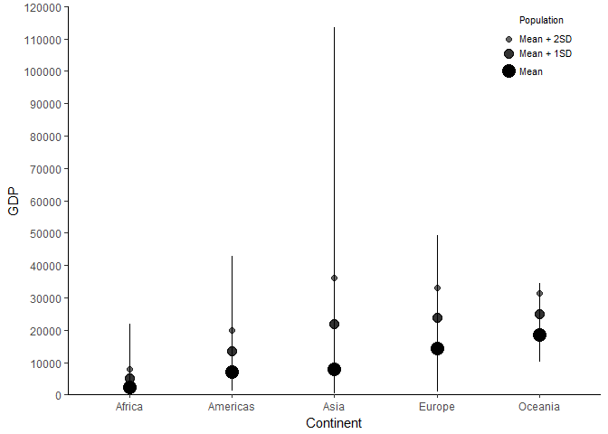
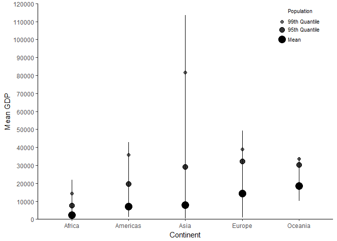
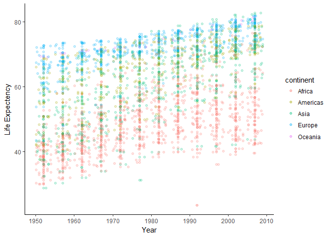
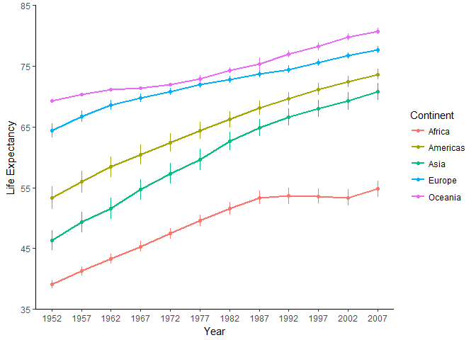
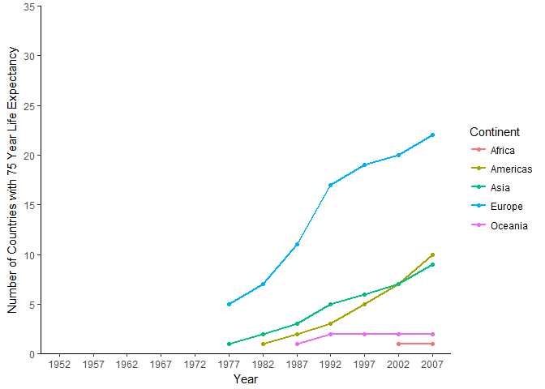
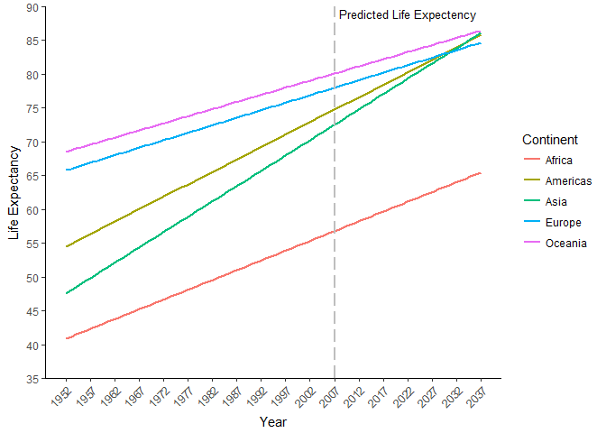

Homework Three
================

#### Begin by loading the relevant libraries

``` r
library(gapminder)
library(tidyverse)
```

*1. Get the maximum and minimum of GDP per capita for all continents.*

To obtain these values we will first group our data by continent. Then we can use the summarize function and create two new variables titled maxGDP and minGDP which will have our desired statistics.

``` r
gapminder %>%
    group_by(continent) %>% 
    summarize(minGDP = min(gdpPercap), maxGDP = max(gdpPercap)) %>%
    knitr::kable(format="markdown") #creates a table with our thus far output
```

| continent |      minGDP|     maxGDP|
|:----------|-----------:|----------:|
| Africa    |    241.1659|   21951.21|
| Americas  |   1201.6372|   42951.65|
| Asia      |    331.0000|  113523.13|
| Europe    |    973.5332|   49357.19|
| Oceania   |  10039.5956|   34435.37|

A few notes can be taken from this table. For instance, Oceania has the largest minimum GDP and this value is substantially larger than the minimum GDP of other continents. Africa on the other hand has the smallest minimum and maximum GDP.

*2. Look at the spread of GDP per capita within the continents.*

One somewhat blunt method of capturing GDP spread is to calculate a range for each continent. To do this subtract a continent's maximum GDP by minimum GDP and this resulting value captures that data set range. We will call this variable rangeGDP. We can also look at the mean GDP of each continent to measure what GDP value seems most representative of a given continent.

In addition to these two variables we can calculate more nuanced and informative measures of data spread via variance and standard deviation. Variance will provide us a numeric value describing how far data points are from their respective mean whereas the standard deviation is the square root of variance and can be helpful for data segmentation. We will call these variables varGDP and sdGDP

``` r
gapminder %>%
    group_by(continent) %>% 
    summarize(rangeGDP = max(gdpPercap) - min(gdpPercap), MeanGDP = mean(gdpPercap), varGDP = var(gdpPercap),        sdGDP = sd(gdpPercap)) %>%
    knitr::kable(format="markdown")
```

| continent |   rangeGDP|    MeanGDP|     varGDP|      sdGDP|
|:----------|----------:|----------:|----------:|----------:|
| Africa    |   21710.05|   2193.755|    7997187|   2827.930|
| Americas  |   41750.02|   7136.110|   40918591|   6396.764|
| Asia      |  113192.13|   7902.150|  197272506|  14045.373|
| Europe    |   48383.66|  14469.476|   87520020|   9355.213|
| Oceania   |   24395.77|  18621.609|   40436669|   6358.983|

From these values we can see that Asia has the largest range, variance and standard deviation. The range for of Asia for instance is over two fold larger than the range of any other continent. These values inform us that the data points which make up Asia tend to be more dispersed and cover a broad band of values relative to other continents. Africa for instance by way of comparison has the smallest range, variance and standard deviation.

Strictly seeing and deciphering these values from a table however might not be as informative, or visually appealing, as relying on a figure. Let us create one that attempts to represent the data spread of each continent.

``` r
#Aesthetic preferences set for all future figures.
aesthetictheme = theme(panel.grid.major = element_blank(), 
                panel.grid.minor = element_blank(), 
                panel.background = element_blank(), 
                legend.key = element_blank(),
                axis.line = element_line(color = "black"))

options(scipen=10000) #Allows for our y-axis to be exact values (as opposed to scientific notation)

#Preparing the data
  gapminder %>%
  group_by(continent) %>% 
  summarize(meanGDP=mean(gdpPercap), maxGDP = max(gdpPercap), minGDP = min(gdpPercap), SD_GDP =sd(gdpPercap)) %>%
  mutate(MeanPlusSD = meanGDP + SD_GDP) %>% #Create a variable that is mean GDP plus 1 SD
  mutate(MeanPlus2SD = MeanPlusSD + SD_GDP) %>% #Create a variable that is meanGDP plus 2 SD

#Graphing the data    
  ggplot(aes(y = meanGDP, x =continent)) +
  geom_errorbar(aes(x = continent, ymin = minGDP, ymax = maxGDP, width = 0)) + #How range is represented
  geom_point(aes(x = continent, y = meanGDP), size = 5) + #Mean GDP of each continent
  geom_point(aes(x = continent, y = MeanPlusSD), size = 3.5, alpha = .8) +  #Mean GDP + 1SD
  geom_point(aes(x = continent, y = MeanPlus2SD), size = 2, alpha = .6) + #Mean GDP + 2 SD
  scale_y_continuous(expand= c(0,0), breaks=seq(0,120000,10000), lim = c(0,120000)) +  #Set y axis range
  xlab("Continent") + #Title X axis
  ylab("GDP") + #Title Y axis
    
#Creating a legend   
  annotate(geom = "point", x = 4.7, y = 100000, size = 5, color = "black") + 
  annotate(geom = "point", x = 4.7, y = 105500, size = 3.5, color = "black", alpha = .8)+
  annotate(geom = "point", x = 4.7, y = 110000, size = 2, color = "black", alpha = .6)+
  annotate(geom = "text", x = 4.8, y = c(115000,99000, 104500,109000), size = 3, color = "black", label =         c("Population","Mean","Mean + 1SD", "Mean + 2SD"), hjust = 0, vjust = 0)+
  aesthetictheme #Predesignated themes
```



Within this figure the range of each continent is captured by vertical line length. This allows for quick and visible differences between the continents. Asia for instance clearly spans a much wider range of data than does Oceania.

On top of each line are three circles, as also shown in the top right legend of the figure. The largest and most dark circle represents mean GDP, as evident Oceania has the largest mean GDP. Above this circle is another that is smaller and lighter, this represents mean GDP plus one standard deviation. By doing this we can see how much distance one standard deviation covers per continent. The distance between these three data points is visible largest for Asia, again supporting the claim that Asia has the greatest data spread.

*Side note for those who are concerned about the use of standard deviations: Some might argue that given the nature of the data, visually representing standard deviations in such a way might be problematic. For instance, any continent mean minus one standard deviation results in a value that does not exisit within the empirical data. As one imperfect alternative, a graph below is provided that instead of standard deviations uses quantiles. A similar conclusion is reached that Asia has the largest data spread.*

``` r
#Preparing the data  
  gapminder %>%
  group_by(continent) %>% 
  summarize(meanGDP=mean(gdpPercap), maxGDP = max(gdpPercap), minGDP = min(gdpPercap), q95 = quantile(gdpPercap, .95), q99 = quantile(gdpPercap, .99)) %>%

#Graphing the data
  ggplot(aes(y  = meanGDP)) +
  geom_errorbar(aes(x = continent, ymin = minGDP, ymax = maxGDP, width = 0)) +
  geom_point(aes(x = continent, y = meanGDP), size = 5) +
  geom_point(aes(x = continent, y = q95), size = 3.5, alpha = .8) +
  geom_point(aes(x = continent, y = q99), size = 2, alpha = .6) +
  coord_cartesian(ylim = c(0,120000)) +
  scale_y_continuous(expand= c(0,0), breaks=seq(0,120000,10000), lim = c(0,120000)) +  
  xlab("Continent") +
  ylab("Mean GDP") +
  
#Creating the legend  
  annotate(geom = "point", x = 4.7, y = 100000, size = 5, color = "black") +
  annotate(geom = "point", x = 4.7, y = 105500, size = 3.5, color = "black", alpha = .8)+
  annotate(geom = "point", x = 4.7, y = 110000, size = 2, color = "black", alpha = .6)+
  annotate(geom = "text", x = 4.8, y = c(115000, 99000, 104500,109000), size = 3, color = "black", label = c("Population","Mean",      "95th Quantile", "99th Quantile"), hjust = 0, vjust = 0)+
  aesthetictheme
```



*3. Compute a trimmed mean of life expectancy for different years. Or a weighted mean, weighting by population. Just try something other than the plain vanilla mean.*

Some argue that the use of a trimmed mean can be beneficial in specific instances. For instance, if we expect extreme data values within our data set (far too small or far too large) a trimmed mean might remove the capability of these values to bias or unfairly influence our understanding of the data. Let us create a table in which mean life expectancy is shown for every year of study measurement. Then lets compliment this with a 5%, 10% and 50% trimmed mean.

``` r
#Preparing the data
gapminder %>%
group_by(year) %>%
summarize(MeanLife = mean(lifeExp), Trim5 = mean(lifeExp, trim = .05), Trim10 = mean(lifeExp, trim = .10), Trim50 = mean(lifeExp, trim = .50)) %>% #Trims off x percentage of highest and lowest values. %>%
knitr::kable(format="markdown")
```

|  year|  MeanLife|     Trim5|    Trim10|   Trim50|
|-----:|---------:|---------:|---------:|--------:|
|  1952|  49.05762|  48.84636|  48.57668|  45.1355|
|  1957|  51.50740|  51.41927|  51.26888|  48.3605|
|  1962|  53.60925|  53.63838|  53.58075|  50.8810|
|  1967|  55.67829|  55.80484|  55.86538|  53.8250|
|  1972|  57.64739|  57.85226|  58.01444|  56.5300|
|  1977|  59.57016|  59.88981|  60.10206|  59.6720|
|  1982|  61.53320|  61.85009|  62.11694|  62.4415|
|  1987|  63.21261|  63.60734|  63.92106|  65.8340|
|  1992|  64.16034|  64.80741|  65.18519|  67.7030|
|  1997|  65.01468|  65.56467|  66.01736|  69.3940|
|  2002|  65.69492|  66.19818|  66.71641|  70.8255|
|  2007|  67.00742|  67.56459|  68.11489|  71.9355|

Quickly scanning this table, mean life expectancy, as well as trimmed 5% and 10% all seem roughly comparable with one another. Trimmed 50% however (and unsurprisingly given the large trim) deviates from these. Let us capture this through a figure, although for the sake of visual clutter we will skip the 10% trim.

``` r
#Preparing the data
gapminder %>%
group_by(year) %>%
summarize(MeanLife = mean(lifeExp), Trim5 = mean(lifeExp, trim = .05), Trim10 = mean(lifeExp, trim = .10), Trim50 = mean(lifeExp, trim = .50)) %>% #Trims off x percentage of highest and lowest values. 

#Graphing the data
ggplot(aes(y = MeanLife, x = year)) +
geom_point(color = "black") +
geom_smooth(method = 'loess', color = "black", se = "FALSE") +
geom_point(aes(y = Trim10), color = "red")+
geom_smooth(aes(y=Trim10), se = "FALSE", method = 'loess', color = "red")+
geom_point(aes(y = Trim50), color = "green")+
geom_smooth(aes(y=Trim50), se = "FALSE", method = 'loess', color = "green") +
scale_y_continuous(expand= c(0,0), breaks=seq(40,80,10), lim = c(40,80)) +
scale_x_continuous(expand= c(0,0), breaks=seq(1952,2011,5), lim = c(1952,2012.5)) +  #Set range and axis increments to be every 5 years to match empirical data 
xlab("Year") +
ylab("Life Expectency") +
  
#Title the different means  
annotate("text", x = 2009, y = 67, size = 3, label = "Mean") +
annotate("text", x = 2010, y = 68, size = 3, color = "red", label = "10% Trim") +
annotate("text", x = 2010, y = 72, size = 3, color = "green", label = "50% Trim") +
aesthetictheme
```


The mean and 5% trimmed life expectancy across years are highly comparable. The trimmed 50% however is expectedly less accurate, but, somewhat more intriguing is it is inaccurate in both directions. For earlier study years the 50% trimmed mean underestimates life expectancy and for the latter years life expectancy is overestimated.

*4. How is life expectancy changing over time on different continents?*

A scatter plot may be helpful in answering this question.

``` r
gapminder %>%
ggplot(aes(y = lifeExp, x = year, group = continent, colour = continent)) +
geom_jitter(alpha = .20)+
geom_point(alpha = .20)+
aesthetictheme
```



Despite the use of jitter and transparency however data points tightly cluster and are difficult to separate and it is difficult to identify which point belongs to which continent. A step forward would be to use summary statistics instead of individual data points. In the table below each continent's mean life expectancy and standard deviation are provided for all study years.

``` r
gapminder %>%
group_by(continent, year) %>%
  summarize(meanLife = mean(lifeExp), sdLife = sd(lifeExp)) %>%
knitr::kable(format="markdown")
```

| continent |  year|  meanLife|      sdLife|
|:----------|-----:|---------:|-----------:|
| Africa    |  1952|  39.13550|   5.1515814|
| Africa    |  1957|  41.26635|   5.6201229|
| Africa    |  1962|  43.31944|   5.8753639|
| Africa    |  1967|  45.33454|   6.0826726|
| Africa    |  1972|  47.45094|   6.4162583|
| Africa    |  1977|  49.58042|   6.8081974|
| Africa    |  1982|  51.59287|   7.3759401|
| Africa    |  1987|  53.34479|   7.8640891|
| Africa    |  1992|  53.62958|   9.4610710|
| Africa    |  1997|  53.59827|   9.1033866|
| Africa    |  2002|  53.32523|   9.5864959|
| Africa    |  2007|  54.80604|   9.6307807|
| Americas  |  1952|  53.27984|   9.3260819|
| Americas  |  1957|  55.96028|   9.0331923|
| Americas  |  1962|  58.39876|   8.5035437|
| Americas  |  1967|  60.41092|   7.9091710|
| Americas  |  1972|  62.39492|   7.3230168|
| Americas  |  1977|  64.39156|   7.0694956|
| Americas  |  1982|  66.22884|   6.7208338|
| Americas  |  1987|  68.09072|   5.8019288|
| Americas  |  1992|  69.56836|   5.1671038|
| Americas  |  1997|  71.15048|   4.8875839|
| Americas  |  2002|  72.42204|   4.7997055|
| Americas  |  2007|  73.60812|   4.4409476|
| Asia      |  1952|  46.31439|   9.2917507|
| Asia      |  1957|  49.31854|   9.6354286|
| Asia      |  1962|  51.56322|   9.8206319|
| Asia      |  1967|  54.66364|   9.6509646|
| Asia      |  1972|  57.31927|   9.7227000|
| Asia      |  1977|  59.61056|  10.0221970|
| Asia      |  1982|  62.61794|   8.5352214|
| Asia      |  1987|  64.85118|   8.2037919|
| Asia      |  1992|  66.53721|   8.0755490|
| Asia      |  1997|  68.02052|   8.0911706|
| Asia      |  2002|  69.23388|   8.3745954|
| Asia      |  2007|  70.72848|   7.9637245|
| Europe    |  1952|  64.40850|   6.3610883|
| Europe    |  1957|  66.70307|   5.2958054|
| Europe    |  1962|  68.53923|   4.3024996|
| Europe    |  1967|  69.73760|   3.7997285|
| Europe    |  1972|  70.77503|   3.2405764|
| Europe    |  1977|  71.93777|   3.1210300|
| Europe    |  1982|  72.80640|   3.2182603|
| Europe    |  1987|  73.64217|   3.1696803|
| Europe    |  1992|  74.44010|   3.2097811|
| Europe    |  1997|  75.50517|   3.1046766|
| Europe    |  2002|  76.70060|   2.9221796|
| Europe    |  2007|  77.64860|   2.9798127|
| Oceania   |  1952|  69.25500|   0.1909188|
| Oceania   |  1957|  70.29500|   0.0494975|
| Oceania   |  1962|  71.08500|   0.2192031|
| Oceania   |  1967|  71.31000|   0.2969848|
| Oceania   |  1972|  71.91000|   0.0282843|
| Oceania   |  1977|  72.85500|   0.8980256|
| Oceania   |  1982|  74.29000|   0.6363961|
| Oceania   |  1987|  75.32000|   1.4142136|
| Oceania   |  1992|  76.94500|   0.8697413|
| Oceania   |  1997|  78.19000|   0.9050967|
| Oceania   |  2002|  79.74000|   0.8909545|
| Oceania   |  2007|  80.71950|   0.7290271|

This table contains the data we are interested in but given the size remains difficult to decipher. A final approach is taken to visually depict the mean life expectancy of each continent across study years. This plot is presented below, included are error bars which capture the mean +1 and -1 standard error. Standard errors were calculated through iterations of the mutate function (largely for the purpose of practice).

``` r
#Data preparation
gapminder %>%
group_by(continent, year) %>%
  summarize(meanLife = mean(lifeExp), sdLife = sd(lifeExp), observations = n_distinct(lifeExp)) %>%
  mutate(seLife = (sdLife / sqrt(observations))) %>%
  mutate(low_se = (meanLife - seLife)) %>%
  mutate(high_se = (meanLife + seLife)) %>%

#Graphing
  ggplot(aes(y = meanLife, x = year, colour = continent)) +
  geom_point() +
  geom_line(linetype = 1, size = 1) +
  geom_errorbar(aes(ymin = low_se, ymax = high_se, width = 0)) +
  coord_cartesian(ylim = c(35,85), xlim = c(1952,2007)) + #Study start and end time
  scale_y_continuous( expand= c(0,0), breaks=seq(35,85,10)) + 
  scale_x_continuous(breaks=seq(1952,2007,5))+  #Increments of 5 years
  xlab("Year") +
  ylab("Life Expectancy") +
  scale_colour_discrete(name = "Continent") + #Rename the legend title to capitalize continent
  aesthetictheme
```



Finally an answer is clearly visible, life expectancy has increased for all continents since study start. Some continents however showed greater growth than others. Asia and America for instance had greater life expectancy increase than Oceania and Europe. Intriguingly Oceania which began with the highest life expectancy had a relatively small increase in life expectancy through the duration of the study. Perhaps this implies that there exists an upper limit at which life expectancy increases in diminishing increments.

A note should be made on Africa. Although at study end life expectancy was at record high in Africa, this value still fell below the mean value most continents had at study start (e.g. in 2007 Africa had a lowest life expectancy than Europe). Furthermore, Africa unlike the other continents seems to have stagnated or even slightly dipped in life expectancy during the latter study years.

*5. Report the absolute and/or relative abundance of countries with low life expectancy over time by continent: Compute some measure of worldwide life expectancy – you decide – a mean or median or some other quantile or perhaps your current age. Then determine how many countries on each continent have a life expectancy less than this benchmark, for each year.*

As life expectancy has overall been increasing one reality that ought to be considered concerns aging populations. Although different studies might define old age differently for the purposes of the present exercise we will reference a [study](http://www.jstor.org/stable/2136414?seq=1#page_scan_tab_contents) where the oldest cohort were defined as 75+ years old. Critically, individuals from this older cohort have been found to differ on a myriad of measures from younger counterparts, including [health concerns](https://www.ncbi.nlm.nih.gov/pmc/articles/PMC2424085/) and [cognitive abilities](https://www.ncbi.nlm.nih.gov/pmc/articles/PMC3678827/). Identifying what the average life expectancy of a continent is thus pertains valuable information. Let us examine whether continent average life expectancy across study years surpassed the old-age threshold of 75+ years.

``` r
#Data preparation
gapminder %>%
group_by(continent, year) %>%
  summarize(meanLife = mean(lifeExp), sdLife = sd(lifeExp), observations = n_distinct(lifeExp)) %>%
  mutate(seLife = (sdLife / sqrt(observations))) %>%
  mutate(low_se = (meanLife - seLife)) %>%
  mutate(high_se = (meanLife + seLife)) %>%

#Graphing
  ggplot(aes(y = meanLife, x = year, colour = continent)) +
  geom_point() +
  geom_line(linetype = 1, size = 1) +
  geom_errorbar(aes(ymin = low_se, ymax = high_se, width = 0)) +
  coord_cartesian(ylim = c(35,85), xlim = c(1952,2009)) + #Study start and end time
  scale_y_continuous( expand= c(0,0), breaks=seq(35,85,10)) + 
  scale_x_continuous(breaks=seq(1952,2007,5))+  #Increments of 5 years
  geom_segment(x = 0, y = 75, yend=75, xend = 2007, color = "black") +
  xlab("Year") +
  ylab("Life Expectancy") +
  scale_colour_discrete(name = "Continent") +    
  annotate("text", x = 2009.5, y = c(75.5), size = 3, label = c("Old Age")) +
  aesthetictheme
```


Perhaps the broadest implication of this figure is that aging populations are a relatively recent phenomena with only two continents surpassing the old age cutoff of 75 years by study completion. These two continents being Europe and Oceania, which, also started the study with higher life expectancy than other continents.

From the above figure we have a general idea of continent trends. However, we can visually depict the exact number of countries within a continent reaching old age via the following code:

``` r
gapminder %>%
filter(lifeExp > 75) %>%
group_by(continent, year) %>%
summarize(NumCountriesAbove65 = n_distinct(country)) %>%
ggplot(aes(y = NumCountriesAbove65, x = year, colour = continent)) +
  geom_point()  +
  geom_line(linetype = 1, size = 1)   +
  scale_y_continuous(expand= c(0,0), breaks=seq(0,35,5), lim = c(0,35)) +  
  scale_x_continuous(breaks=seq(1952,2007,5), lim = c(1952,2007)) +
  xlab("Year") +
  ylab("Number of Countries with 75 Year Life Expectancy") +
  scale_colour_discrete(name = "Continent") +    
  aesthetictheme
```



From this figure we can note that no country prior to 1977 had a recorded mean life expectancy above 75 years. Interestingly countries in America, Oceania and Africa only began to reach a life expectancy mean above 75 years after 1982, 1987 and 2002 respectively. One thing to note is Oceania is represented by only 2 countries within the gapminder data set, these being Australia and New Zealand. Oceania then has hit its maximum cap on this figure unless more Oceania countries are measured.

*6. Find countries with interesting stories. Open-ended and, therefore, hard. Promising but unsuccessful attempts are encouraged. This will generate interesting questions to follow up on in class.*

An analysis of countries across study years has consistently yielded the same rank order for life expectancy (i.e. Across all study years Oceania always has the longest life expectancy, Europe the second longest, etc.). However can this rank order be expected to continue into future years? To answer this we can construct a regression equation for each continent and predict what future population might be expected.

``` r
#Data preparation
gapminder %>%
group_by(continent, year) %>%
  summarize(meanLife = mean(lifeExp)) %>%

#Graphing
  ggplot(aes(y = meanLife, x = year, colour = continent)) +
  geom_smooth(method="lm",fullrange=T, se = FALSE) + #full range true lets us extend our regression line to future years
  scale_y_continuous(expand= c(0,0), breaks=seq(35,90,5), lim = c(35,90)) +  
  scale_x_continuous(breaks=seq(1952,2037,5), lim = c(1952,2037)) +
  xlab("Year") +
  ylab("Life Expectancy")+
  geom_vline(xintercept = 2007, color = "grey", linetype = "longdash", size = 1) +
  annotate("text", x = 2022, y = 89, size = 3.5, color = "black", label = "Predicted Life Expectency") +
  theme(axis.text.x=element_text(angle=45,hjust=1)) +
  scale_colour_discrete(name = "Continent") +    
  aesthetictheme 
```



As noted above, the relative rank order of population has remained the same from the years 1952 to 2007. Now lets examine predicted life expectancy values. By the year 2037, life expectancy in Asia may surpass both America and Europe. By 2037 life expectancy in America is also expected to surpass Europe. Now although this disrupts the relative rank order of life expectancy, various cautions should be considered as well. First of course is that this figure is entirely for code demonstration and practice purposes. Second, it is possible that an upper bound exists for life expectancy, and that on reaching this bound the rate of life expectancy increase can be expected to diminish. This might mean continents become more comparable as life expectancy increases rather than an unrestricted growth rate. Perhaps one good addition here would be if more modern data exists comparable to the gapminder data, empirical values can be plotted and assessed for prediction accuracy.
