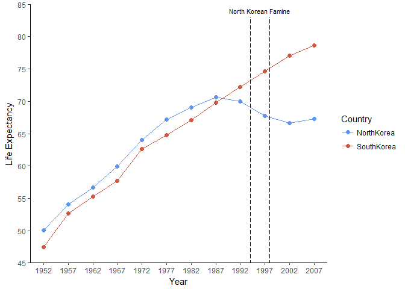
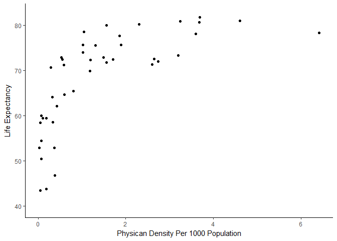
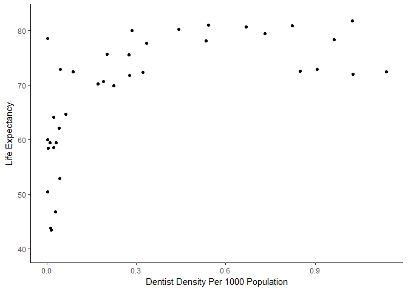
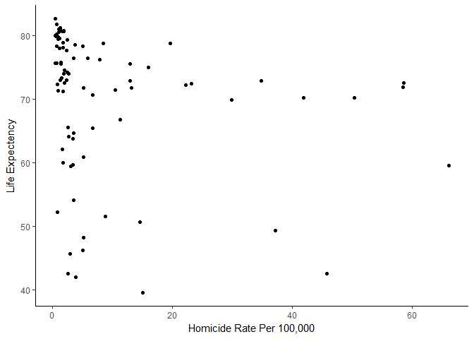

hw4
================

### Load relevant libraries

### General data reshaping and relationship to aggregation

*Activity \#2*

*Make a tibble with one row per year and columns for life expectancy for two or more countries.* *Use knitr::kable() to make this table look pretty in your rendered homework.* *Take advantage of this new data shape to scatter plot life expectancy for one country against that of another.*

To complete this question we will do a comparison of two relatively new countries that resulted from the splitting of Korea. These countries being the Democratic People's Republic of Korea and the Republic of Korea. While these are the official titles of both countries more colloquially they are often referred to as North Korea and South Korea. For this assignment I will use these latter names.

Let us first identify these countries within our data set

``` r
unique(gapminder$country)
```

    ##   [1] Afghanistan              Albania                 
    ##   [3] Algeria                  Angola                  
    ##   [5] Argentina                Australia               
    ##   [7] Austria                  Bahrain                 
    ##   [9] Bangladesh               Belgium                 
    ##  [11] Benin                    Bolivia                 
    ##  [13] Bosnia and Herzegovina   Botswana                
    ##  [15] Brazil                   Bulgaria                
    ##  [17] Burkina Faso             Burundi                 
    ##  [19] Cambodia                 Cameroon                
    ##  [21] Canada                   Central African Republic
    ##  [23] Chad                     Chile                   
    ##  [25] China                    Colombia                
    ##  [27] Comoros                  Congo, Dem. Rep.        
    ##  [29] Congo, Rep.              Costa Rica              
    ##  [31] Cote d'Ivoire            Croatia                 
    ##  [33] Cuba                     Czech Republic          
    ##  [35] Denmark                  Djibouti                
    ##  [37] Dominican Republic       Ecuador                 
    ##  [39] Egypt                    El Salvador             
    ##  [41] Equatorial Guinea        Eritrea                 
    ##  [43] Ethiopia                 Finland                 
    ##  [45] France                   Gabon                   
    ##  [47] Gambia                   Germany                 
    ##  [49] Ghana                    Greece                  
    ##  [51] Guatemala                Guinea                  
    ##  [53] Guinea-Bissau            Haiti                   
    ##  [55] Honduras                 Hong Kong, China        
    ##  [57] Hungary                  Iceland                 
    ##  [59] India                    Indonesia               
    ##  [61] Iran                     Iraq                    
    ##  [63] Ireland                  Israel                  
    ##  [65] Italy                    Jamaica                 
    ##  [67] Japan                    Jordan                  
    ##  [69] Kenya                    Korea, Dem. Rep.        
    ##  [71] Korea, Rep.              Kuwait                  
    ##  [73] Lebanon                  Lesotho                 
    ##  [75] Liberia                  Libya                   
    ##  [77] Madagascar               Malawi                  
    ##  [79] Malaysia                 Mali                    
    ##  [81] Mauritania               Mauritius               
    ##  [83] Mexico                   Mongolia                
    ##  [85] Montenegro               Morocco                 
    ##  [87] Mozambique               Myanmar                 
    ##  [89] Namibia                  Nepal                   
    ##  [91] Netherlands              New Zealand             
    ##  [93] Nicaragua                Niger                   
    ##  [95] Nigeria                  Norway                  
    ##  [97] Oman                     Pakistan                
    ##  [99] Panama                   Paraguay                
    ## [101] Peru                     Philippines             
    ## [103] Poland                   Portugal                
    ## [105] Puerto Rico              Reunion                 
    ## [107] Romania                  Rwanda                  
    ## [109] Sao Tome and Principe    Saudi Arabia            
    ## [111] Senegal                  Serbia                  
    ## [113] Sierra Leone             Singapore               
    ## [115] Slovak Republic          Slovenia                
    ## [117] Somalia                  South Africa            
    ## [119] Spain                    Sri Lanka               
    ## [121] Sudan                    Swaziland               
    ## [123] Sweden                   Switzerland             
    ## [125] Syria                    Taiwan                  
    ## [127] Tanzania                 Thailand                
    ## [129] Togo                     Trinidad and Tobago     
    ## [131] Tunisia                  Turkey                  
    ## [133] Uganda                   United Kingdom          
    ## [135] United States            Uruguay                 
    ## [137] Venezuela                Vietnam                 
    ## [139] West Bank and Gaza       Yemen, Rep.             
    ## [141] Zambia                   Zimbabwe                
    ## 142 Levels: Afghanistan Albania Algeria Angola Argentina ... Zimbabwe

Both countries are present and titled *Korea, Dem. Rep.* and *Korea, Rep.*. Let us respectively rename them to North Korea and South Korea with the code below.

``` r
levels(gapminder$country)[match("Korea, Dem. Rep.",levels(gapminder$country))] <- "NorthKorea"
levels(gapminder$country)[match("Korea, Rep.",levels(gapminder$country))] <- "SouthKorea"
```

Next, we can simplify our data set to two ways. First we can create a data set that contains solely our two countries of interest. Second, we can select only the specific variables of interested in, these being country, year and life expectancy. Once this is accomplished we can create a table to hold the resulting output.

``` r
gapminder %>%
filter(country == "NorthKorea" | country == "SouthKorea") %>%
select(country, year, lifeExp) %>%
kable(digits = 2, format="markdown",  col.names=c("Country","Year", "Life Expectency"), booktabs = T) 
```

| Country    |  Year|  Life Expectency|
|:-----------|-----:|----------------:|
| NorthKorea |  1952|            50.06|
| NorthKorea |  1957|            54.08|
| NorthKorea |  1962|            56.66|
| NorthKorea |  1967|            59.94|
| NorthKorea |  1972|            63.98|
| NorthKorea |  1977|            67.16|
| NorthKorea |  1982|            69.10|
| NorthKorea |  1987|            70.65|
| NorthKorea |  1992|            69.98|
| NorthKorea |  1997|            67.73|
| NorthKorea |  2002|            66.66|
| NorthKorea |  2007|            67.30|
| SouthKorea |  1952|            47.45|
| SouthKorea |  1957|            52.68|
| SouthKorea |  1962|            55.29|
| SouthKorea |  1967|            57.72|
| SouthKorea |  1972|            62.61|
| SouthKorea |  1977|            64.77|
| SouthKorea |  1982|            67.12|
| SouthKorea |  1987|            69.81|
| SouthKorea |  1992|            72.24|
| SouthKorea |  1997|            74.65|
| SouthKorea |  2002|            77.05|
| SouthKorea |  2007|            78.62|

The output appears as desired. However, it is a bit difficult to extract from this a meaningful interpretation. A visualization here would be helpful and so let us plot life expectancy over time for these two countries. In addition to this however we can include a key historical event that occurred in North Korea. During the years 1994 to 1998 North Korea experienced an extreme [famine](https://en.wikipedia.org/wiki/North_Korean_famine), we can capture this time period in our graph through the use of dotted vertical lines.

``` r
#My preferred aesthetic theme
a_theme = theme(panel.grid.major = element_blank(), 
                panel.grid.minor = element_blank(), 
                panel.background = element_blank(), 
                legend.key = element_blank(),
                axis.line = element_line(color = "black"))

#Data preparation
gapminder %>%
group_by(year) %>%
filter(country == "NorthKorea" | country == "SouthKorea") %>%
select(country, year, lifeExp) %>%
  
#Data plotting  
ggplot(aes(x = year, y = lifeExp, group = country))+
geom_point(aes(color = country), size = 2) + 
geom_line(aes(color = country))+
scale_color_manual(values=c("cornflowerblue", "coral3"), name = "Country")+ #Select colors I like
xlab("Year")+ #Rename X axis
ylab("Life Expectancy")+ #Rename Y Axis
geom_segment(x = 1994, xend = 1994, y = 0, yend=83,  color = "black", linetype = "longdash", size = .5) + #Starti of time window
geom_segment(x = 1998, xend = 1998, y = 0, yend=83,  color = "black", linetype = "longdash", size = .5) + #End of time window
annotate("text", x = 1996, y = 84, size = 3, color = "black", label = c("North Korean Famine")) +
scale_y_continuous(expand= c(0,0), breaks=seq(45,85,5), lim = c(45,85)) + #Set Y axis increments and range
scale_x_continuous(breaks=seq(1952,2007,5), lim = c(1952,2007)) + #Set X axis increments and range
a_theme
```



There are various points emerging from this figure. One broad note is that North Korea had a higher life expectancy than South Korea during the early study years. Over time however this changed. Starting in the early 1990's life expectancy in North Korea declined while in South Korea life expectancy continued to increase. During the time period of the North Korean Famine, and after, the divide between the two countries further grew and exasperated.

### Join, merge, look up

*Activity \#1*

*Create a second data frame, complementary to Gapminder. Join this with (part of) Gapminder using a dplyr join function and make some observations about the process and result. Explore the different types of joins. Examples of a second data frame you could build:*

*- One row per country, a country variable and one or more variables with extra info, such as language spoken, NATO membership, national animal, or capitol city. If you really want to be helpful, you could attempt to make a pull request to resolve this issue, where I would like to bring ISO country codes into the gapminder package.*

*- One row per continent, a continent variable and one or more variables with extra info, such as northern versus southern hemisphere.*

To address this question having a specific focus is important. I will first simplify my data set to include only data collected during the final year of data collection, 2007. Then I will identify data sets that to collected during this year to allow a comparison of different countries during the same year.

``` r
#Simplify gapminder to only have data from 2007
gapminder2007 <- gapminder %>% 
  filter (year == 2007)
```

#### Health Statistics

One option of complimentary data may be provided by the [World Health Organization (WHO)](http://www.who.int/en/). Specifically, we can consider [data in which physican and dentist densisty was measured in different countries](http://apps.who.int/gho/data/view.main.92100).

[*direct download link for those interested*](http://apps.who.int/gho/athena/data/data.xls?target=GHO/HRH_26,HRH_33,HRH_28,HRH_25,HRH_27,HRH_31,HRH_29,HRH_30,HRH_32&format=xml&profile=excel-xtab&filter=COUNTRY:*&x-sideaxis=COUNTRY;YEAR&x-topaxis=GHO)

``` r
#Load the data set into R
library(readxl)
PD <- read_excel("C:/Users/Pavel/Desktop/Physician Density.xls.xlsx", sheet = "data-text")
```

When working with a new data set it is important to inspect the data frame itself and to become familiar with the variables themselves.

``` r
head(PD)
```

    ## # A tibble: 6 x 31
    ##   `PUBLISH STATES (string)` `Year (string)` `WHO region (string)`
    ##                       <chr>           <chr>                 <chr>
    ## 1                 Published            1990                Africa
    ## 2                 Published            1990              Americas
    ## 3                 Published            1990              Americas
    ## 4                 Published            1990              Americas
    ## 5                 Published            1990              Americas
    ## 6                 Published            1990              Americas
    ## # ... with 28 more variables: `Country (string)` <chr>, `Pharmaceutical
    ## #   personnel density (per 1000 population) (string)` <chr>,
    ## #   `Pharmaceutical personnel density (per 1000 population)
    ## #   (numeric)` <dbl>, `Pharmaceutical personnel density (per 1000
    ## #   population) (comment)` <chr>, `Physicians density (per 1000
    ## #   population) (string)` <chr>, `Physicians density (per 1000 population)
    ## #   (numeric)` <dbl>, `Physicians density (per 1000 population)
    ## #   (comment)` <chr>, `Laboratory health workers density (per 1000
    ## #   population) (string)` <chr>, `Laboratory health workers density (per
    ## #   1000 population) (numeric)` <dbl>, `Laboratory health workers density
    ## #   (per 1000 population) (comment)` <chr>, `Dentistry personnel density
    ## #   (per 1000 population) (string)` <chr>, `Dentistry personnel density
    ## #   (per 1000 population) (numeric)` <dbl>, `Dentistry personnel density
    ## #   (per 1000 population) (comment)` <chr>, `Community and traditional
    ## #   health workers density (per 1000 population) (string)` <chr>,
    ## #   `Community and traditional health workers density (per 1000
    ## #   population) (numeric)` <dbl>, `Community and traditional health
    ## #   workers density (per 1000 population) (comment)` <chr>, `Other health
    ## #   workers density (per 1000 population) (string)` <chr>, `Other health
    ## #   workers density (per 1000 population) (numeric)` <dbl>, `Other health
    ## #   workers density (per 1000 population) (comment)` <lgl>, `Environmental
    ## #   and public health workers density (per 1000 population)
    ## #   (string)` <chr>, `Environmental and public health workers density (per
    ## #   1000 population) (numeric)` <dbl>, `Environmental and public health
    ## #   workers density (per 1000 population) (comment)` <chr>, `Health
    ## #   management & support workers density (per 1000 population)
    ## #   (string)` <chr>, `Health management & support workers density (per
    ## #   1000 population) (numeric)` <dbl>, `Health management & support
    ## #   workers density (per 1000 population) (comment)` <lgl>, `Nursing and
    ## #   midwifery personnel density (per 1000 population) (string)` <chr>,
    ## #   `Nursing and midwifery personnel density (per 1000 population)
    ## #   (numeric)` <dbl>, `Nursing and midwifery personnel density (per 1000
    ## #   population) (comment)` <chr>

``` r
names(PD)
```

    ##  [1] "PUBLISH STATES (string)"                                                         
    ##  [2] "Year (string)"                                                                   
    ##  [3] "WHO region (string)"                                                             
    ##  [4] "Country (string)"                                                                
    ##  [5] "Pharmaceutical personnel density (per 1000 population) (string)"                 
    ##  [6] "Pharmaceutical personnel density (per 1000 population) (numeric)"                
    ##  [7] "Pharmaceutical personnel density (per 1000 population) (comment)"                
    ##  [8] "Physicians density (per 1000 population) (string)"                               
    ##  [9] "Physicians density (per 1000 population) (numeric)"                              
    ## [10] "Physicians density (per 1000 population) (comment)"                              
    ## [11] "Laboratory health workers density (per 1000 population) (string)"                
    ## [12] "Laboratory health workers density (per 1000 population) (numeric)"               
    ## [13] "Laboratory health workers density (per 1000 population) (comment)"               
    ## [14] "Dentistry personnel density (per 1000 population) (string)"                      
    ## [15] "Dentistry personnel density (per 1000 population) (numeric)"                     
    ## [16] "Dentistry personnel density (per 1000 population) (comment)"                     
    ## [17] "Community and traditional health workers density (per 1000 population) (string)" 
    ## [18] "Community and traditional health workers density (per 1000 population) (numeric)"
    ## [19] "Community and traditional health workers density (per 1000 population) (comment)"
    ## [20] "Other health workers density (per 1000 population) (string)"                     
    ## [21] "Other health workers density (per 1000 population) (numeric)"                    
    ## [22] "Other health workers density (per 1000 population) (comment)"                    
    ## [23] "Environmental and public health workers density (per 1000 population) (string)"  
    ## [24] "Environmental and public health workers density (per 1000 population) (numeric)" 
    ## [25] "Environmental and public health workers density (per 1000 population) (comment)" 
    ## [26] "Health management & support workers density (per 1000 population) (string)"      
    ## [27] "Health management & support workers density (per 1000 population) (numeric)"     
    ## [28] "Health management & support workers density (per 1000 population) (comment)"     
    ## [29] "Nursing and midwifery personnel density (per 1000 population) (string)"          
    ## [30] "Nursing and midwifery personnel density (per 1000 population) (numeric)"         
    ## [31] "Nursing and midwifery personnel density (per 1000 population) (comment)"

For brevity and simplicity, we will rename our variables of interest.

``` r
names(PD)[names(PD) == "Year (string)"] <- "Year"
names(PD)[names(PD) == "Physicians density (per 1000 population) (string)"] <- "PhysiciansPer1000"              
names(PD)[names(PD) == "Dentistry personnel density (per 1000 population) (string)"] <- "DentistPer1000"  
```

Because we will be merging data sets on the basis of country, we also want to make sure that this data set uses the variable name "country" as written in gapminder.

``` r
names(PD)[names(PD) == "Country (string)"] <- "country"
```

Like gapminder, we will focus only on data collected in 2007. Let us filter this data set to do so, and then we can extract our specific variables of interest: country, year, physician density and dentist density.

``` r
#Data prep and organization

PD2007 <- PD %>%
filter(Year == 2007) %>%
select(country, Year, PhysiciansPer1000, DentistPer1000)
```

A quick glimpse to ensure we have what we want and nothing has gone wrong.

``` r
head(PD2007)
```

    ## # A tibble: 6 x 4
    ##      country  Year PhysiciansPer1000 DentistPer1000
    ##        <chr> <chr>             <chr>          <chr>
    ## 1    Algeria  2007             1.192          0.321
    ## 2   Cameroon  2007             0.069          0.002
    ## 3 Cabo Verde  2007             0.283          0.006
    ## 4      Congo  2007             0.108           <NA>
    ## 5   Ethiopia  2007             0.022           <NA>
    ## 6     Gambia  2007             0.103           0.03

The data appears as desired on first inspection. Let us consider if the data types are as we would like them to be.

``` r
str(PD2007)
```

    ## Classes 'tbl_df', 'tbl' and 'data.frame':    69 obs. of  4 variables:
    ##  $ country          : chr  "Algeria" "Cameroon" "Cabo Verde" "Congo" ...
    ##  $ Year             : chr  "2007" "2007" "2007" "2007" ...
    ##  $ PhysiciansPer1000: chr  "1.192" "0.069" "0.283" "0.108" ...
    ##  $ DentistPer1000   : chr  "0.321" "0.002" "0.006" NA ...

All variable types in PD2007 are listed as characters. One thing that might benefit us to do now rather than later is to convert the numeric variables into a numeric format.

``` r
PD2007$NumPhysiciansPer1000 <- as.numeric(as.character(PD2007$PhysiciansPer1000))
PD2007$NumDentistPer1000 <- as.numeric(as.character(PD2007$DentistPer1000))
```

Both data frames now are ready to be joined. We can do so with the left\_join function.

``` r
HealthMinder <- left_join(gapminder2007, PD2007)
```

    ## Joining, by = "country"

    ## Warning in left_join_impl(x, y, by$x, by$y, suffix$x, suffix$y): joining
    ## character vector and factor, coercing into character vector

Let us run a few summary statistics on this joint data set titled *HealthMinder*.

``` r
summary(HealthMinder)
```

    ##    country             continent       year         lifeExp     
    ##  Length:142         Africa  :52   Min.   :2007   Min.   :39.61  
    ##  Class :character   Americas:25   1st Qu.:2007   1st Qu.:57.16  
    ##  Mode  :character   Asia    :33   Median :2007   Median :71.94  
    ##                     Europe  :30   Mean   :2007   Mean   :67.01  
    ##                     Oceania : 2   3rd Qu.:2007   3rd Qu.:76.41  
    ##                                   Max.   :2007   Max.   :82.60  
    ##                                                                 
    ##       pop              gdpPercap           Year          
    ##  Min.   :1.996e+05   Min.   :  277.6   Length:142        
    ##  1st Qu.:4.508e+06   1st Qu.: 1624.8   Class :character  
    ##  Median :1.052e+07   Median : 6124.4   Mode  :character  
    ##  Mean   :4.402e+07   Mean   :11680.1                     
    ##  3rd Qu.:3.121e+07   3rd Qu.:18008.8                     
    ##  Max.   :1.319e+09   Max.   :49357.2                     
    ##                                                          
    ##  PhysiciansPer1000  DentistPer1000     NumPhysiciansPer1000
    ##  Length:142         Length:142         Min.   :0.0220      
    ##  Class :character   Class :character   1st Qu.:0.3285      
    ##  Mode  :character   Mode  :character   Median :1.0250      
    ##                                        Mean   :1.4321      
    ##                                        3rd Qu.:2.0970      
    ##                                        Max.   :6.4180      
    ##                                        NA's   :99          
    ##  NumDentistPer1000
    ##  Min.   :0.0010   
    ##  1st Qu.:0.0280   
    ##  Median :0.2020   
    ##  Mean   :0.3342   
    ##  3rd Qu.:0.5420   
    ##  Max.   :1.1400   
    ##  NA's   :105

The merge was successful and now we can begin asking novel questions. For instance, is there a relationship between the physician density and life expectancy. A scatter plot here can help.

``` r
HealthMinder %>%
  ggplot(aes(x = NumPhysiciansPer1000, y = lifeExp))+
  geom_point() +
  a_theme +
  ylab("Life Expectancy") +
  xlab("Physican Density Per 1000 Population") 
```



A positive relationship seems tenable, as physician density increases as does life expectancy. While an increase in physician density may help extend life expectancy there to are other potential factors at play. For instance a country capable of training numerous physicians may also have greater financial resources, more educational facilities or have other unique sociodemographic variables.

Solely for the purpose of practice and not to be taken seriously, let us do a very simple test of our supposed correlation. We will assume a linear trend for simplicity here even though one could argue there is a seemingly logarithmic or curve-like appearance to the actual data. To do the test we will use the *cor.test* function of the *psych package*.

``` r
library(psych)
cor.test(x = HealthMinder$NumPhysiciansPer1000, y = HealthMinder$lifeExp)
```

    ## 
    ##  Pearson's product-moment correlation
    ## 
    ## data:  HealthMinder$NumPhysiciansPer1000 and HealthMinder$lifeExp
    ## t = 6.1097, df = 41, p-value = 3.02e-07
    ## alternative hypothesis: true correlation is not equal to 0
    ## 95 percent confidence interval:
    ##  0.4920041 0.8205491
    ## sample estimates:
    ##       cor 
    ## 0.6903366

Our oversimplified test suggests that there is a positive correlation between physician density and life expectancy. Let us move on from here and consider dentist density through a figure.

``` r
HealthMinder %>%
  ggplot(aes(x = NumDentistPer1000, y = lifeExp))+
  geom_point() +
  a_theme +
  ylab("Life Expectancy") +
  xlab("Dentist Density Per 1000 Population") 
```



Here to the data data shape contains somewhat of a curve although something of a positive trend can be seen. As dentist density increases as does life expectancy. With the same forewarning as prior, but again for the purpose of practice, we will do a linear test of this trend.

``` r
cor.test(x = HealthMinder$NumDentistPer1000, y = HealthMinder$lifeExp)
```

    ## 
    ##  Pearson's product-moment correlation
    ## 
    ## data:  HealthMinder$NumDentistPer1000 and HealthMinder$lifeExp
    ## t = 4.621, df = 35, p-value = 5.013e-05
    ## alternative hypothesis: true correlation is not equal to 0
    ## 95 percent confidence interval:
    ##  0.3641817 0.7833414
    ## sample estimates:
    ##       cor 
    ## 0.6155631

Although the correlation is smaller, a similar message is implied.

Density of medical staff like physicians and dentists would seem to perhaps associate positively with life expectancy. A future study approaching the topic with greater nuance and appropriate analysis may be promising.

#### Crime Statistics

An additional and intriguing data set worth examining concerns crime rates rates of different countries. Here we will focus specifically on homicide rates as collected by the [United Nations Office on Drugs and Crime](http://www.unodc.org/)

[*direct download link to data for those interested*](http://www.unodc.org/documents/data-and-analysis/dataportal/PublicationReports2017_1a.xlsx)

``` r
#Load the data into R. Note that there are many different "sheets", e.g. assault, kidnapping, theft. We will select intentional homicide.
HomicideData <- read_excel("C:/Users/Pavel/Desktop/HomicideData.xlsx", sheet = "Intentional homicide count rate")
```

As before let us take a look at the data.

``` r
head(HomicideData)
```

    ## # A tibble: 6 x 30
    ##    X__1  X__2
    ##   <chr> <chr>
    ## 1  <NA>  <NA>
    ## 2  <NA>  <NA>
    ## 3  <NA>  <NA>
    ## 4  <NA>  <NA>
    ## 5  <NA>  <NA>
    ## 6  <NA>  <NA>
    ## # ... with 28 more variables: X__3 <chr>, X__4 <chr>, X__5 <dbl>,
    ## #   X__6 <dbl>, X__7 <dbl>, X__8 <dbl>, `Intentional homicide, counts and
    ## #   rates per 100,000 population` <dbl>, X__9 <dbl>, X__10 <dbl>,
    ## #   X__11 <dbl>, X__12 <dbl>, X__13 <dbl>, X__14 <dbl>, X__15 <dbl>,
    ## #   X__16 <lgl>, X__17 <chr>, X__18 <dbl>, X__19 <dbl>, X__20 <dbl>,
    ## #   X__21 <dbl>, X__22 <dbl>, X__23 <dbl>, X__24 <dbl>, X__25 <dbl>,
    ## #   X__26 <dbl>, X__27 <dbl>, X__28 <dbl>, X__29 <dbl>

``` r
names(HomicideData)
```

    ##  [1] "X__1"                                                         
    ##  [2] "X__2"                                                         
    ##  [3] "X__3"                                                         
    ##  [4] "X__4"                                                         
    ##  [5] "X__5"                                                         
    ##  [6] "X__6"                                                         
    ##  [7] "X__7"                                                         
    ##  [8] "X__8"                                                         
    ##  [9] "Intentional homicide, counts and rates per 100,000 population"
    ## [10] "X__9"                                                         
    ## [11] "X__10"                                                        
    ## [12] "X__11"                                                        
    ## [13] "X__12"                                                        
    ## [14] "X__13"                                                        
    ## [15] "X__14"                                                        
    ## [16] "X__15"                                                        
    ## [17] "X__16"                                                        
    ## [18] "X__17"                                                        
    ## [19] "X__18"                                                        
    ## [20] "X__19"                                                        
    ## [21] "X__20"                                                        
    ## [22] "X__21"                                                        
    ## [23] "X__22"                                                        
    ## [24] "X__23"                                                        
    ## [25] "X__24"                                                        
    ## [26] "X__25"                                                        
    ## [27] "X__26"                                                        
    ## [28] "X__27"                                                        
    ## [29] "X__28"                                                        
    ## [30] "X__29"

This data set as evident will require greater organization and reshaping. It may be important to use the *View* function if one does not have a bearing on what the data set contains.

The first problem to address is that the first 8 rows of the data set are graphics and descriptive information. Removing them will bring us closer to something manageable.

``` r
HomicideData <- HomicideData[-c(1:8), ] #Remove the first 8 rows of the data set
head(HomicideData) #See how the new data set looks
```

    ## # A tibble: 6 x 30
    ##     X__1           X__2              X__3  X__4  X__5       X__6  X__7
    ##    <chr>          <chr>             <chr> <chr> <dbl>      <dbl> <dbl>
    ## 1 Region     Sub-region Country/territory  2003  2004 2005.00000  2006
    ## 2 Africa Eastern Africa           Burundi  <NA>    NA         NA    NA
    ## 3   <NA>           <NA>           Comoros  <NA>    NA   58.33259    NA
    ## 4   <NA>           <NA>          Djibouti  <NA>    NA   63.49203    NA
    ## 5   <NA>           <NA>           Eritrea  <NA>    NA  381.80539    NA
    ## 6   <NA>           <NA>          Ethiopia  <NA>    NA 7214.18013    NA
    ## # ... with 23 more variables: X__8 <dbl>, `Intentional homicide, counts
    ## #   and rates per 100,000 population` <dbl>, X__9 <dbl>, X__10 <dbl>,
    ## #   X__11 <dbl>, X__12 <dbl>, X__13 <dbl>, X__14 <dbl>, X__15 <dbl>,
    ## #   X__16 <lgl>, X__17 <chr>, X__18 <dbl>, X__19 <dbl>, X__20 <dbl>,
    ## #   X__21 <dbl>, X__22 <dbl>, X__23 <dbl>, X__24 <dbl>, X__25 <dbl>,
    ## #   X__26 <dbl>, X__27 <dbl>, X__28 <dbl>, X__29 <dbl>

The data is a bit easier to understand but still somewhat unclear. The next problem we must tackle is that variable names currently reside within the first row of the data set itself. We will need to move these over and adjust accordingly.

``` r
#Take the names of the first row
my.names <- HomicideData[1,]
#And apply them to be the title of the variable
colnames(HomicideData) <- my.names
#Then remove the first row
HomicideData <- HomicideData[-c(1:1), ] 
head(HomicideData)
```

    ## # A tibble: 6 x 30
    ##   Region   `Sub-region` `Country/territory` `2003` `2004`     `2005`
    ##    <chr>          <chr>               <chr>  <chr>  <dbl>      <dbl>
    ## 1 Africa Eastern Africa             Burundi   <NA>     NA         NA
    ## 2   <NA>           <NA>             Comoros   <NA>     NA   58.33259
    ## 3   <NA>           <NA>            Djibouti   <NA>     NA   63.49203
    ## 4   <NA>           <NA>             Eritrea   <NA>     NA  381.80539
    ## 5   <NA>           <NA>            Ethiopia   <NA>     NA 7214.18013
    ## 6   <NA>           <NA>               Kenya   <NA>   1395 1260.00000
    ## # ... with 24 more variables: `2006` <dbl>, `2007` <dbl>, `2008` <dbl>,
    ## #   `2009` <dbl>, `2010` <dbl>, `2011` <dbl>, `2012` <dbl>, `2013` <dbl>,
    ## #   `2014` <dbl>, `2015` <dbl>, `NA` <lgl>, `2003` <chr>, `2004` <dbl>,
    ## #   `2005` <dbl>, `2006` <dbl>, `2007` <dbl>, `2008` <dbl>, `2009` <dbl>,
    ## #   `2010` <dbl>, `2011` <dbl>, `2012` <dbl>, `2013` <dbl>, `2014` <dbl>,
    ## #   `2015` <dbl>

Now we can clearly see a country variable and years for which homicide statistics were measured. Visible though is that the *country* variable is titled *Country/territory*, we will need to change this so it matches HealthMinder. In both cases we want the variable indexing different countries to be called "country".

``` r
names(HomicideData)[names(HomicideData) == "Country/territory"] <- "country"

#Lets look through this variable briefly
unique(HomicideData$country)
```

    ##   [1] "Burundi"                                                           
    ##   [2] "Comoros"                                                           
    ##   [3] "Djibouti"                                                          
    ##   [4] "Eritrea"                                                           
    ##   [5] "Ethiopia"                                                          
    ##   [6] "Kenya"                                                             
    ##   [7] "Madagascar"                                                        
    ##   [8] "Malawi"                                                            
    ##   [9] "Mauritius"                                                         
    ##  [10] "Mayotte"                                                           
    ##  [11] "Mozambique"                                                        
    ##  [12] "Réunion"                                                           
    ##  [13] "Rwanda"                                                            
    ##  [14] "Seychelles"                                                        
    ##  [15] "Somalia"                                                           
    ##  [16] "Uganda"                                                            
    ##  [17] "United Republic of Tanzania"                                       
    ##  [18] "Zambia"                                                            
    ##  [19] "Zimbabwe"                                                          
    ##  [20] "Angola"                                                            
    ##  [21] "Cameroon"                                                          
    ##  [22] "Central African Republic"                                          
    ##  [23] "Chad"                                                              
    ##  [24] "Congo"                                                             
    ##  [25] "Democratic Republic of the Congo"                                  
    ##  [26] "Equatorial Guinea"                                                 
    ##  [27] "Gabon"                                                             
    ##  [28] "Sao Tome and Principe"                                             
    ##  [29] "Algeria"                                                           
    ##  [30] "Egypt"                                                             
    ##  [31] "Libya"                                                             
    ##  [32] "Morocco"                                                           
    ##  [33] "South Sudan"                                                       
    ##  [34] "Sudan"                                                             
    ##  [35] "Tunisia"                                                           
    ##  [36] "Botswana"                                                          
    ##  [37] "Lesotho"                                                           
    ##  [38] "Namibia"                                                           
    ##  [39] "South Africa"                                                      
    ##  [40] "Swaziland"                                                         
    ##  [41] "Benin"                                                             
    ##  [42] "Burkina Faso"                                                      
    ##  [43] "Cabo Verde"                                                        
    ##  [44] "Côte d'Ivoire"                                                     
    ##  [45] "Gambia"                                                            
    ##  [46] "Ghana"                                                             
    ##  [47] "Guinea"                                                            
    ##  [48] "Guinea-Bissau"                                                     
    ##  [49] "Liberia"                                                           
    ##  [50] "Mali"                                                              
    ##  [51] "Mauritania"                                                        
    ##  [52] "Niger"                                                             
    ##  [53] "Nigeria"                                                           
    ##  [54] "Senegal"                                                           
    ##  [55] "Sierra Leone"                                                      
    ##  [56] "Togo"                                                              
    ##  [57] "Anguilla"                                                          
    ##  [58] "Antigua and Barbuda"                                               
    ##  [59] "Aruba"                                                             
    ##  [60] "Bahamas"                                                           
    ##  [61] "Barbados"                                                          
    ##  [62] "British Virgin Islands"                                            
    ##  [63] "Cayman Islands"                                                    
    ##  [64] "Cuba"                                                              
    ##  [65] "Dominica"                                                          
    ##  [66] "Dominican Republic"                                                
    ##  [67] "Grenada"                                                           
    ##  [68] "Guadeloupe"                                                        
    ##  [69] "Haiti"                                                             
    ##  [70] "Jamaica"                                                           
    ##  [71] "Martinique"                                                        
    ##  [72] "Montserrat"                                                        
    ##  [73] "Puerto Rico"                                                       
    ##  [74] "Saint Kitts and Nevis"                                             
    ##  [75] "Saint Lucia"                                                       
    ##  [76] "Saint Vincent and the Grenadines"                                  
    ##  [77] "Trinidad and Tobago"                                               
    ##  [78] "Turks and Caicos Islands"                                          
    ##  [79] "United States Virgin Islands"                                      
    ##  [80] "Bermuda"                                                           
    ##  [81] "Canada"                                                            
    ##  [82] "Greenland"                                                         
    ##  [83] "Saint Pierre and Miquelon"                                         
    ##  [84] "United States of America"                                          
    ##  [85] "Argentina"                                                         
    ##  [86] "Bolivia (Plurinational State of)"                                  
    ##  [87] "Brazil"                                                            
    ##  [88] "Chile"                                                             
    ##  [89] "Colombia"                                                          
    ##  [90] "Ecuador"                                                           
    ##  [91] "French Guiana"                                                     
    ##  [92] "Guyana"                                                            
    ##  [93] "Paraguay"                                                          
    ##  [94] "Peru"                                                              
    ##  [95] "Suriname"                                                          
    ##  [96] "Uruguay"                                                           
    ##  [97] "Venezuela (Bolivarian Republic of)"                                
    ##  [98] "Belize"                                                            
    ##  [99] "Costa Rica"                                                        
    ## [100] "El Salvador"                                                       
    ## [101] "Guatemala"                                                         
    ## [102] "Honduras"                                                          
    ## [103] "Mexico"                                                            
    ## [104] "Nicaragua"                                                         
    ## [105] "Panama"                                                            
    ## [106] "Kyrgyzstan"                                                        
    ## [107] "Tajikistan"                                                        
    ## [108] "Turkmenistan"                                                      
    ## [109] "Uzbekistan"                                                        
    ## [110] "Kazakhstan*"                                                       
    ## [111] "China"                                                             
    ## [112] "China, Hong Kong Special Administrative Region"                    
    ## [113] "China, Macao Special Administrative Region"                        
    ## [114] "Democratic People's Republic of Korea"                             
    ## [115] "Japan"                                                             
    ## [116] "Mongolia"                                                          
    ## [117] "Republic of Korea"                                                 
    ## [118] "Taiwan Province of China"                                          
    ## [119] "Brunei Darussalam"                                                 
    ## [120] "Cambodia"                                                          
    ## [121] "Indonesia"                                                         
    ## [122] "Lao People's Democratic Republic"                                  
    ## [123] "Malaysia"                                                          
    ## [124] "Myanmar"                                                           
    ## [125] "Singapore"                                                         
    ## [126] "Thailand"                                                          
    ## [127] "Timor-Leste"                                                       
    ## [128] "Viet Nam"                                                          
    ## [129] "Philippines*"                                                      
    ## [130] "Afghanistan"                                                       
    ## [131] "Bangladesh"                                                        
    ## [132] "Bhutan"                                                            
    ## [133] "India"                                                             
    ## [134] "Iran (Islamic Republic of)"                                        
    ## [135] "Maldives"                                                          
    ## [136] "Nepal"                                                             
    ## [137] "Pakistan"                                                          
    ## [138] "Sri Lanka*"                                                        
    ## [139] "Armenia"                                                           
    ## [140] "Azerbaijan"                                                        
    ## [141] "Bahrain"                                                           
    ## [142] "Cyprus"                                                            
    ## [143] "Georgia"                                                           
    ## [144] "Iraq"                                                              
    ## [145] "Iraq (Central Iraq)"                                               
    ## [146] "Iraq (Kurdistan Region)"                                           
    ## [147] "Israel"                                                            
    ## [148] "Jordan"                                                            
    ## [149] "Kuwait"                                                            
    ## [150] "Lebanon"                                                           
    ## [151] "Oman"                                                              
    ## [152] "Qatar"                                                             
    ## [153] "Saudi Arabia"                                                      
    ## [154] "State of Palestine"                                                
    ## [155] "Syrian Arab Republic"                                              
    ## [156] "Turkey"                                                            
    ## [157] "United Arab Emirates"                                              
    ## [158] "Yemen"                                                             
    ## [159] "Belarus"                                                           
    ## [160] "Bulgaria"                                                          
    ## [161] "Czechia"                                                           
    ## [162] "Hungary"                                                           
    ## [163] "Poland"                                                            
    ## [164] "Republic of Moldova"                                               
    ## [165] "Russian Federation"                                                
    ## [166] "Slovakia"                                                          
    ## [167] "Ukraine"                                                           
    ## [168] "Romania***"                                                        
    ## [169] "Denmark"                                                           
    ## [170] "Estonia"                                                           
    ## [171] "Finland"                                                           
    ## [172] "Iceland"                                                           
    ## [173] "Ireland"                                                           
    ## [174] "Latvia"                                                            
    ## [175] "Lithuania"                                                         
    ## [176] "Norway"                                                            
    ## [177] "Sweden"                                                            
    ## [178] "United Kingdom of Great Britain and Northern Ireland"              
    ## [179] "Albania"                                                           
    ## [180] "Andorra"                                                           
    ## [181] "Bosnia and Herzegovina"                                            
    ## [182] "Croatia"                                                           
    ## [183] "Greece"                                                            
    ## [184] "Italy"                                                             
    ## [185] "Kosovo (in compliance with UN Security Council Resolution 1244/99)"
    ## [186] "Malta"                                                             
    ## [187] "Montenegro"                                                        
    ## [188] "Portugal"                                                          
    ## [189] "San Marino"                                                        
    ## [190] "Serbia"                                                            
    ## [191] "Slovenia"                                                          
    ## [192] "Spain"                                                             
    ## [193] "The former Yugoslav Republic of Macedonia"                         
    ## [194] "Austria"                                                           
    ## [195] "France"                                                            
    ## [196] "Germany"                                                           
    ## [197] "Liechtenstein"                                                     
    ## [198] "Luxembourg"                                                        
    ## [199] "Monaco"                                                            
    ## [200] "Netherlands"                                                       
    ## [201] "Switzerland"                                                       
    ## [202] "Belgium***"                                                        
    ## [203] "Fiji"                                                              
    ## [204] "New Caledonia"                                                     
    ## [205] "Papua New Guinea"                                                  
    ## [206] "Solomon Islands"                                                   
    ## [207] "Vanuatu"                                                           
    ## [208] "Guam"                                                              
    ## [209] "Kiribati"                                                          
    ## [210] "Marshall Islands"                                                  
    ## [211] "Micronesia (Federated States of)"                                  
    ## [212] "Nauru"                                                             
    ## [213] "Palau"                                                             
    ## [214] "Cook Islands"                                                      
    ## [215] "French Polynesia"                                                  
    ## [216] "Niue"                                                              
    ## [217] "Samoa"                                                             
    ## [218] "Tonga"                                                             
    ## [219] "Tuvalu"                                                            
    ## [220] "Australia"                                                         
    ## [221] "New Zealand****"                                                   
    ## [222] NA

The new variable works well but when we look at the contents there are a few NAs. While we could ignore this for the time being, it might be easier to handle this now rather than later given that we know our endgame goals. Let's remove rows that have an NA value within the country column.

``` r
HomicideData <- HomicideData[!(is.na(HomicideData$country) | HomicideData$country==""), ]
```

As done in the prior data sets we want to limit our time span strictly to the year 2007. This data set however indexes years a bit differently, rather than having a single column with different years multiple columns are presented that contain homicide statistic for that specific year.

Let us extract solely our variables of interest, *country* and homicides committed in *2007*.

``` r
#HomicideData %>%
  #select(country, 2007)
```

Unfortunately this gives us an error: "Error in combine\_vars(vars, ind\_list) : Position must be between 0 and n"

It would that seem using the name 2007 is problematic for the select function. We can both resolve this, and give a more informative variable title as follows.

``` r
names(HomicideData)[names(HomicideData) == "2007"] <- "HomicidesIn2007"
```

Let us try again to select our variables of interest, *country* and *HomicidesIn2007*.

``` r
#HomicideData2007 <- HomicideData %>%
  #select(country, HomicidesIn2007)
```

Unfortunately there is another problem.

"Error in select\_impl(.data, vars) : found duplicated column name: 2003, 2004, 2005, 2006, HomicidesIn2007, 2008, 2009, 2010, 2011, 2012, 2013, 2014, 2015"

The data set contains duplicate variable names. For instance we can see there multiple columns both sharing the name "2003"

``` r
which(colnames(HomicideData)=="2003" )
```

    ## [1]  4 18

This informs us that the 4th and 18th column are both titled "2003". Something that now must be addressed is that two different sets of homicide statistics are present. The first set of years measures homicide count per population whereas the second set of years measures homicide rate per population.

Let us focus exclusively on rate and so we can drop the unwanted variables having the same name which measure count. Because data was recorded from 2003 to 2015, columns 4 through 16 contain contain count data that we are not interested in. We can remove these columns.

``` r
HomicideData <- HomicideData[,-(4:16)]
```

Let us try and select again our variables of interest.

``` r
HomicideData2007 <- HomicideData %>%
  select(country, HomicidesIn2007)
```

Since we have now done a few different steps, we should review the data set to make sure it is as expected.

``` r
head(HomicideData2007)
```

    ## # A tibble: 6 x 2
    ##    country HomicidesIn2007
    ##      <chr>           <dbl>
    ## 1  Burundi              NA
    ## 2  Comoros              NA
    ## 3 Djibouti              NA
    ## 4  Eritrea              NA
    ## 5 Ethiopia              NA
    ## 6    Kenya        3.438876

We can also run a few summary statistics to see if errors or odd output emerges. In addition to this, let us identify what countries had the highest homicide rates in 2007 through the arrange function.

``` r
HomicideData2007 %>%
summary
```

    ##    country          HomicidesIn2007 
    ##  Length:221         Min.   : 0.000  
    ##  Class :character   1st Qu.: 1.382  
    ##  Mode  :character   Median : 3.426  
    ##                     Mean   : 8.535  
    ##                     3rd Qu.: 8.465  
    ##                     Max.   :66.128  
    ##                     NA's   :66

``` r
HomicideData2007 %>%
arrange(desc(HomicidesIn2007))
```

    ## # A tibble: 221 x 2
    ##                               country HomicidesIn2007
    ##                                 <chr>           <dbl>
    ##  1                               Iraq        66.12829
    ##  2                            Jamaica        58.56676
    ##  3                        El Salvador        58.41561
    ##  4                           Honduras        50.29622
    ##  5 Venezuela (Bolivarian Republic of)        47.54495
    ##  6                            Lesotho        45.76469
    ##  7                          Guatemala        41.89850
    ##  8       United States Virgin Islands        40.12467
    ##  9                       South Africa        37.20199
    ## 10                           Colombia        34.75633
    ## # ... with 211 more rows

As the output shows Iraq, Jamaica and El Salvador had the most homicides in 2007.

The data appears ready to merge.

``` r
HomicideHealthMinder <- left_join(HealthMinder, HomicideData2007)
```

    ## Joining, by = "country"

We can now ask a novel question. For instance, how did life expectancy in 2007 match homicide rate.

``` r
HomicideHealthMinder %>%
  ggplot(aes(x = HomicidesIn2007, y = lifeExp))+
  geom_point() + 
  xlab("Homicide Rate Per 100,000") +
  ylab("Life Expectency") +
  a_theme
```



The resulting scatter plot does not seem to make visible any immediate or obvious association. The relationship then between these two variables is likely much more nuanced and would require further inquiry.

###### Task 3

*Activity \#3*

*This is really an optional add-on to either of the previous activities.* *Explore the base function merge(), which also does joins. Compare and contrast with dplyr joins.* *Explore the base function match(), which is related to joins and merges, but is really more of a “table lookup”. Compare and contrast with a true join/merge.*

Let us go back and join two data sets using the left\_join function

``` r
HealthMinder <- left_join(gapminder2007, PD2007)
```

    ## Joining, by = "country"

    ## Warning in left_join_impl(x, y, by$x, by$y, suffix$x, suffix$y): joining
    ## character vector and factor, coercing into character vector

``` r
dim(HealthMinder)
```

    ## [1] 142  11

This results in a data frame with 142 observations and 11 columns.

We can contrast this with the *merge* function

``` r
Merge_HealthMinder <- merge(gapminder2007, PD2007)
dim(Merge_HealthMinder)
```

    ## [1] 49 11

This results in a much smaller data frame with 49 observations for 11 columns.

Why do these two functions differ?

To answer this we can look up the functions i.e. ?left\_join and ?merge

Or alternatively we can try and see if a visual difference can be found

``` r
head(HealthMinder)
```

    ## # A tibble: 6 x 11
    ##       country continent  year lifeExp      pop  gdpPercap  Year
    ##         <chr>    <fctr> <int>   <dbl>    <int>      <dbl> <chr>
    ## 1 Afghanistan      Asia  2007  43.828 31889923   974.5803  2007
    ## 2     Albania    Europe  2007  76.423  3600523  5937.0295  <NA>
    ## 3     Algeria    Africa  2007  72.301 33333216  6223.3675  2007
    ## 4      Angola    Africa  2007  42.731 12420476  4797.2313  <NA>
    ## 5   Argentina  Americas  2007  75.320 40301927 12779.3796  <NA>
    ## 6   Australia   Oceania  2007  81.235 20434176 34435.3674  <NA>
    ## # ... with 4 more variables: PhysiciansPer1000 <chr>,
    ## #   DentistPer1000 <chr>, NumPhysiciansPer1000 <dbl>,
    ## #   NumDentistPer1000 <dbl>

``` r
head(Merge_HealthMinder)
```

    ##       country continent year lifeExp       pop  gdpPercap Year
    ## 1 Afghanistan      Asia 2007  43.828  31889923   974.5803 2007
    ## 2     Algeria    Africa 2007  72.301  33333216  6223.3675 2007
    ## 3     Bahrain      Asia 2007  75.635    708573 29796.0483 2007
    ## 4  Bangladesh      Asia 2007  64.062 150448339  1391.2538 2007
    ## 5     Belgium    Europe 2007  79.441  10392226 33692.6051 2007
    ## 6      Brazil  Americas 2007  72.390 190010647  9065.8008 2007
    ##   PhysiciansPer1000 DentistPer1000 NumPhysiciansPer1000 NumDentistPer1000
    ## 1             0.183          0.012                0.183             0.012
    ## 2             1.192          0.321                1.192             0.321
    ## 3             1.025           <NA>                1.025                NA
    ## 4              0.32          0.022                0.320             0.022
    ## 5              <NA>          0.732                   NA             0.732
    ## 6             1.707           1.14                1.707             1.140

Quickly evident is that Angola and Albania appear via left\_join but not merge. We can also note that when Angola and Albania do appear, they do not contain values for both data sets, that is, they both have NA values for year, PhysiciansPer1000 and DentistPer1000. The merge function as such produces us a data set only for which data entries on our matching variable are filled by both data sets. R documentation supports this as written for the merge package. *The rows in the two data frames that match on the specified columns are extracted, and joined together.*

``` r
Match_HealthMinder <- match(gapminder2007, PD2007)
Match_HealthMinder
```

    ## [1] NA NA NA NA NA NA

Using *match* produces a result of NA values. Something clearly is not working. The R documentation suggests this function is more useful for table indexing. Let us see if we can index what years in gapminder2007 match the years in PD2007.

``` r
Match_HealthMinder <- match(gapminder2007$year, PD2007$Year)
Match_HealthMinder
```

    ##   [1] 1 1 1 1 1 1 1 1 1 1 1 1 1 1 1 1 1 1 1 1 1 1 1 1 1 1 1 1 1 1 1 1 1 1 1
    ##  [36] 1 1 1 1 1 1 1 1 1 1 1 1 1 1 1 1 1 1 1 1 1 1 1 1 1 1 1 1 1 1 1 1 1 1 1
    ##  [71] 1 1 1 1 1 1 1 1 1 1 1 1 1 1 1 1 1 1 1 1 1 1 1 1 1 1 1 1 1 1 1 1 1 1 1
    ## [106] 1 1 1 1 1 1 1 1 1 1 1 1 1 1 1 1 1 1 1 1 1 1 1 1 1 1 1 1 1 1 1 1 1 1 1
    ## [141] 1 1

``` r
length(Match_HealthMinder)
```

    ## [1] 142

The result is 142 instances of the value 1. This would seem to suggest every instance of *gapminder2007*y**e**a**r* \* *m**a**t**c**h**e**s**e**v**e**r**y**i**n**s**t**a**n**c**e**o**f* \* *P**D*2007Year*, and this is indeed true because *2007* is the only value each variable holds.

``` r
unique(gapminder2007$year)
```

    ## [1] 2007

``` r
unique(PD2007$Year)
```

    ## [1] "2007"

Match then, is telling us which values in the two data frames *match*. We can then for instance use match to index the location of matching countries within the two data sets.

``` r
Match_HealthMinder <- match(gapminder2007$country, PD2007$country)
```

Deciphering this, the first country of *gapminder2007*c**o**u**n**t**r**y* \* *s**h**o**u**l**d**m**a**t**c**h**t**h**e*47*t**h**c**o**u**n**t**r**y**i**n* \* *P**D*2007country*

``` r
as.character(gapminder2007$country)[1]
```

    ## [1] "Afghanistan"

``` r
PD2007$country[47]
```

    ## [1] "Afghanistan"

Another example is, the third country of *gapminder2007*c**o**u**n**t**r**y* \* *s**h**o**u**l**d**m**a**t**c**h**t**h**e**f**i**r**s**t**c**o**u**n**t**r**y**o**f* \* *P**D*2007country*

``` r
as.character(gapminder2007$country)[3]
```

    ## [1] "Algeria"

``` r
PD2007$country[1]
```

    ## [1] "Algeria"

By using the match function we can thus identify what the matching countries are and where they are indexed in our two data sets.
