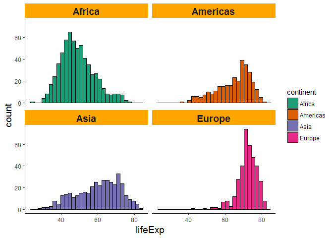
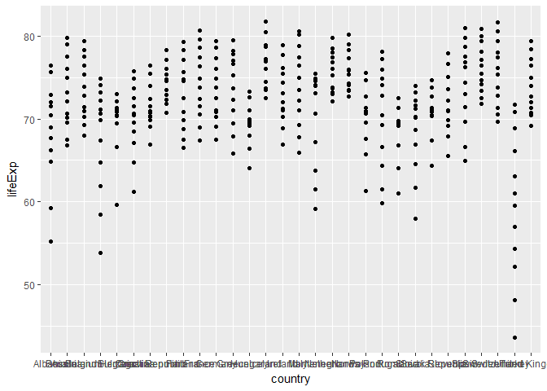
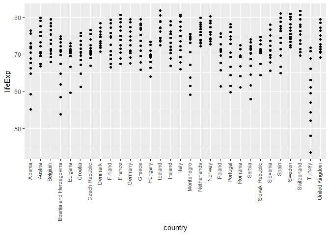
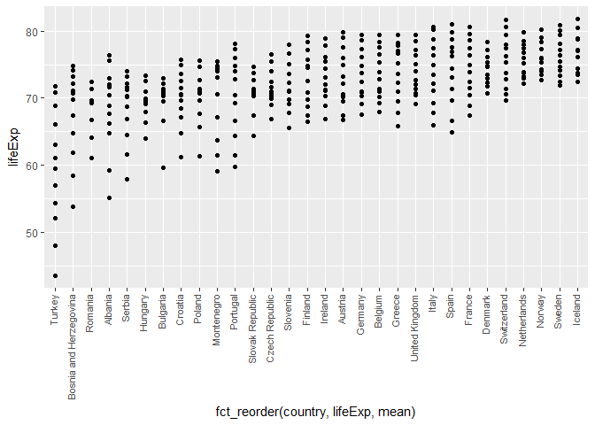
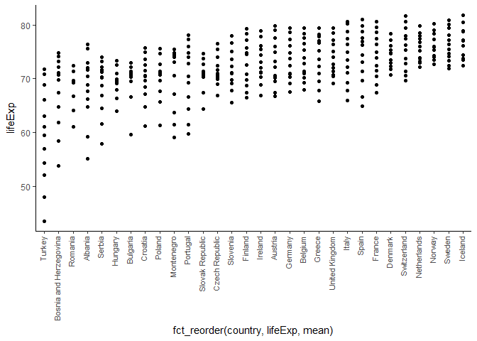
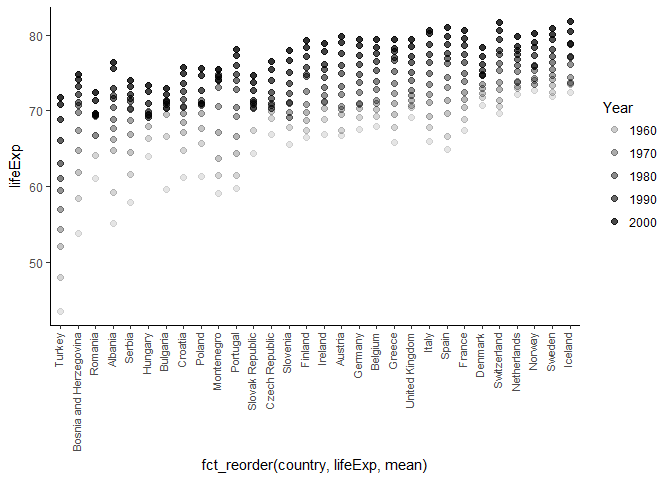
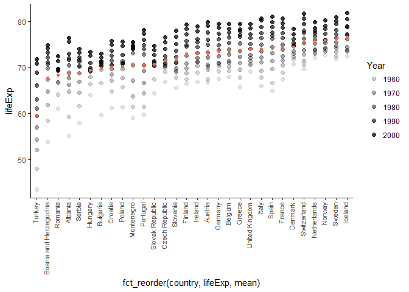
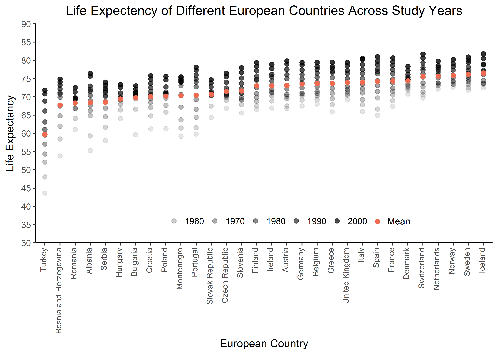

Homework 5
================

``` r
library(RColorBrewer)
library(gapminder)
library(dplyr)
library(tidyverse)
library(ggplot2)
library(forcats)
library(knitr)

#Aesthetic Preference
a_theme = theme(panel.grid.major = element_blank(), 
                panel.grid.minor = element_blank(), 
                panel.background = element_blank(), 
                legend.key = element_blank(),
                axis.line = element_line(color = "black"))
```

### Data management and refactoring

Beginning our data analysis, let us do a simple histogram showing how well sampled each continent is for life expectency. This can give us an early look if perhaps there is merit to dropping Oceania. We can also use this as an opportunity to test different color schemes provided by *RColorBrewer* package.

``` r
gapminder %>%
ggplot(aes(x = lifeExp))+
geom_histogram(aes(fill = continent), color = "black") + 
scale_fill_manual(values=brewer.pal(n=5, "Dark2")) + #The dark2 color aesthetic
scale_color_manual(values=brewer.pal(n=5, "Dark2")) + 

 #Since we are using facet_wrap lets also make it look nice

facet_wrap(~continent)+
 theme(strip.background = element_rect(fill="Orange"),
          axis.title = element_text(size=14),
          strip.text = element_text(size=14, face="bold"))+
a_theme #My otherwise predefined aesthetic preference
```

    ## `stat_bin()` using `bins = 30`. Pick better value with `binwidth`.


Clearly Oceania is not particularly well represented in this data set. We can use the summary function to check and verify.

``` r
summary(gapminder$continent)
```

    ##   Africa Americas     Asia   Europe  Oceania 
    ##      624      300      396      360       24

Oceania is composed of only 24 data points. Since the spanned 12 different years for which data was collected, this likely means Oceania is only composed of two countries. We can test this, and identify these countries as follows.

``` r
gapminder %>%
filter(continent == "Oceania") %>%
select(country) %>%
unique()
```

    ## # A tibble: 2 x 1
    ##       country
    ##        <fctr>
    ## 1   Australia
    ## 2 New Zealand

The two countries are Australia and New Zealand. Given that this continent was less sampled than the others and consists of only two countries, we might have some slight justification for narrowing our focus. Let us drop Oceania through the *filter* command.

``` r
gapminder_NoOceania <- gapminder %>% 
  filter(continent !="Oceania")

summary(gapminder_NoOceania)
```

    ##         country        continent        year         lifeExp     
    ##  Afghanistan:  12   Africa  :624   Min.   :1952   Min.   :23.60  
    ##  Albania    :  12   Americas:300   1st Qu.:1966   1st Qu.:48.08  
    ##  Algeria    :  12   Asia    :396   Median :1980   Median :60.34  
    ##  Angola     :  12   Europe  :360   Mean   :1980   Mean   :59.26  
    ##  Argentina  :  12   Oceania :  0   3rd Qu.:1993   3rd Qu.:70.75  
    ##  Austria    :  12                  Max.   :2007   Max.   :82.60  
    ##  (Other)    :1608                                                
    ##       pop              gdpPercap       
    ##  Min.   :6.001e+04   Min.   :   241.2  
    ##  1st Qu.:2.780e+06   1st Qu.:  1189.1  
    ##  Median :7.024e+06   Median :  3449.5  
    ##  Mean   :2.990e+07   Mean   :  7052.4  
    ##  3rd Qu.:1.987e+07   3rd Qu.:  8943.2  
    ##  Max.   :1.319e+09   Max.   :113523.1  
    ## 

Although we have filtered out Oceania, a summary of the data frame still shows its prescence. A step further is required to fully drop Oceania from the data frame, the *droplevels* function is needed.

``` r
gapminder_NoOceania <- gapminder_NoOceania %>% droplevels()
summary(gapminder_NoOceania)
```

    ##         country        continent        year         lifeExp     
    ##  Afghanistan:  12   Africa  :624   Min.   :1952   Min.   :23.60  
    ##  Albania    :  12   Americas:300   1st Qu.:1966   1st Qu.:48.08  
    ##  Algeria    :  12   Asia    :396   Median :1980   Median :60.34  
    ##  Angola     :  12   Europe  :360   Mean   :1980   Mean   :59.26  
    ##  Argentina  :  12                  3rd Qu.:1993   3rd Qu.:70.75  
    ##  Austria    :  12                  Max.   :2007   Max.   :82.60  
    ##  (Other)    :1608                                                
    ##       pop              gdpPercap       
    ##  Min.   :6.001e+04   Min.   :   241.2  
    ##  1st Qu.:2.780e+06   1st Qu.:  1189.1  
    ##  Median :7.024e+06   Median :  3449.5  
    ##  Mean   :2.990e+07   Mean   :  7052.4  
    ##  3rd Qu.:1.987e+07   3rd Qu.:  8943.2  
    ##  Max.   :1.319e+09   Max.   :113523.1  
    ## 

Oceania no longer appears within the data frame summary. We can now compare what the original gapminder dataset looked like compared to this data frame in which Oceania is dropped.

The original gapminder (before dropping Oceania):

``` r
dim(gapminder)
```

    ## [1] 1704    6

There are 1704 rows (observations) by 6 columns (variables). After dropping Oceania the number of rows should decrease by 24 while the number of columns should remain the same (as we are not removing a variable but only a specific level of a variable).

``` r
dim(gapminder_NoOceania)
```

    ## [1] 1680    6

The expected outcome, 1680 rows by 6 columns. The count function similarly verifies this for us.

``` r
gapminder %>% 
  count(continent)
```

    ## # A tibble: 5 x 2
    ##   continent     n
    ##      <fctr> <int>
    ## 1    Africa   624
    ## 2  Americas   300
    ## 3      Asia   396
    ## 4    Europe   360
    ## 5   Oceania    24

``` r
gapminder_NoOceania %>% 
  count(continent)
```

    ## # A tibble: 4 x 2
    ##   continent     n
    ##      <fctr> <int>
    ## 1    Africa   624
    ## 2  Americas   300
    ## 3      Asia   396
    ## 4    Europe   360

Lets take a look at what continents we still have and their data distribution.

``` r
gapminder_NoOceania %>%
ggplot(aes(x = lifeExp))+
geom_histogram(aes(fill = continent), color = "black") + 
facet_wrap(~continent) +
scale_fill_manual(values=brewer.pal(n=5, "Dark2")) +
scale_color_manual(values=brewer.pal(n=5, "Dark2")) + 
theme(strip.background = element_rect(fill="Orange"),
          axis.title = element_text(size=14),
          strip.text = element_text(size=14, face="bold"))+
a_theme
```

    ## `stat_bin()` using `bins = 30`. Pick better value with `binwidth`.



The order in which continents appear is alphabetical.

``` r
gapminder_NoOceania$continent %>%
  levels()
```

    ## [1] "Africa"   "Americas" "Asia"     "Europe"

We can manipulate this through a few different methods. Some are likely to be more trivial than others, for instance, we can present the levels in reverse alphabetical order

``` r
gapminder_NoOceania$continent %>%
  levels() %>%
  fct_rev() 
```

    ## [1] Africa   Americas Asia     Europe  
    ## Levels: Europe Asia Americas Africa

Instead however we can organize levels based on a quantiative value. Let us reorganize continents such that they appear in descending mean life expectency order.

``` r
gapminder_continent <- fct_reorder(gapminder_NoOceania$continent, gapminder_NoOceania$lifeExp, mean,  .desc = TRUE)  #The factor we are reorganizing and the factor by which we reorganize, then the literal statistic we will accomplish this by. 

gapminder_continent%>% 
  levels() 
```

    ## [1] "Europe"   "Americas" "Asia"     "Africa"

Success, but, let us double check through a different method that relies on filtering and calculating an actual mean life expectency value.

``` r
gapminder_NoOceania %>%
group_by(continent) %>%
summarize(MeanLife = mean(lifeExp)) %>%
arrange(desc(MeanLife))
```

    ## # A tibble: 4 x 2
    ##   continent MeanLife
    ##      <fctr>    <dbl>
    ## 1    Europe 71.90369
    ## 2  Americas 64.65874
    ## 3      Asia 60.06490
    ## 4    Africa 48.86533

Both agree, in order of mean life expectency are Europe, America, Asia and Africa.

These values however while informative might be a bit too blunt. A more nuanced picture might be captured by refactoring and organizing on the basis of country mean life expectency rather than continent.

``` r
gapminder_country <- fct_reorder(gapminder_NoOceania$country, gapminder_NoOceania$lifeExp, mean,  .desc = TRUE)


gapminder_country%>% 
levels() %>%
head() #Head is used to limit our displayed output to something more managable
```

    ## [1] "Iceland"     "Sweden"      "Norway"      "Netherlands" "Switzerland"
    ## [6] "Canada"

We can again verify and see that both methods agree via the arrange function.

``` r
gapminder_NoOceania %>%
    group_by(country) %>% 
    summarize(meanExp=mean(lifeExp)) %>%
    arrange(desc(meanExp)) %>%
head()
```

    ## # A tibble: 6 x 2
    ##       country  meanExp
    ##        <fctr>    <dbl>
    ## 1     Iceland 76.51142
    ## 2      Sweden 76.17700
    ## 3      Norway 75.84300
    ## 4 Netherlands 75.64850
    ## 5 Switzerland 75.56508
    ## 6      Canada 74.90275

Both approaches agree and it would seem in general Scandinavian countries fair among the top for life expectency. Let us save our work thus far.

### Saving and reading files

We can use the \*write \_csv\* function to save our data set in which Oceania was dropped.

``` r
write_csv(gapminder_NoOceania, "gapminder_NoOceania.csv")
```

To save our refactored objects however we will fare better to use .*saveRSD* as this will allow us to serialize our objects into a simple binary file.

``` r
saveRDS(gapminder_continent, "gapminder_continent.rds")
saveRDS(gapminder_country, "gapminder_country.rds")
```

Since we have saved these files and are confident in their storage, we can remove them from our current work space using *rm*

``` r
rm(gapminder_NoOceania, gapminder_continent, gapminder_country)
```

And now we can read our files back in starting with "gapminder\_NoOceania.csv"

``` r
gapminder_NoOceania <- read.csv("gapminder_NoOceania.csv")
summary(gapminder_NoOceania)
```

    ##         country        continent        year         lifeExp     
    ##  Afghanistan:  12   Africa  :624   Min.   :1952   Min.   :23.60  
    ##  Albania    :  12   Americas:300   1st Qu.:1966   1st Qu.:48.08  
    ##  Algeria    :  12   Asia    :396   Median :1980   Median :60.34  
    ##  Angola     :  12   Europe  :360   Mean   :1980   Mean   :59.26  
    ##  Argentina  :  12                  3rd Qu.:1993   3rd Qu.:70.75  
    ##  Austria    :  12                  Max.   :2007   Max.   :82.60  
    ##  (Other)    :1608                                                
    ##       pop              gdpPercap       
    ##  Min.   :6.001e+04   Min.   :   241.2  
    ##  1st Qu.:2.780e+06   1st Qu.:  1189.1  
    ##  Median :7.024e+06   Median :  3449.5  
    ##  Mean   :2.990e+07   Mean   :  7052.4  
    ##  3rd Qu.:1.987e+07   3rd Qu.:  8943.2  
    ##  Max.   :1.319e+09   Max.   :113523.1  
    ## 

Everything here appears as we left it and in good order. Lets load in the rds files and check that their levels are still as we left them.

``` r
gapminder_continent <- readRDS("gapminder_continent.rds")
gapminder_country <- readRDS("gapminder_country.rds")

levels(gapminder_continent)
```

    ## [1] "Europe"   "Americas" "Asia"     "Africa"

``` r
head(levels(gapminder_country))
```

    ## [1] "Iceland"     "Sweden"      "Norway"      "Netherlands" "Switzerland"
    ## [6] "Canada"

Everything appears good and ready for progression.

### Data Visualization

Rather than relying on a table let us create a visualization that captures life expectency of different countries for all study years.

``` r
gapminder_NoOceania %>%
filter(continent == "Europe") %>%
ggplot(aes(y = lifeExp, x = country)) +
geom_point() 
```



This figure is obviously very difficult, if not entirely useless to a viewer. We will need to do various edits and modifications.

Perhaps the most obvious and notable, the X axis of the figure is entirely illegible because the different country names are overlapping with one another. We can tilt these names so they orient vertically rather than horizontally.

``` r
#We can store this variable as we will be calling on it multiple times
Europe <-  gapminder_NoOceania %>%
filter(continent == "Europe")


ggplot(data = Europe, (aes(y = lifeExp, x = country))) +
  geom_point() +
  theme(axis.text.x = element_text(angle=90,hjust=1, vjust=.2, size = 8)) #9 degree tilt and some slight moving around for fit
```



Next we can reorganize the data points. Right now the data are somewhat difficult to visually digest, so, let us reorganize them on the basis of countries and their overall mean life expectency. This will help provide clarity and more immediate structure to the data.

``` r
#Value for the X axis is modified to refactor country on the basis of overall mean life expectency.
ggplot(data = Europe, (aes(y = lifeExp, x = fct_reorder(country, lifeExp, mean)))) +
  geom_point() +
  theme(axis.text.x = element_text(angle=90,hjust=1, vjust=.2, size = 8))
```



Another modification concerns more broad aesthetic appearance. For instance, there is currently in defined X axis or Y axis line, and the grey background in this case is not helping data interpretation. Typically I define such aesthetic preferences at the start of the study script and call on them as needed, but I will redefine all these prferences below for completeness.

``` r
#This will remove the default background, grid, and provide X-Y axis lines for our plots.
a_theme = theme(panel.grid.major = element_blank(), 
                panel.grid.minor = element_blank(), 
                panel.background = element_blank(), 
                legend.key = element_blank(),
                axis.line = element_line(color = "black"))

ggplot(data = Europe, (aes(y = lifeExp, x = fct_reorder(country, lifeExp, mean)))) +
  geom_point() +
  theme(axis.text.x = element_text(angle=90,hjust=1, vjust=.2, size = 8)) +
  a_theme #The call of my aesthetic preferences
```



Next, although we have all our data points and their associated countries are visible, we cannot decipher which data point belongs to which year of data collection. Let us change the transparency of our data points, such that those which were most recently collected are the most visible, and those from the distant past are less visible.

``` r
ggplot(data = Europe, (aes(y = lifeExp, x = fct_reorder(country, lifeExp, mean)))) +
  geom_point(aes(alpha = year), size = 2) + #alpha will allow us to accomplish our transparency goals 
  scale_alpha_continuous("Year", range = c(0.1, .8)) +
  theme(axis.text.x = element_text(angle=90,hjust=1, vjust=.2, size = 8)) +
  a_theme +
scale_fill_identity(guide = guide_legend())
```



A somewhat more subtle distinction can be made for how our data were organized and what they actually depict. We reorganized countries on the basis of their overall life expectency, but, we depict the mean life expectecy of several years. Because of this, the value on which countries are being reorganized (overall mean life expectency) does not actually appear in the figure. Let us include this value.

To do so we can create a data set that contains overall mean life expectancy.

``` r
MeanEurope <- gapminder_NoOceania %>%
group_by(country) %>%
filter(continent == "Europe") %>%
summarize(MeanLife = mean(lifeExp)) 
```

Let us also save this data set as it is intriguing in its own right. For practise we can also present it as a table below.

``` r
write_csv(MeanEurope, "MeanEurope.csv")
rm(MeanEurope)
MeanEurope<-read.csv("MeanEurope.csv")
MeanEurope%>%
kable(digits = 2, format="markdown") 
```

| country                |  MeanLife|
|:-----------------------|---------:|
| Albania                |     68.43|
| Austria                |     73.10|
| Belgium                |     73.64|
| Bosnia and Herzegovina |     67.71|
| Bulgaria               |     69.74|
| Croatia                |     70.06|
| Czech Republic         |     71.51|
| Denmark                |     74.37|
| Finland                |     72.99|
| France                 |     74.35|
| Germany                |     73.44|
| Greece                 |     73.73|
| Hungary                |     69.39|
| Iceland                |     76.51|
| Ireland                |     73.02|
| Italy                  |     74.01|
| Montenegro             |     70.30|
| Netherlands            |     75.65|
| Norway                 |     75.84|
| Poland                 |     70.18|
| Portugal               |     70.42|
| Romania                |     68.29|
| Serbia                 |     68.55|
| Slovak Republic        |     70.70|
| Slovenia               |     71.60|
| Spain                  |     74.20|
| Sweden                 |     76.18|
| Switzerland            |     75.57|
| Turkey                 |     59.70|
| United Kingdom         |     73.92|

Now that we have mean life expectency stored, we can call on this variable within ggplot.

``` r
ggplot(data = Europe, (aes(y = lifeExp, x = fct_reorder(country, lifeExp, mean)))) +
  geom_point(aes(alpha = year), size = 2) + 
  scale_alpha_continuous("Year", range = c(0.1, .8)) +
  theme(axis.text.x = element_text(angle=90,hjust=1, vjust=.2, size = 8)) +
  geom_point(data = MeanEurope, aes(y = MeanLife, x = country), color = "coral2", size = 1.5)+  # call our new data frame
  a_theme 
```



One surprise would have been if the order of the orange dots, representing mean life expectency, did not align in ascending order. But they do and so we continue on.

Before presenting the final graph, I am going to complete a series of minor, but I think worthwhile edits. These will include moving the figure legend, flipping it from vertical to horizontal, removing the title, adding an extra point to designate mean life expectency. Other edits not specific to the legend will also be done, such as renaming the X and Y axis, and creating a centered figure title.

``` r
LifePlot <- ggplot(data = Europe, (aes(y = lifeExp, x = fct_reorder(country, lifeExp, mean)))) +
  geom_point(aes(alpha = year), size = 2) + 
  scale_alpha_continuous("Year", range = c(0.1, .8)) +
  geom_point(data = MeanEurope, aes(y = MeanLife, x = country), color = "coral2", size = 2)+
  theme(axis.text.x = element_text(angle=90,hjust=1, vjust=.2, size = 8))+
  scale_y_continuous(expand= c(0,0), breaks=seq(30,90,5), lim = c(30,90))+
  theme(legend.position = c(0.5, .1), legend.direction="horizontal", legend.title=element_blank())+
  ylab("Life Expectancy") +
  xlab("European Country") +
  annotate(geom = "text", x = 24.4, y = 36, size = 3.3, color = "black", label = "Mean")+
  annotate(geom = "point", x = 23, y = 35.8, size = 2, color = "coral2") +
  ggtitle("Life Expectency of Different European Countries Across Study Years")+
  theme(plot.title = element_text(hjust = 0.5))+
  a_theme 
```

Rather than showing the result, I will instead save this final figure

``` r
ggsave("LifeExpByEuro.png", plot = LifePlot, dpi = 600)
```

    ## Saving 7 x 5 in image

and will upload it here:


