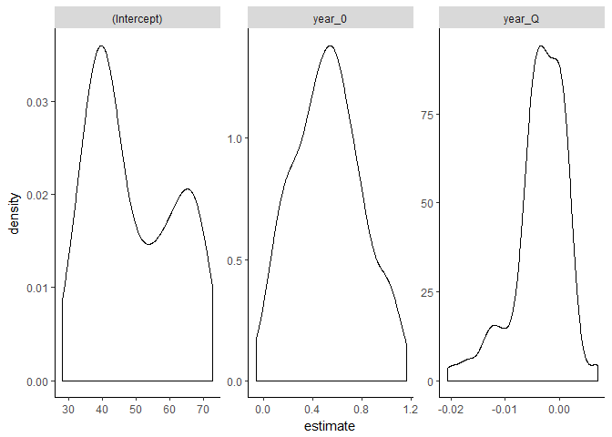
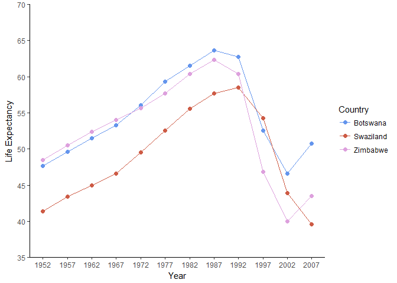
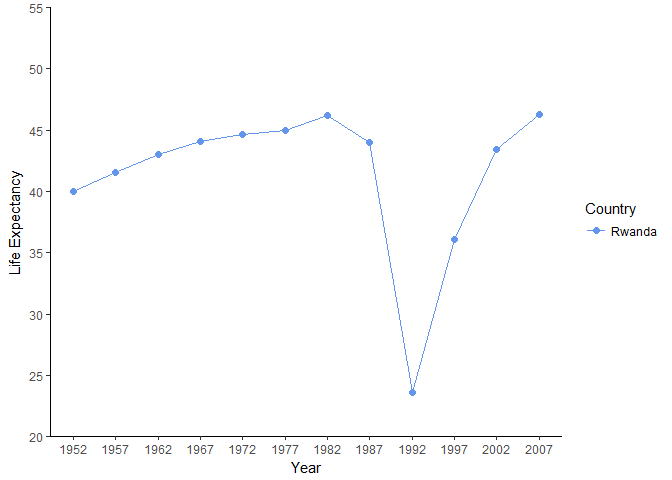

Homework 6
================

Writing functions
-----------------

*Write one (or more) functions that do something useful to pieces of the Gapminder or Singer data. It is logical to think about computing on the mini-data frames corresponding to the data for each specific country, location, year, band, album, … This would pair well with the prompt below about working with a nested data frame, as you could apply your function there.*

*Make it something you can’t easily do with built-in functions. Make it something that’s not trivial to do with the simple dplyr verbs. The linear regression function presented here is a good starting point. You could generalize that to do quadratic regression (include a squared term) or use robust regression, using MASS::rlm() or robustbase::lmrob().*

*If you plan to complete the homework where we build an R package, write a couple of experimental functions exploring some functionality that is useful to you in real life and that might form the basis of your personal package.*

------------------------------------------------------------------------

 

One task I have done for past assignments was calculating a standard error. Having a function to do this quickly on a given variable would be useful. We can begin this task with this goal in mind. A refresher on the formula:

<p align="center">

</p>
To calculate a standard error we will need to know the standard deviation of a given variable, and its number of observations. We can obtain this information through already built in functions. We can use *sd* to calculate a standard deviation and *length* to measure number of observations.

``` r
#A function that takes a numeric value in x and returns a standard error
SE <- function(x) sd(x) / sqrt(length(x))
```

Lets test the function with numeric values:

``` r
#Load a library for us to have data
library(gapminder)
```

    ## Warning: package 'gapminder' was built under R version 3.3.3

``` r
#Make sure we are dealing with numeric values
class(gapminder$lifeExp)
```

    ## [1] "numeric"

``` r
class(gapminder$pop)
```

    ## [1] "integer"

``` r
#Testing the new function
SE(gapminder$lifeExp)
```

    ## [1] 0.3129179

``` r
SE(gapminder$pop)
```

    ## [1] 2571683

The function works as desired. We should also make sure the function crashes when it should, let us try the function with a non-numeric value.

``` r
#A non-numeric variable
class(gapminder$country)
```

    ## [1] "factor"

``` r
#The funciton should crash
SE(gapminder$country)
```

    ## Warning in var(if (is.vector(x) || is.factor(x)) x else as.double(x), na.rm = na.rm): Calling var(x) on a factor x is deprecated and will become an error.
    ##   Use something like 'all(duplicated(x)[-1L])' to test for a constant vector.

    ## [1] 0.9932982

The function along with a cryptic warning provides a numeric value. We can both make the warning less cryptic, and ensure no incorrect or meaningless output is provided.

``` r
#If the value of x is not numeric (designated by !is.nuermic) then stop the function
#and print an error message. Let the reader also know what object they had attempted to insert

SE <- function(x) {
  if(!is.numeric(x)) {
    stop('This function calculates a standard error and as such requires numeric\n',
         'values. You have instead provided an object of class: ', class(x)[1])
  }
  S <- sd(x) / sqrt(length(x))
  S <- setNames(S, c("Standard Error:"))
  return(S)
}
```

Lets try the function again.

``` r
class(gapminder$country)
```

    ## [1] "factor"

``` r
#SE(gapminder$country)
#Error in SE(gapminder$country) : 
#This function calculates a standard error and as such requires numeric
#values. You have instead provided an object of class: factor
```

The function crashed (and had to be commented out above) and provided the desired error text output.

R also does not seem to have a function for obtaining modal values. Although not often used as a measure of central tendency, there might be instances where the mode is of use. We can create a function to identify the mode of a data set.

``` r
#Identify all the unique values of x and then through which.max(tabulate) identify the most frequently occuring value.

Mode <- function(x) {
  if(!is.numeric(x)) {
    stop('This function calculates a standard error and as such requires numeric\n',
         'values. You have instead provided an object of class: ', class(x)[1])
  }
  Values <- unique(x)
  Values[which.max(tabulate(match(x, Values)))] 
}
```

 

The code below produces a variable containing many numbers, but as visible the most frequently occurring one is 3. We can test our mode function accordingly.

``` r
#A variable with different values in which 3 is the most reoccuring.
ModeTest <- c(1,2,2,3,3,3,3,3,3,3,3,3,3,4,4,4,5,5,5,5,6,6,6,6,6,7,7,8,9)
Mode(ModeTest)
```

    ## [1] 3

We can combine these two new functions, one for calculating standard errors and another for finding the mode. Further, we can add various other descriptive statistics including the mean, median, and others. Such a function can help us learn a great deal about a given variable.

``` r
Descriptives <- function(x) {
  if(!is.numeric(x)) {
    stop('This function calculates a standard error and as such requires numeric\n',
         'values. You have instead provided an object of class: ', class(x)[1])
  }
  SE <- sd(x) / sqrt(length(x))
  M <- mean(x)
  Med <- median(x)
  Mod <- Mode(x)
  R <- max(x) - min(x)
  V <- var(x)
  SD <- sd(x)
  SZ <- length(x)
  #We want to title all the descriptive statistics so they are easily identified.
  M <- setNames(M, c("Mean:"))
  Med<- setNames(Med, c("Median:"))
  Mod<- setNames(Mod, c("Mode:")) 
  V <- setNames(V, c("Variance:"))
  SD <- setNames(SD, c("Standard Deviation:"))
  SE <- setNames(SE, c("Standard Error:"))
  R <- setNames(R, c("Range:"))
  SZ <- setNames(SZ, c("Observations:"))
  out <-c(M,Med,Mod,V, SD, SE, R, SZ)
  print(out)
}
```

 

Now we can test this function

``` r
Descriptives(gapminder$lifeExp)
```

    ##               Mean:             Median:               Mode: 
    ##          59.4744394          60.7125000          69.3900000 
    ##           Variance: Standard Deviation:     Standard Error: 
    ##         166.8516640          12.9171074           0.3129179 
    ##              Range:       Observations: 
    ##          59.0040000        1704.0000000

Everything appears as desired. We can now also use the *map* function so as to run the *Descriptives* function on more than one variable at a time.

``` r
#map is contained in the purrr package
library(purrr)
#Run the Descriptives function on variables 4 through 5 of the gapminder dataset
map(gapminder[4:5], Descriptives)
```

    ##               Mean:             Median:               Mode: 
    ##          59.4744394          60.7125000          69.3900000 
    ##           Variance: Standard Deviation:     Standard Error: 
    ##         166.8516640          12.9171074           0.3129179 
    ##              Range:       Observations: 
    ##          59.0040000        1704.0000000 
    ##               Mean:             Median:               Mode: 
    ##        2.960121e+07        7.023596e+06        8.425333e+06 
    ##           Variance: Standard Deviation:     Standard Error: 
    ##        1.126950e+16        1.061579e+08        2.571683e+06 
    ##              Range:       Observations: 
    ##        1.318623e+09        1.704000e+03

    ## $lifeExp
    ##               Mean:             Median:               Mode: 
    ##          59.4744394          60.7125000          69.3900000 
    ##           Variance: Standard Deviation:     Standard Error: 
    ##         166.8516640          12.9171074           0.3129179 
    ##              Range:       Observations: 
    ##          59.0040000        1704.0000000 
    ## 
    ## $pop
    ##               Mean:             Median:               Mode: 
    ##        2.960121e+07        7.023596e+06        8.425333e+06 
    ##           Variance: Standard Deviation:     Standard Error: 
    ##        1.126950e+16        1.061579e+08        2.571683e+06 
    ##              Range:       Observations: 
    ##        1.318623e+09        1.704000e+03

We now have descriptive statistics on the variables life expectancy (*lifeExp*) and population (*pop*). In a future iteration of the function, having it display the output only once (rather than twice) would be the goal but for the time being it will suffice.

Although these are informative values, one step going forward might be to compute inferential statistics. For instance we might want to test if life expectancy has been significantly increasing over study years. We can test this through a linear regression.

``` r
#Life expectency predicted by year
summary(lm(lifeExp ~ year, data = gapminder))
```

    ## 
    ## Call:
    ## lm(formula = lifeExp ~ year, data = gapminder)
    ## 
    ## Residuals:
    ##     Min      1Q  Median      3Q     Max 
    ## -39.949  -9.651   1.697  10.335  22.158 
    ## 
    ## Coefficients:
    ##               Estimate Std. Error t value Pr(>|t|)    
    ## (Intercept) -585.65219   32.31396  -18.12   <2e-16 ***
    ## year           0.32590    0.01632   19.96   <2e-16 ***
    ## ---
    ## Signif. codes:  0 '***' 0.001 '**' 0.01 '*' 0.05 '.' 0.1 ' ' 1
    ## 
    ## Residual standard error: 11.63 on 1702 degrees of freedom
    ## Multiple R-squared:  0.1898, Adjusted R-squared:  0.1893 
    ## F-statistic: 398.6 on 1 and 1702 DF,  p-value: < 2.2e-16

We can see from this result that as time has progressed life expectancy has increased. We can turn this analysis into a function allowing us to then quickly compare the association between years and life expectancy for different countries.

``` r
Reg <- function(y, x) {
  Criterion <- (y)
  Predictor <- (x)
  the_fit <- lm(Criterion ~ Predictor)
  summary(the_fit)
}
```

This function when run on all countries should obtain the same result as above.

``` r
Reg(gapminder$lifeExp, gapminder$year)
```

    ## 
    ## Call:
    ## lm(formula = Criterion ~ Predictor)
    ## 
    ## Residuals:
    ##     Min      1Q  Median      3Q     Max 
    ## -39.949  -9.651   1.697  10.335  22.158 
    ## 
    ## Coefficients:
    ##               Estimate Std. Error t value Pr(>|t|)    
    ## (Intercept) -585.65219   32.31396  -18.12   <2e-16 ***
    ## Predictor      0.32590    0.01632   19.96   <2e-16 ***
    ## ---
    ## Signif. codes:  0 '***' 0.001 '**' 0.01 '*' 0.05 '.' 0.1 ' ' 1
    ## 
    ## Residual standard error: 11.63 on 1702 degrees of freedom
    ## Multiple R-squared:  0.1898, Adjusted R-squared:  0.1893 
    ## F-statistic: 398.6 on 1 and 1702 DF,  p-value: < 2.2e-16

Having been assured, we can now specify to certain countries by *filtering*.

``` r
library(tidyverse)
Canada_Minder <- gapminder %>% 
filter(country == "Canada")

Reg(Canada_Minder$lifeExp, Canada_Minder$year)
```

    ## 
    ## Call:
    ## lm(formula = Criterion ~ Predictor)
    ## 
    ## Residuals:
    ##     Min      1Q  Median      3Q     Max 
    ## -0.3812 -0.1368 -0.0471  0.2481  0.3157 
    ## 
    ## Coefficients:
    ##               Estimate Std. Error t value Pr(>|t|)    
    ## (Intercept) -3.583e+02  8.252e+00  -43.42 1.01e-12 ***
    ## Predictor    2.189e-01  4.169e-03   52.50 1.52e-13 ***
    ## ---
    ## Signif. codes:  0 '***' 0.001 '**' 0.01 '*' 0.05 '.' 0.1 ' ' 1
    ## 
    ## Residual standard error: 0.2492 on 10 degrees of freedom
    ## Multiple R-squared:  0.9964, Adjusted R-squared:  0.996 
    ## F-statistic:  2757 on 1 and 10 DF,  p-value: 1.521e-13

Evidently in Canada, as overall, with the passage of time life expectancy has increased.

Just as we created a regression function, so can we create quadratic regression function.

``` r
Quad_R <- function(x, y) {
  Criterion <- na.omit(x)
  Predictor <- na.omit(y)
  Quadratic_Predictor <- y*y
  the_fit <- lm(Criterion ~ Predictor + Quadratic_Predictor)
  summary(the_fit)
}
```

Let us apply this function to the same data as above

``` r
Quad_R(Canada_Minder$lifeExp, Canada_Minder$year)
```

    ## 
    ## Call:
    ## lm(formula = Criterion ~ Predictor + Quadratic_Predictor)
    ## 
    ## Residuals:
    ##      Min       1Q   Median       3Q      Max 
    ## -0.45956 -0.12014  0.01247  0.21920  0.26547 
    ## 
    ## Coefficients:
    ##                       Estimate Std. Error t value Pr(>|t|)
    ## (Intercept)         -1.628e+03  1.045e+03  -1.559    0.153
    ## Predictor            1.502e+00  1.055e+00   1.423    0.188
    ## Quadratic_Predictor -3.241e-04  2.666e-04  -1.216    0.255
    ## 
    ## Residual standard error: 0.2435 on 9 degrees of freedom
    ## Multiple R-squared:  0.9969, Adjusted R-squared:  0.9962 
    ## F-statistic:  1445 on 2 and 9 DF,  p-value: 5.176e-12

In the resulting model neither the linear nor quadratic slope are significant.

A better attempt at fitting a quadratic trend might be found when modelling North Korea. In an [earlier assignment](https://github.com/Kozp/STAT545-hw-Kozik-Pavel/blob/Side-Branch/hw04%20-%20Tables%2C%20data%20splitting%20and%20joining%2C%20cleaning%20and%20merging%20open%20data%20bases/hw4.md) a plot was created showing life expectancy of both North and South Korea. The plot is reproduced below:


Given that life expectancy increased until the early 1990s in North Korea and then descended, a quadratic model might be expected to fit.

``` r
NK_Minder <- gapminder %>% 
filter(country == "Korea, Dem. Rep.")
Quad_R(NK_Minder$lifeExp, NK_Minder$year)
```

    ## 
    ## Call:
    ## lm(formula = Criterion ~ Predictor + Quadratic_Predictor)
    ## 
    ## Residuals:
    ##     Min      1Q  Median      3Q     Max 
    ## -1.5280 -1.3079  0.4321  0.8920  1.5651 
    ## 
    ## Coefficients:
    ##                       Estimate Std. Error t value Pr(>|t|)    
    ## (Intercept)         -5.084e+04  5.312e+03  -9.571 5.15e-06 ***
    ## Predictor            5.112e+01  5.368e+00   9.524 5.36e-06 ***
    ## Quadratic_Predictor -1.283e-02  1.356e-03  -9.466 5.64e-06 ***
    ## ---
    ## Signif. codes:  0 '***' 0.001 '**' 0.01 '*' 0.05 '.' 0.1 ' ' 1
    ## 
    ## Residual standard error: 1.238 on 9 degrees of freedom
    ## Multiple R-squared:  0.9729, Adjusted R-squared:  0.9669 
    ## F-statistic: 161.5 on 2 and 9 DF,  p-value: 8.886e-08

The presence of a significant quadratic term here suggests that at lower levels of the predictor (years) there is a positive association between the passage of time and life expectancy. However, this relationship later changes such that at higher levels of the predictor, life expectancy decreased.

 

------------------------------------------------------------------------

 

Work with a nested data frame
-----------------------------

*Create a nested data frame and map a function over the list column holding the nested data. Use list extraction or other functions to pull interesting information out of these results and work your way back to a simple data frame you can visualize and explore.*

*Here’s a fully developed prompt for Gapminder:*

*See the split-apply-combine lesson from class.* *Nest the data by country (and continent).* *Fit a model of life expectancy against year. Possibly quadratic, possibly robust (see above prompt re: function writing).* *Use functions for working with fitted models or the broom package to get information out of your linear models.* *Use the usual dplyr, tidyr, and ggplot2 workflows to explore, e.g., the estimated cofficients.* *Inspiration for the modelling and downstream inspiration*

------------------------------------------------------------------------

 

To begin this task, we will load all relevant libraries.

``` r
#Load relevant libraries for the task
library(broom)
library(gapminder)
library(tidyverse)
library(ggplot2)
```

Working with the original data frame we will compute a new variable. Rather than having year (i.e. 1952, 1957, etc) we will instead create a variable that is the current year of study measurement minus 1952. This resulting variable will therefore tell us how many years since study inception have passed. This is not vital, and will not change the end models we obtain or their significance, but might help interpretation or sorting down the road.

``` r
gapminder$year_0 <- gapminder$year - 1952
```

Next we can create a quadratic term should we later wish to run a quadratic regression.

``` r
gapminder$year_Q <- gapminder$year_0*gapminder$year_0
```

Before going further though, lets view that the variables we created. At the same time we can take note that the gapminder data frame may be a bit difficult to sift through.

``` r
gapminder
```

    ## # A tibble: 1,704 x 8
    ##        country continent  year lifeExp      pop gdpPercap year_0 year_Q
    ##         <fctr>    <fctr> <int>   <dbl>    <int>     <dbl>  <dbl>  <dbl>
    ##  1 Afghanistan      Asia  1952  28.801  8425333  779.4453      0      0
    ##  2 Afghanistan      Asia  1957  30.332  9240934  820.8530      5     25
    ##  3 Afghanistan      Asia  1962  31.997 10267083  853.1007     10    100
    ##  4 Afghanistan      Asia  1967  34.020 11537966  836.1971     15    225
    ##  5 Afghanistan      Asia  1972  36.088 13079460  739.9811     20    400
    ##  6 Afghanistan      Asia  1977  38.438 14880372  786.1134     25    625
    ##  7 Afghanistan      Asia  1982  39.854 12881816  978.0114     30    900
    ##  8 Afghanistan      Asia  1987  40.822 13867957  852.3959     35   1225
    ##  9 Afghanistan      Asia  1992  41.674 16317921  649.3414     40   1600
    ## 10 Afghanistan      Asia  1997  41.763 22227415  635.3414     45   2025
    ## # ... with 1,694 more rows

There are for instance nearly 1,700 rows of data, many of which present the same country at different time points. Nesting the data might help us to create something more compact.

``` r
gap_nested <- gapminder %>%
    group_by(country, continent) %>% 
    nest()

gap_nested
```

    ## # A tibble: 142 x 3
    ##        country continent              data
    ##         <fctr>    <fctr>            <list>
    ##  1 Afghanistan      Asia <tibble [12 x 6]>
    ##  2     Albania    Europe <tibble [12 x 6]>
    ##  3     Algeria    Africa <tibble [12 x 6]>
    ##  4      Angola    Africa <tibble [12 x 6]>
    ##  5   Argentina  Americas <tibble [12 x 6]>
    ##  6   Australia   Oceania <tibble [12 x 6]>
    ##  7     Austria    Europe <tibble [12 x 6]>
    ##  8     Bahrain      Asia <tibble [12 x 6]>
    ##  9  Bangladesh      Asia <tibble [12 x 6]>
    ## 10     Belgium    Europe <tibble [12 x 6]>
    ## # ... with 132 more rows

Now we have a data frame in which every country appears once, and has an associated tibble in which are study variables (like population, life expectancy, etc).

If desired we can for instance open the first tibble as follows.

``` r
gap_nested[[1, "data"]]
```

    ## # A tibble: 12 x 6
    ##     year lifeExp      pop gdpPercap year_0 year_Q
    ##    <int>   <dbl>    <int>     <dbl>  <dbl>  <dbl>
    ##  1  1952  28.801  8425333  779.4453      0      0
    ##  2  1957  30.332  9240934  820.8530      5     25
    ##  3  1962  31.997 10267083  853.1007     10    100
    ##  4  1967  34.020 11537966  836.1971     15    225
    ##  5  1972  36.088 13079460  739.9811     20    400
    ##  6  1977  38.438 14880372  786.1134     25    625
    ##  7  1982  39.854 12881816  978.0114     30    900
    ##  8  1987  40.822 13867957  852.3959     35   1225
    ##  9  1992  41.674 16317921  649.3414     40   1600
    ## 10  1997  41.763 22227415  635.3414     45   2025
    ## 11  2002  42.129 25268405  726.7341     50   2500
    ## 12  2007  43.828 31889923  974.5803     55   3025

Similarly we can look at the 50th country tibble:

``` r
gap_nested[[50, "data"]]
```

    ## # A tibble: 12 x 6
    ##     year lifeExp      pop gdpPercap year_0 year_Q
    ##    <int>   <dbl>    <int>     <dbl>  <dbl>  <dbl>
    ##  1  1952  65.860  7733250  3530.690      0      0
    ##  2  1957  67.860  8096218  4916.300      5     25
    ##  3  1962  69.510  8448233  6017.191     10    100
    ##  4  1967  71.000  8716441  8513.097     15    225
    ##  5  1972  72.340  8888628 12724.830     20    400
    ##  6  1977  73.680  9308479 14195.524     25    625
    ##  7  1982  75.240  9786480 15268.421     30    900
    ##  8  1987  76.670  9974490 16120.528     35   1225
    ##  9  1992  77.030 10325429 17541.496     40   1600
    ## 10  1997  77.869 10502372 18747.698     45   2025
    ## 11  2002  78.256 10603863 22514.255     50   2500
    ## 12  2007  79.483 10706290 27538.412     55   3025

One difficult aspect of this, is that we do not know what the 50th country is. The code below will inform us.

``` r
gap_nested$country[50]
```

    ## [1] Greece
    ## 142 Levels: Afghanistan Albania Algeria Angola Argentina ... Zimbabwe

A more useful approach however is to use the *which* function.

``` r
which(gap_nested$country == "Canada")
```

    ## [1] 21

This informs us that the 21st country is Canada. We can double check this.

``` r
gap_nested$country[21]
```

    ## [1] Canada
    ## 142 Levels: Afghanistan Albania Algeria Angola Argentina ... Zimbabwe

An implication of this, we can directly insert the *which* function to find the desired country tibble

``` r
gap_nested[[which(gap_nested$country == "Canada"), "data"]]
```

    ## # A tibble: 12 x 6
    ##     year lifeExp      pop gdpPercap year_0 year_Q
    ##    <int>   <dbl>    <int>     <dbl>  <dbl>  <dbl>
    ##  1  1952  68.750 14785584  11367.16      0      0
    ##  2  1957  69.960 17010154  12489.95      5     25
    ##  3  1962  71.300 18985849  13462.49     10    100
    ##  4  1967  72.130 20819767  16076.59     15    225
    ##  5  1972  72.880 22284500  18970.57     20    400
    ##  6  1977  74.210 23796400  22090.88     25    625
    ##  7  1982  75.760 25201900  22898.79     30    900
    ##  8  1987  76.860 26549700  26626.52     35   1225
    ##  9  1992  77.950 28523502  26342.88     40   1600
    ## 10  1997  78.610 30305843  28954.93     45   2025
    ## 11  2002  79.770 31902268  33328.97     50   2500
    ## 12  2007  80.653 33390141  36319.24     55   3025

``` r
gap_nested[[which(gap_nested$country == "China"), "data"]]
```

    ## # A tibble: 12 x 6
    ##     year  lifeExp        pop gdpPercap year_0 year_Q
    ##    <int>    <dbl>      <int>     <dbl>  <dbl>  <dbl>
    ##  1  1952 44.00000  556263527  400.4486      0      0
    ##  2  1957 50.54896  637408000  575.9870      5     25
    ##  3  1962 44.50136  665770000  487.6740     10    100
    ##  4  1967 58.38112  754550000  612.7057     15    225
    ##  5  1972 63.11888  862030000  676.9001     20    400
    ##  6  1977 63.96736  943455000  741.2375     25    625
    ##  7  1982 65.52500 1000281000  962.4214     30    900
    ##  8  1987 67.27400 1084035000 1378.9040     35   1225
    ##  9  1992 68.69000 1164970000 1655.7842     40   1600
    ## 10  1997 70.42600 1230075000 2289.2341     45   2025
    ## 11  2002 72.02800 1280400000 3119.2809     50   2500
    ## 12  2007 72.96100 1318683096 4959.1149     55   3025

``` r
gap_nested[[which(gap_nested$country == "Bulgaria"), "data"]]
```

    ## # A tibble: 12 x 6
    ##     year lifeExp     pop gdpPercap year_0 year_Q
    ##    <int>   <dbl>   <int>     <dbl>  <dbl>  <dbl>
    ##  1  1952  59.600 7274900  2444.287      0      0
    ##  2  1957  66.610 7651254  3008.671      5     25
    ##  3  1962  69.510 8012946  4254.338     10    100
    ##  4  1967  70.420 8310226  5577.003     15    225
    ##  5  1972  70.900 8576200  6597.494     20    400
    ##  6  1977  70.810 8797022  7612.240     25    625
    ##  7  1982  71.080 8892098  8224.192     30    900
    ##  8  1987  71.340 8971958  8239.855     35   1225
    ##  9  1992  71.190 8658506  6302.623     40   1600
    ## 10  1997  70.320 8066057  5970.389     45   2025
    ## 11  2002  72.140 7661799  7696.778     50   2500
    ## 12  2007  73.005 7322858 10680.793     55   3025

Next for this specific data structure we can create a function to model a quadratic regression. Here the criterion (thing being predicted) will be life expectancy and the predictors will be year of study measurement as a linear variable and quadratic variable.

``` r
Quad_Reg <- function(df) {
  lm(lifeExp ~ year_0 + year_Q, data = df)
}
```

 

We can run this function on the first country within our data frame.

``` r
#Run the Quad_Reg function on the gap_nested data frame, for the first country and its values stored in 
#"data" variable
summary(Quad_Reg(gap_nested[[1, "data"]]))
```

    ## 
    ## Call:
    ## lm(formula = lifeExp ~ year_0 + year_Q, data = df)
    ## 
    ## Residuals:
    ##      Min       1Q   Median       3Q      Max 
    ## -0.75900 -0.51487  0.02653  0.51654  0.62231 
    ## 
    ## Coefficients:
    ##               Estimate Std. Error t value Pr(>|t|)    
    ## (Intercept) 28.1786868  0.4330130  65.076 2.41e-13 ***
    ## year_0       0.4827616  0.0366013  13.190 3.43e-07 ***
    ## year_Q      -0.0037715  0.0006412  -5.882 0.000234 ***
    ## ---
    ## Signif. codes:  0 '***' 0.001 '**' 0.01 '*' 0.05 '.' 0.1 ' ' 1
    ## 
    ## Residual standard error: 0.5856 on 9 degrees of freedom
    ## Multiple R-squared:  0.9892, Adjusted R-squared:  0.9868 
    ## F-statistic: 412.4 on 2 and 9 DF,  p-value: 1.41e-09

Should we forget we can identify what the first country is just as above.

``` r
gap_nested$country[1]
```

    ## [1] Afghanistan
    ## 142 Levels: Afghanistan Albania Algeria Angola Argentina ... Zimbabwe

Similarly we use the *which* function to directly insert by name a specific country.

``` r
summary(Quad_Reg(gap_nested[[which(gap_nested$country == "France"), "data"]]))
```

    ## 
    ## Call:
    ## lm(formula = lifeExp ~ year_0 + year_Q, data = df)
    ## 
    ## Residuals:
    ##      Min       1Q   Median       3Q      Max 
    ## -0.28980 -0.08429  0.00560  0.09903  0.33864 
    ## 
    ## Coefficients:
    ##               Estimate Std. Error t value Pr(>|t|)    
    ## (Intercept) 67.5821841  0.1377781 490.515  < 2e-16 ***
    ## year_0       0.2634547  0.0116460  22.622 3.06e-09 ***
    ## year_Q      -0.0004537  0.0002040  -2.224   0.0532 .  
    ## ---
    ## Signif. codes:  0 '***' 0.001 '**' 0.01 '*' 0.05 '.' 0.1 ' ' 1
    ## 
    ## Residual standard error: 0.1863 on 9 degrees of freedom
    ## Multiple R-squared:  0.9985, Adjusted R-squared:  0.9981 
    ## F-statistic:  2931 on 2 and 9 DF,  p-value: 2.163e-13

This approach allows us to easily run this function and model through numerous different countries.

``` r
#Run the Quad_Reg function on the data variable of the 20th and 21st countries within gap_nested
TwoCountries <- map(gap_nested$data[20:21], Quad_Reg)
TwoCountries
```

    ## [[1]]
    ## 
    ## Call:
    ## lm(formula = lifeExp ~ year_0 + year_Q, data = df)
    ## 
    ## Coefficients:
    ## (Intercept)       year_0       year_Q  
    ##   36.759489     0.788944    -0.009796  
    ## 
    ## 
    ## [[2]]
    ## 
    ## Call:
    ## lm(formula = lifeExp ~ year_0 + year_Q, data = df)
    ## 
    ## Coefficients:
    ## (Intercept)       year_0       year_Q  
    ##  68.7352885    0.2366962   -0.0003241

Going a step further we can apply this function to every country. We will store this information in a variable by using the *mutate* function. This new variable will be called *fit* and will consist of the *data* variable being run through the *Quad\_Reg* function.

``` r
(gap_nested <- gap_nested %>% 
    mutate(fit = map(data, Quad_Reg)))
```

    ## # A tibble: 142 x 4
    ##        country continent              data      fit
    ##         <fctr>    <fctr>            <list>   <list>
    ##  1 Afghanistan      Asia <tibble [12 x 6]> <S3: lm>
    ##  2     Albania    Europe <tibble [12 x 6]> <S3: lm>
    ##  3     Algeria    Africa <tibble [12 x 6]> <S3: lm>
    ##  4      Angola    Africa <tibble [12 x 6]> <S3: lm>
    ##  5   Argentina  Americas <tibble [12 x 6]> <S3: lm>
    ##  6   Australia   Oceania <tibble [12 x 6]> <S3: lm>
    ##  7     Austria    Europe <tibble [12 x 6]> <S3: lm>
    ##  8     Bahrain      Asia <tibble [12 x 6]> <S3: lm>
    ##  9  Bangladesh      Asia <tibble [12 x 6]> <S3: lm>
    ## 10     Belgium    Europe <tibble [12 x 6]> <S3: lm>
    ## # ... with 132 more rows

Now we can open the first countries regression result through *tidy*.

``` r
tidy(gap_nested$fit[[1]])
```

    ##          term     estimate    std.error statistic      p.value
    ## 1 (Intercept) 28.178686813 0.4330129763 65.075848 2.411684e-13
    ## 2      year_0  0.482761638 0.0366012911 13.189743 3.428452e-07
    ## 3      year_Q -0.003771508 0.0006412076 -5.881884 2.342789e-04

As before we can unpack the results of any country we want by number or name.

``` r
tidy(gap_nested$fit[[which(gap_nested$country == "Spain")]])
```

    ##          term     estimate   std.error statistic      p.value
    ## 1 (Intercept) 64.997760989 0.308491103 210.69574 6.217401e-18
    ## 2      year_0  0.458537912 0.026075830  17.58479 2.816145e-08
    ## 3      year_Q -0.003229221 0.000456815  -7.06899 5.862524e-05

Rather than unpacking each country individually however, we can unpack all model results at once. To do so we will create a new variable called *results* in which each countries *fit* variable is run through the *tidy* function.

``` r
(gap_nested <- gap_nested %>% 
    mutate(results = map(fit, tidy)))
```

    ## # A tibble: 142 x 5
    ##        country continent              data      fit              results
    ##         <fctr>    <fctr>            <list>   <list>               <list>
    ##  1 Afghanistan      Asia <tibble [12 x 6]> <S3: lm> <data.frame [3 x 5]>
    ##  2     Albania    Europe <tibble [12 x 6]> <S3: lm> <data.frame [3 x 5]>
    ##  3     Algeria    Africa <tibble [12 x 6]> <S3: lm> <data.frame [3 x 5]>
    ##  4      Angola    Africa <tibble [12 x 6]> <S3: lm> <data.frame [3 x 5]>
    ##  5   Argentina  Americas <tibble [12 x 6]> <S3: lm> <data.frame [3 x 5]>
    ##  6   Australia   Oceania <tibble [12 x 6]> <S3: lm> <data.frame [3 x 5]>
    ##  7     Austria    Europe <tibble [12 x 6]> <S3: lm> <data.frame [3 x 5]>
    ##  8     Bahrain      Asia <tibble [12 x 6]> <S3: lm> <data.frame [3 x 5]>
    ##  9  Bangladesh      Asia <tibble [12 x 6]> <S3: lm> <data.frame [3 x 5]>
    ## 10     Belgium    Europe <tibble [12 x 6]> <S3: lm> <data.frame [3 x 5]>
    ## # ... with 132 more rows

Then we can unnest this data frame.

``` r
(gap_coefs <- gap_nested %>% 
    select(continent, country, results) %>% 
    unnest(results))
```

    ## # A tibble: 426 x 7
    ##    continent     country        term     estimate    std.error statistic
    ##       <fctr>      <fctr>       <chr>        <dbl>        <dbl>     <dbl>
    ##  1      Asia Afghanistan (Intercept) 28.178686813 0.4330129763 65.075848
    ##  2      Asia Afghanistan      year_0  0.482761638 0.0366012911 13.189743
    ##  3      Asia Afghanistan      year_Q -0.003771508 0.0006412076 -5.881884
    ##  4    Europe     Albania (Intercept) 56.853134615 1.0134515113 56.098525
    ##  5    Europe     Albania      year_0  0.619802448 0.0856640234  7.235271
    ##  6    Europe     Albania      year_Q -0.005183986 0.0015007236 -3.454324
    ##  7    Africa     Algeria (Intercept) 41.942236264 0.7537233613 55.646725
    ##  8    Africa     Algeria      year_0  0.741208292 0.0637099802 11.634100
    ##  9    Africa     Algeria      year_Q -0.003125974 0.0011161170 -2.800758
    ## 10    Africa      Angola (Intercept) 30.117670330 0.4785540412 62.934732
    ## # ... with 416 more rows, and 1 more variables: p.value <dbl>

And the resulting data frame has every countries linear slope, quadratic slope and intercept under the *estimate* variable, as indexed by the *term* variable.

``` r
gap_coefs
```

    ## # A tibble: 426 x 7
    ##    continent     country        term     estimate    std.error statistic
    ##       <fctr>      <fctr>       <chr>        <dbl>        <dbl>     <dbl>
    ##  1      Asia Afghanistan (Intercept) 28.178686813 0.4330129763 65.075848
    ##  2      Asia Afghanistan      year_0  0.482761638 0.0366012911 13.189743
    ##  3      Asia Afghanistan      year_Q -0.003771508 0.0006412076 -5.881884
    ##  4    Europe     Albania (Intercept) 56.853134615 1.0134515113 56.098525
    ##  5    Europe     Albania      year_0  0.619802448 0.0856640234  7.235271
    ##  6    Europe     Albania      year_Q -0.005183986 0.0015007236 -3.454324
    ##  7    Africa     Algeria (Intercept) 41.942236264 0.7537233613 55.646725
    ##  8    Africa     Algeria      year_0  0.741208292 0.0637099802 11.634100
    ##  9    Africa     Algeria      year_Q -0.003125974 0.0011161170 -2.800758
    ## 10    Africa      Angola (Intercept) 30.117670330 0.4785540412 62.934732
    ## # ... with 416 more rows, and 1 more variables: p.value <dbl>

If desired, we can unpack this further through the use of *spread*

``` r
(gap_ests <- gap_coefs %>% 
    select(continent:estimate) %>% 
    spread(key = term, value = estimate))
```

    ## # A tibble: 142 x 5
    ##    continent                  country `(Intercept)`    year_0       year_Q
    ##  *    <fctr>                   <fctr>         <dbl>     <dbl>        <dbl>
    ##  1    Africa                  Algeria      41.94224 0.7412083 -0.003125974
    ##  2    Africa                   Angola      30.11767 0.4504179 -0.004383237
    ##  3    Africa                    Benin      37.86994 0.5404620 -0.003749620
    ##  4    Africa                 Botswana      44.91197 1.0227257 -0.017491948
    ##  5    Africa             Burkina Faso      31.54945 0.7402045 -0.006840539
    ##  6    Africa                  Burundi      39.26621 0.3116255 -0.002863477
    ##  7    Africa                 Cameroon      36.75949 0.7889436 -0.009796304
    ##  8    Africa Central African Republic      33.86187 0.7776226 -0.010794855
    ##  9    Africa                     Chad      37.15506 0.5717611 -0.005791219
    ## 10    Africa                  Comoros      40.64126 0.3729596  0.001407842
    ## # ... with 132 more rows

Now rather than there being a variable that indexes intercepts and slopes they each have their own column. We can also rename these columns for ease of reading.

``` r
colnames(gap_ests) <- c("Continent", "Country", "Intercept", "YearLinearSlope", "YearQuadraticSlope")
```

A final test to ensure nothing crashes and reasonable values are provided.

``` r
gap_ests %>% 
  select(Intercept, YearLinearSlope, YearQuadraticSlope) %>% 
  summary()
```

    ##    Intercept     YearLinearSlope    YearQuadraticSlope 
    ##  Min.   :28.18   Min.   :-0.06327   Min.   :-0.020779  
    ##  1st Qu.:38.45   1st Qu.: 0.32038   1st Qu.:-0.005415  
    ##  Median :44.48   Median : 0.52106   Median :-0.003022  
    ##  Mean   :48.92   Mean   : 0.51742   Mean   :-0.003482  
    ##  3rd Qu.:60.72   3rd Qu.: 0.71379   3rd Qu.:-0.000184  
    ##  Max.   :72.88   Max.   : 1.16222   Max.   : 0.007128

 

------------------------------------------------------------------------

 

With all of this completed we can visually explore the data.

``` r
#Aesthetic Preference
a_theme = theme(panel.grid.major = element_blank(), 
                panel.grid.minor = element_blank(), 
                panel.background = element_blank(), 
                legend.key = element_blank(),
                axis.line = element_line(color = "black"))

ggplot(gap_coefs, aes(x = estimate)) +
  geom_density() + facet_wrap(~ term, scales = "free") +
  a_theme
```



Visible from here quadratic values appear somewhat leptokurtic in distribution shape whereas whereas linear values are more evenly distributed. We can identify through our data frame which countries had a particularly curvilinear relationship for study years and life expectancy. We can do this by sorting quadratic slopes in ascending order.

``` r
gap_ests %>%
arrange((YearQuadraticSlope))
```

    ## # A tibble: 142 x 5
    ##    Continent          Country Intercept YearLinearSlope YearQuadraticSlope
    ##       <fctr>           <fctr>     <dbl>           <dbl>              <dbl>
    ##  1    Africa         Zimbabwe  45.69741       1.0498395        -0.02077928
    ##  2    Africa        Swaziland  37.49494       1.1622248        -0.01940273
    ##  3    Africa         Botswana  44.91197       1.0227257        -0.01749195
    ##  4    Africa          Lesotho  39.63623       1.0247014        -0.01689338
    ##  5    Africa          Namibia  39.99334       1.0880834        -0.01558036
    ##  6    Africa     South Africa  42.92082       0.9396144        -0.01400827
    ##  7    Africa            Kenya  40.72899       0.9592736        -0.01368665
    ##  8    Africa           Zambia  41.59716       0.6668781        -0.01322370
    ##  9      Asia Korea, Dem. Rep.  49.02373       1.0222518        -0.01283319
    ## 10      Asia             Iraq  44.41139       0.9194594        -0.01244089
    ## # ... with 132 more rows

Zimbabwe, Swaziland and Botswana all had the fairly high linear slopes and had particularly negative quadratic slopes. We could anticipate that if graphed these countries will show a life expectancy increase during early study years and then a decline in latter years.

``` r
#Organize from the raw data
gapminder %>%
group_by(year) %>%
filter(country == "Zimbabwe" | country == "Swaziland" | country == "Botswana") %>%
select(country, year, lifeExp) %>%  
  
#Data plotting  
ggplot(aes(x = year, y = lifeExp, group = country))+
geom_point(aes(color = country), size = 2) + 
geom_line(aes(color = country))+
scale_color_manual(values=c("cornflowerblue", "coral3", "plum"), name = "Country")+ #Select colors I like
xlab("Year")+ #Rename X axis
ylab("Life Expectancy")+ #Rename Y Axis
scale_y_continuous(expand= c(0,0), breaks=seq(35,70,5), lim = c(35,70)) + #Set Y axis increments and range
scale_x_continuous(breaks=seq(1952,2007,5), lim = c(1952,2007)) + #Set X axis increments and range
a_theme
```



Up until the early 1990s all three countries were seeing a life expectancy increase, however, soon after life expectancy drastically dropped. Markedly, the lowest life expectancy on record for Zimbabwe occurred during the final year of study measurement. Swaziland although showing potential signs of recovery also had lower expectancy at study end than at study start.

Given this a quadratic model would be expected to fit substantially better for these countries than a linear one.

``` r
Linear_Reg <- function(df) {
  lm(lifeExp ~ year_0, data = df)
}

summary(Linear_Reg(gap_nested[[which(gap_nested$country == "Zimbabwe"), "data"]]))
```

    ## 
    ## Call:
    ## lm(formula = lifeExp ~ year_0, data = df)
    ## 
    ## Residuals:
    ##     Min      1Q  Median      3Q     Max 
    ## -10.581  -4.870  -0.882   5.567  10.386 
    ## 
    ## Coefficients:
    ##             Estimate Std. Error t value Pr(>|t|)    
    ## (Intercept) 55.22124    3.91270  14.113 6.27e-08 ***
    ## year_0      -0.09302    0.12051  -0.772    0.458    
    ## ---
    ## Signif. codes:  0 '***' 0.001 '**' 0.01 '*' 0.05 '.' 0.1 ' ' 1
    ## 
    ## Residual standard error: 7.205 on 10 degrees of freedom
    ## Multiple R-squared:  0.05623,    Adjusted R-squared:  -0.03814 
    ## F-statistic: 0.5958 on 1 and 10 DF,  p-value: 0.458

``` r
summary(Linear_Reg(gap_nested[[which(gap_nested$country == "Swaziland"), "data"]]))
```

    ## 
    ## Call:
    ## lm(formula = lifeExp ~ year_0, data = df)
    ## 
    ## Residuals:
    ##      Min       1Q   Median       3Q      Max 
    ## -12.0040  -3.8246   0.0408   4.4094   8.2831 
    ## 
    ## Coefficients:
    ##             Estimate Std. Error t value Pr(>|t|)    
    ## (Intercept) 46.38786    3.60788  12.857 1.52e-07 ***
    ## year_0       0.09507    0.11112   0.856    0.412    
    ## ---
    ## Signif. codes:  0 '***' 0.001 '**' 0.01 '*' 0.05 '.' 0.1 ' ' 1
    ## 
    ## Residual standard error: 6.644 on 10 degrees of freedom
    ## Multiple R-squared:  0.06821,    Adjusted R-squared:  -0.02497 
    ## F-statistic: 0.732 on 1 and 10 DF,  p-value: 0.4123

``` r
summary(Linear_Reg(gap_nested[[which(gap_nested$country == "Botswana"), "data"]]))
```

    ## 
    ## Call:
    ## lm(formula = lifeExp ~ year_0, data = df)
    ## 
    ## Residuals:
    ##    Min     1Q Median     3Q    Max 
    ## -9.329 -4.038 -1.278  5.339  8.569 
    ## 
    ## Coefficients:
    ##             Estimate Std. Error t value Pr(>|t|)    
    ## (Intercept) 52.92912    3.31904  15.947 1.94e-08 ***
    ## year_0       0.06067    0.10223   0.593    0.566    
    ## ---
    ## Signif. codes:  0 '***' 0.001 '**' 0.01 '*' 0.05 '.' 0.1 ' ' 1
    ## 
    ## Residual standard error: 6.112 on 10 degrees of freedom
    ## Multiple R-squared:  0.03402,    Adjusted R-squared:  -0.06257 
    ## F-statistic: 0.3522 on 1 and 10 DF,  p-value: 0.566

For all three countries a linear model fit poorly and was not significant.

``` r
summary(Quad_Reg(gap_nested[[which(gap_nested$country == "Zimbabwe"), "data"]]))
```

    ## 
    ## Call:
    ## lm(formula = lifeExp ~ year_0 + year_Q, data = df)
    ## 
    ## Residuals:
    ##     Min      1Q  Median      3Q     Max 
    ## -6.2522 -2.7543 -0.6202  2.7916  5.9329 
    ## 
    ## Coefficients:
    ##              Estimate Std. Error t value Pr(>|t|)    
    ## (Intercept) 45.697407   3.107870  14.704 1.34e-07 ***
    ## year_0       1.049839   0.262699   3.996  0.00313 ** 
    ## year_Q      -0.020779   0.004602  -4.515  0.00146 ** 
    ## ---
    ## Signif. codes:  0 '***' 0.001 '**' 0.01 '*' 0.05 '.' 0.1 ' ' 1
    ## 
    ## Residual standard error: 4.203 on 9 degrees of freedom
    ## Multiple R-squared:  0.711,  Adjusted R-squared:  0.6467 
    ## F-statistic: 11.07 on 2 and 9 DF,  p-value: 0.003753

``` r
summary(Quad_Reg(gap_nested[[which(gap_nested$country == "Swaziland"), "data"]]))
```

    ## 
    ## Call:
    ## lm(formula = lifeExp ~ year_0 + year_Q, data = df)
    ## 
    ## Residuals:
    ##     Min      1Q  Median      3Q     Max 
    ## -3.9297 -3.1409 -0.6419  3.4013  5.5344 
    ## 
    ## Coefficients:
    ##              Estimate Std. Error t value Pr(>|t|)    
    ## (Intercept) 37.494942   2.781932  13.478 2.85e-07 ***
    ## year_0       1.162225   0.235148   4.943 0.000799 ***
    ## year_Q      -0.019403   0.004119  -4.710 0.001105 ** 
    ## ---
    ## Signif. codes:  0 '***' 0.001 '**' 0.01 '*' 0.05 '.' 0.1 ' ' 1
    ## 
    ## Residual standard error: 3.762 on 9 degrees of freedom
    ## Multiple R-squared:  0.7311, Adjusted R-squared:  0.6713 
    ## F-statistic: 12.23 on 2 and 9 DF,  p-value: 0.002712

``` r
summary(Quad_Reg(gap_nested[[which(gap_nested$country == "Botswana"), "data"]]))
```

    ## 
    ## Call:
    ## lm(formula = lifeExp ~ year_0 + year_Q, data = df)
    ## 
    ## Residuals:
    ##     Min      1Q  Median      3Q     Max 
    ## -5.6844 -2.4986 -0.0995  2.5370  4.9111 
    ## 
    ## Coefficients:
    ##              Estimate Std. Error t value Pr(>|t|)    
    ## (Intercept) 44.911973   2.681356  16.750 4.31e-08 ***
    ## year_0       1.022726   0.226647   4.512  0.00146 ** 
    ## year_Q      -0.017492   0.003971  -4.405  0.00171 ** 
    ## ---
    ## Signif. codes:  0 '***' 0.001 '**' 0.01 '*' 0.05 '.' 0.1 ' ' 1
    ## 
    ## Residual standard error: 3.626 on 9 degrees of freedom
    ## Multiple R-squared:  0.694,  Adjusted R-squared:  0.626 
    ## F-statistic:  10.2 on 2 and 9 DF,  p-value: 0.004853

When a quadratic term was introduced however the fit of all models substantially improved. All models were now significant and as were all predictors for each model. All models also saw a sharp increase in multiple r-squared.

Lastly lets consider which countries had the largest standard error and how life expectancy in these countries changed over time.

``` r
gap_coefs %>%
arrange(desc(std.error))
```

    ## # A tibble: 426 x 7
    ##    continent      country        term estimate std.error statistic
    ##       <fctr>       <fctr>       <chr>    <dbl>     <dbl>     <dbl>
    ##  1    Africa       Rwanda (Intercept) 42.88723  5.110949  8.391246
    ##  2      Asia     Cambodia (Intercept) 40.11066  4.116343  9.744247
    ##  3    Africa     Zimbabwe (Intercept) 45.69741  3.107870 14.703771
    ##  4    Africa    Swaziland (Intercept) 37.49494  2.781932 13.478021
    ##  5    Africa     Botswana (Intercept) 44.91197  2.681356 16.749723
    ##  6    Africa      Lesotho (Intercept) 39.63623  2.632169 15.058392
    ##  7      Asia        China (Intercept) 43.24529  2.298321 18.816037
    ##  8    Africa South Africa (Intercept) 42.92082  1.931239 22.224499
    ##  9    Africa       Zambia (Intercept) 41.59716  1.896735 21.930929
    ## 10    Africa        Gabon (Intercept) 33.73499  1.860273 18.134431
    ## # ... with 416 more rows, and 1 more variables: p.value <dbl>

Let us graph from this Rwanda.

``` r
#Organize from the raw data
gapminder %>%
group_by(year) %>%
filter(country == "Rwanda") %>%
select(country, year, lifeExp) %>%  
  
#Data plotting  
ggplot(aes(x = year, y = lifeExp, group = country))+
geom_point(aes(color = country), size = 2) + 
geom_line(aes(color = country))+
scale_color_manual(values=c("cornflowerblue"), name = "Country")+ #Select colors I like
xlab("Year")+ #Rename X axis
ylab("Life Expectancy")+ #Rename Y Axis
scale_y_continuous(expand= c(0,0), breaks=seq(20,55,5), lim = c(20,55)) + #Set Y axis increments and range
scale_x_continuous(breaks=seq(1952,2007,5), lim = c(1952,2007)) + #Set X axis increments and range
a_theme
```



During early study years Rwanda life expectancy was increasing. However, a massive drop followed after 1987 such that mean life expectancy fell below 25 years. In the following years, an ascension is visible.
