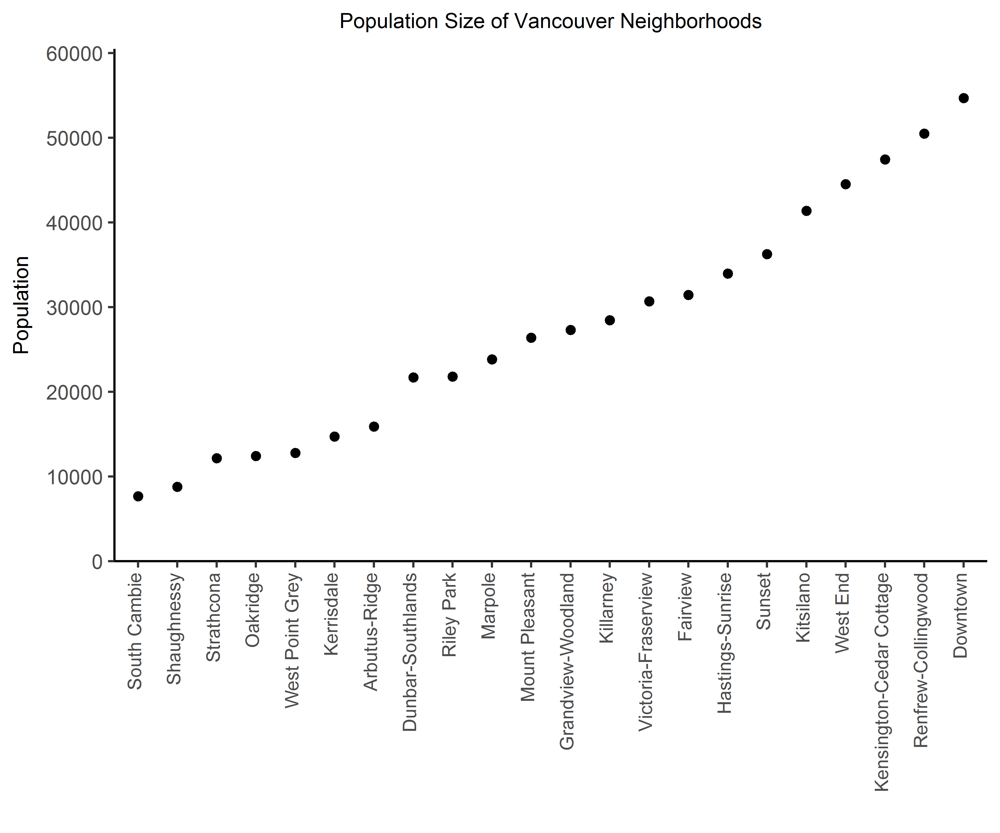
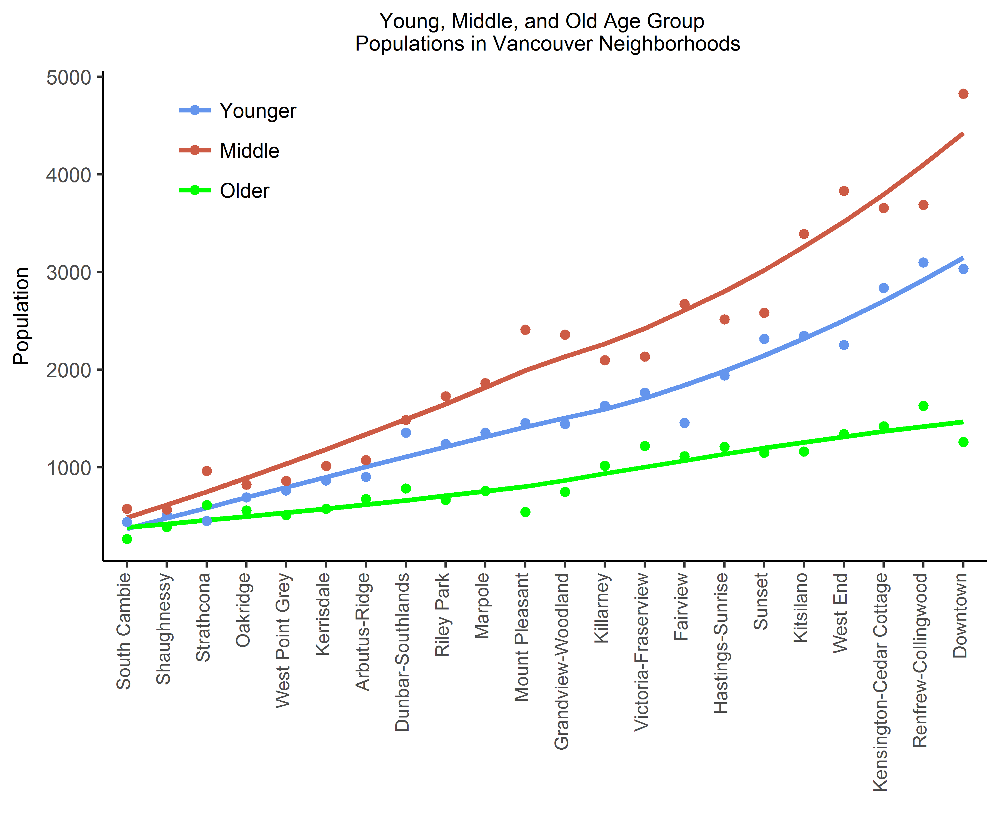

Homework 7
================

For this assignment rather than using gapminder data, we will for the purpose of practice and variety instead use Vancouver census data. By relying on multiple r scripts prior to the creation of this file, much of the coding, and thereby data cleaning, management, pruning and analysis can be run behind the scenes. As a result we can instead focus solely on the figures and interpretation that arose.

By using this data we first can graph what the population size is of different Vancouver neighborhoods.

As visible South Cambie is the least populated neighborhood and Downtown is the most. The magnitude of this difference is over five fold.

------------------------------------------------------------------------

A different question pertains to Vancouver demographics. Here we can examine, for instance, what age groups most populate the city.

Those aged 70 and above were the least populated age groups whereas those aged 25 through 34 were the most. A broader interpretation is evident as well, the least populated age groups tend to be both those who are older and younger whereas the most populated age groups were in between these two ends. We can do a better job assessing this in the next figure.

------------------------------------------------------------------------

Three age groups were created. Those 29 years and under formed the *Younger* group, those 60 and over the *Older* group and those in between the *Middle* group. Lets visualize the population of these age groups across different Vancouver neighborhoods.

The three age groups are very consistent in their relative ranking. In almost every neighborhood the oldest age group was the least prevalent, followed by the younger and then middle group. This seems to agree with what we inferred from the figure prior that middle-aged individuals make up the majority of the current population. We can note however that areas are much more divided then others. In Oakridge for instance the prevalence of the three age groups is more comparable than in Mount Pleasant, Kitsilano or Downtown.

------------------------------------------------------------------------

One other demographic of interest is whether males and females tend to differ in the neighborhoods for which they reside. In doing so a relatively simple figure can be created.

Evident in this figure is that some neighborhoods, like Sunset and Mount Pleasant, have a very close male-to-female ratio. Others however have more males (e.g. Strathcona) and others still more females (e.g. Fairview). In general however most neighborhoods, though often by a small margin, have more females. Given this, it is an interesting note that the largest sex discrepancy occurs in Downtown in which are more males.
